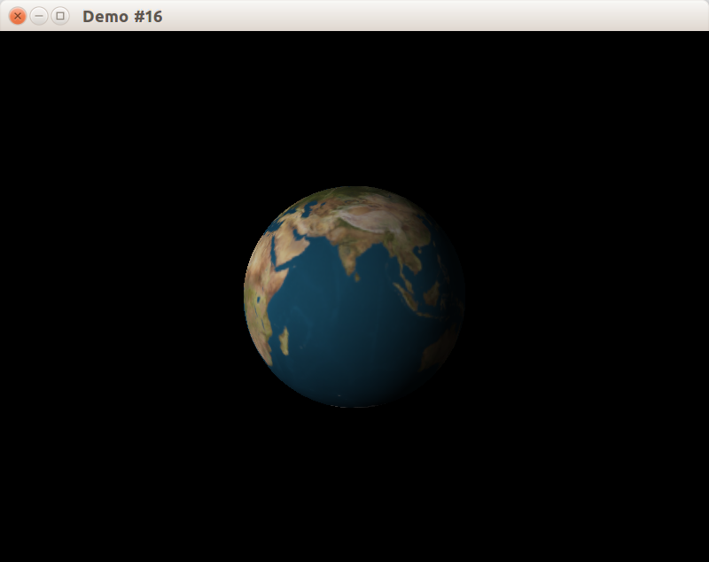
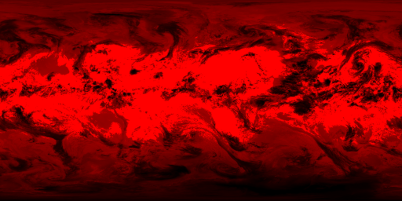

## Выборка данных из текстуры во фрагментном шейдере

Фрагментный и вершинный шейдеры могут осуществлять выборки значений из текстур. В стандарте OpenGL не зафиксировано, в каком виде должны быть реализованы текстурные модули, поэтому доступ к текстурам осуществляется при помощи специального интерфейса – дискретизатора (*англ.* sampler).

Существуют следующие типы дискретизаторов:

- sampler1D
- sampler2D
- sampler3D
- samplerCube
- sampler1DShadow
- sampler2DShadow

Чтобы в шейдерной программе использовать дискретизатор, необходимо объявить uniform- переменную одного из перечиленных выше типов. Например, объявить дискретизатор для доступа к двухмерной текстуре можно следующим образом:

```glsl
uniform sampler2D mainTexture;
```

Для чтения данных из дискретизатора используются функции texture* и shadow* (см. спецификацию языка GLSL). Например, для того, чтобы просто считать значение из двухмерной текстуры можно воспользоваться функцией

```glsl
vec4 texture2D(sampler2D sampler, vec2 coord [, float bias]);
```

Данная функция считывает значение из текстуры, связанной с 2D-дискретизатором sampler, из позиции, задаваемой 2D координатой coord. При использовании данной функции во фрагментном шейдере опциональный параметр «bias» добавляется к вычисленному уровню детализации текстуры (mip-уровню).

Рассмотрим примеры шейдеров, выполняющих наложение текстуры на примитив аналогично тому, как это делает сдандартный конвейер OpenGL. Для простоты ограничимся использованием только одной текстуры, а также не будем учитывать значение матрицы, задающей преобразования текстурных координат.

## Разрабатываем каркас приложения

Для демонстрации наложения текстуры мы воспользуемся одним из предыдущих примеров, в котором на сферу накладывалась текстура Земли. Непосредственно операции с текстурой будут выглядеть так:

```cpp
class CWindowClient : public CAbstractWindowClient
{
public:
    // ... публичный интерфейс

private:
    CTexture2DUniquePtr m_pEarthTexture;
    // ... остальные поля
};

CWindowClient::CWindowClient(CWindow &window)
{
    // ... инициализация полей класса

    std::string path = CFilesystemUtils::GetResourceAbspath("res/img/earth.bmp");
    m_pEarthTexture = LoadTexture2DFromBMP(path);
}

void CWindowClient::OnUpdateWindow(float deltaSeconds)
{
    // ... настройка камеры и освещения

    m_programQueue.front()->Use();
    m_pEarthTexture->DoWhileBinded([this]{
        m_sphereObj.Draw();
    });
}
```

Запустив программу, убедимся, что сфера действительно рисуется:



## Простые шейдеры, применяющие текстуры

В первом варианте шейдеров пиксели текстуры будут напрямую копироваться на поверхность, без учёта освещения и без добавления дополнительных деталей. Вершинный шейдер просто копирует значение во встроенную varying-переменную gl_TexCoord:

```glsl
void main()
{
    // Transform the vertex:
    // gl_Position = gl_ModelViewProjectionMatrix * gl_Vertex
    gl_Position = ftransform();
    // Copy texture coordinates from gl_MultiTexCoord0 vertex attribute
    // to gl_TexCoord[0] varying variable
    gl_TexCoord[0] = gl_MultiTexCoord0;
}
```

Фрагментный шейдер использует функцию texture2D для получения цвета фрагмента из цвета соответствующего пикселя текстуры.

```glsl
uniform sampler2D mainTexture;

void main()
{
    // Calculate fragment color by fetching the texture
    gl_FragColor = texture2D(mainTexture, gl_TexCoord[0].st);
}
```

В результате получаем сферу, на которой текстура наложена как простая карта цветов, без дополнительной обработки и без освещения:


Для проверки работоспособности шейдеров можно внести какое-нибудь осмысленное искажение цветов во фрагментный шейдер. Например, инвертировать каждый компонент цвета текстуры:

```glsl
uniform sampler2D mainTexture;

void main()
{
    // Calculate fragment color by fetching the texture
    gl_FragColor = 1.0 - texture2D(mainTexture, gl_TexCoord[0].st);
}
```


## Выборка данных из нескольких текстур

Доработаем программу таким образом, чтобы помимо текстуры земной поверхности, на сферу были нанесены облака.

Поскольку цвет облаков, преимущественно, белый, либо серый, отводить 24-битное изображение для их хранения было бы расточительно. Поэтому на хранение информации об облачности можно отвести всего 8 бит. Как же разумно распорядиться оставшимися разрядами? Одним из возможных вариантов решения данной задачи является хранение дополнительной информации о земной поверхности. Например, о том, принадлежит ли данная точка сферы суше или воде. Используя эту информацию, фрагментный шейдер при расчете освещения мог бы использовать различные модели освещения для суши и воды. 

Используемая нами дополнительная текстура Земли пока что кодирует лишь маску облаков и выглядит следующим образом:



Величина красный канала изображения хранит инвертированную интенсивность облаков, т.е. чем ближе значение канала в данном пикселе к нулю, тем выше облачность. В соответствии с этим обновим фрагментный шейдер:

```glsl
uniform sampler2D colormap;
uniform sampler2D surfaceDataMap;

void main()
{
    // Get base color by fetching the texture
    vec4 color = texture2D(colormap, gl_TexCoord[0].st);
    // Extract surface data where each channel has own meaning
    vec4 surfaceData = texture2D(surfaceDataMap, gl_TexCoord[0].st);
    // Red channel keeps inverted cloud luminance
    float cloudGray = 1.0 - surfaceData.r;
    vec4 cloudsColor = vec4(cloudGray, cloudGray, cloudGray, 0.0);
    gl_FragColor = color + cloudsColor;
}
```

Для выборки из нескольких текстур мы воспользуемся расширением GL_ARB_multitexture, которое вошло в стандарт OpenGL 1.2, но может быть недоступно на Windows без установленных драйверов (т.к. программная реализация OpenGL для Windows не развивается и обеспечивает только версию OpenGL 1.1).

Этот механизм мультитекстурирования основан на концепции "слотов" для прикрепления текстур, число которых фиксировано реализацией. Можно предполагать, что на большинстве видеокарт доступно как минимум 8 слотов текстур, и этого более чем достаточно для симуляции различных материалов.

- для включения слота используется функция-команда [glActiveTexture(GLenum slot)](https://www.opengl.org/sdk/docs/man/docbook4/xhtml/glActiveTexture.xml), после вызова которой все вызовы glBindTexture будут привязывать текстуру к слоту с указанным номером

```cpp
void CWindowClient::OnUpdateWindow(float deltaSeconds)
{
    m_camera.Update(deltaSeconds);
    SetupView(GetWindow().GetWindowSize());

    m_sunlight.Setup();

    // переключаемся на текстурный слот #1
    glActiveTexture(GL_TEXTURE1);
    m_pCloudTexture->Bind();
    // переключаемся обратно на текстурный слот #0
    // перед началом рендеринга активным будет именно этот слот.
    glActiveTexture(GL_TEXTURE0);
    m_pEarthTexture->Bind();

    // Активной будет первая программа из очереди.
    const CShaderProgram &program = *m_programQueue.front();
    program.Use();
    program.FindUniform("colormap") = 0; // GL_TEXTURE0
    program.FindUniform("surfaceDataMap") = 1; // GL_TEXTURE1

    m_pEarthTexture->DoWhileBinded([this]{
        m_sphereObj.Draw();
    });
}
```


## Совмещаем с моделью освещения Фонга

В данный момент планета отображается без учёта освещения от Солнца. Теперь мы совместим показанный в одном из прошлых примеров шейдер для расчёта освещения по Фонгу с уже написанным шейдером.

В вершинном шейдере будут объявлены две varying-переменные для нормали и для направления на камеру, чтобы расчитывать интенсивность освещения по модели Фонга попиксельно, и тем самым получать плавную освещённость без артефактов. Также происходит копирование текстурных координат.

```glsl
varying vec3 normal;
varying vec3 viewDir;

void main(void)
{
    viewDir = vec3(gl_ModelViewMatrix * gl_Vertex);
    normal = normalize(gl_NormalMatrix * gl_Normal);
    gl_Position = ftransform();
    gl_TexCoord[0] = gl_MultiTexCoord0;
}
```

Мы также добавим фрагментный шейдер, в котором выполняется одновременно освещение по модели Фонга и уже рассмотренное ранее совмещение двух текстур (цветовой карты поверхности Земли и карты облаков).

В данном шейдере мы применим пользовательские структуры. В GLSL нет указателей и ссылок, но это не мешает объявить структуру как соединение нескольких полей в единую сущность, и возвращать структуру из функции. Структура понадобится нам для функции GetLight0Factors, которая расчитывает для источника света `GL_LIGHT0` коэффициенты уменьшения diffuse и specular компонентов освещения, зависящие от углов между наблюдателем, нормалью и направлением на источник света. После занесения данных в поля структуры мы также сделаем `clamp(x, 0.0, 1.0)` для каждого поля, поскольку

- интенсивность не может быть отрицательной
- коэффициент уменьшения не может быть меньше 1, иначе он ничего не уменьшает

```glsl
struct LightFactors
{
    float diffuse;
    float specular;
};

LightFactors GetLight0Factors()
{
    vec3 viewDirection = normalize(-viewDir);
    vec3 fixedNormal = normalize(normal);
    // Fix lightDirection for both directed and undirected light sources.
    vec3 delta = gl_LightSource[0].position.w * viewDirection;
    vec3 lightDirection = normalize(gl_LightSource[0].position.xyz + delta);

    vec3 reflectDirection = normalize(-reflect(lightDirection, fixedNormal));

    LightFactors result;
    result.diffuse = max(dot(fixedNormal, lightDirection), 0.0);
    float base = max(dot(reflectDirection, viewDirection), 0.0);
    result.specular = pow(base, gl_FrontMaterial.shininess / 4.0);

    result.diffuse = clamp(result.diffuse, 0.0, 1.0);
    result.specular = clamp(result.specular, 0.0, 1.0);

    return result;
}
```

При совмещении цветов облаков и поверхности земли мы применим фунцию mix.

### Функция mix

```glsl
float mix(float x, float y, float a)  
vec2 mix(vec2 x, vec2 y, vec2 a)  
vec3 mix(vec3 x, vec3 y, vec3 a)  
vec4 mix(vec4 x, vec4 y, vec4 a)
```

Функция mix возвращает результат линейного смешения между x и y, то есть произведение `x * (1 - a)`, сложенное с произведением `y * a`. Входные параметры могут быть скалярами или векторами с плавающей запятой. В случае использования векторов операция совершается покомпонентно.

float mix(float x, float y, float a)  
vec2 mix(vec2 x, vec2 y, float a)  
vec3 mix(vec3 x, vec3 y, float a)  
vec4 mix(vec4 x, vec4 y, float a)

Есть также перегрузка функции `mix`, в которой третий параметр всегда является скаляром с плавающей точкой.

### Листинг фрагментного шейдера

```glsl
uniform sampler2D colormap;
uniform sampler2D surfaceDataMap;

varying vec3 normal;
varying vec3 viewDir;

struct LightFactors
{
    float diffuse;
    float specular;
};

LightFactors GetLight0Factors()
{
    vec3 viewDirection = normalize(-viewDir);
    vec3 fixedNormal = normalize(normal);
    // Fix lightDirection for both directed and undirected light sources.
    vec3 delta = gl_LightSource[0].position.w * viewDirection;
    vec3 lightDirection = normalize(gl_LightSource[0].position.xyz + delta);

    vec3 reflectDirection = normalize(-reflect(lightDirection, fixedNormal));

    LightFactors result;
    result.diffuse = max(dot(fixedNormal, lightDirection), 0.0);
    float base = max(dot(reflectDirection, viewDirection), 0.0);
    result.specular = pow(base, gl_FrontMaterial.shininess / 4.0);

    result.diffuse = clamp(result.diffuse, 0.0, 1.0);
    result.specular = clamp(result.specular, 0.0, 1.0);

    return result;
}

void main()
{
    LightFactors factors = GetLight0Factors();

    // Get base color by fetching the texture
    vec4 color = texture2D(colormap, gl_TexCoord[0].st);
    // Extract surface data where each channel has own meaning
    vec4 surfaceData = texture2D(surfaceDataMap, gl_TexCoord[0].st);
    // Red channel keeps inverted cloud luminance
    float cloudGray = 1.0 - surfaceData.r;

    vec4 diffuseColor = mix(color, vec4(factors.diffuse), cloudGray);
    vec4 diffuseIntensity = diffuseColor * factors.diffuse
            * gl_FrontLightProduct[0].diffuse;

    vec4 ambientColor = mix(color, vec4(1.0), cloudGray);
    vec4 ambientIntensity = ambientColor
            * gl_FrontLightProduct[0].ambient;

    vec4 specularIntensity = factors.specular
            * gl_FrontLightProduct[0].specular;

    gl_FragColor = ambientIntensity + diffuseIntensity + specularIntensity;
}
```


