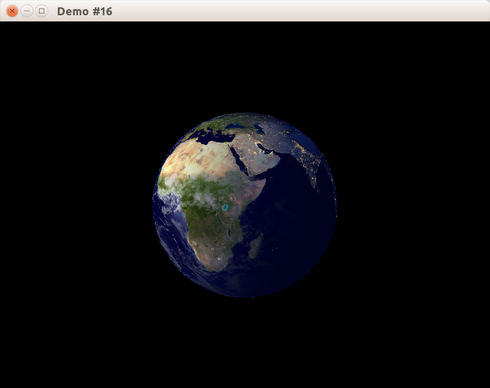

С приходом OpenGL 3.0 началась новая эпоха: старые способы рисования, предшествующие появлению шейдеров и массивов вершин, были объявлены устаревшими, и у программиста появилась возможность отказаться от устаревших функций ещё при создании контекста OpenGL.

В OpenGL для настольных компьютеров программисту достпен выбор между двумя профилям:

- Core Profile, в котором для рисования необходимо установить вершинный и фрагментный шейдер, а glBegin и glEnd недоступны
- Compatibility Profile, в котором работают все возможности как новых, так и старых версий OpenGL.

В OpenGL ES, который используется в мобильных устройствах, включая смартфоны и планшеты, доступен только режим Core Profile, а устаревшая функциональность не реализована в видеодрайвере.

В WebGL, который реализован современными браузерами, ради совместимости со смартфонами Compatibility Profile также недоступен.

## Включаем Core Profile

Наша задача на сегодня &mdash; взять предыдущий пример рендеринга планеты Земля и портировать его на Core Profile, заменив ранее использованную устаревшую функциональность на современные подходы.

Для начала дополним класс CWindow, обеспечив возможность выбора профиля OpenGL перед показом окна. Класс CWindow получит новый метод:

```cpp
class CWindow : private boost::noncopyable
{
public:
    // ...конструктор и деструктор...
    void SetCoreProfileEnabled(bool enabled);
    // ...остальные методы и поля...
};

// --------- Window.cpp --------

class CWindow::Impl
{
public:
    void SetCoreProfileEnabled(bool enabled)
    {
        if (m_pWindow)
        {
            throw std::logic_error("Cannot change OpenGL profile after window created");
        }
        m_isCoreProfileEnabled = enabled;
    }

    void Show(const std::string &title, const glm::ivec2 &size)
    {
        m_size = size;

        // Выбираем между профилями Core и Compatibility
        const SDL_GLprofile profile = m_isCoreProfileEnabled
                ? SDL_GL_CONTEXT_PROFILE_CORE
                : SDL_GL_CONTEXT_PROFILE_COMPATIBILITY;
        SDL_GL_SetAttribute(SDL_GL_CONTEXT_PROFILE_MASK, profile);

        // Специальное значение SDL_WINDOWPOS_CENTERED вместо x и y заставит SDL2
        // разместить окно в центре монитора по осям x и y.
        // Для использования OpenGL вы ДОЛЖНЫ указать флаг SDL_WINDOW_OPENGL.
        m_pWindow.reset(SDL_CreateWindow(title.c_str(), SDL_WINDOWPOS_CENTERED, SDL_WINDOWPOS_CENTERED,
                                         size.x, size.y, SDL_WINDOW_OPENGL | SDL_WINDOW_RESIZABLE));

        // Создаём контекст OpenGL, связанный с окном.
        m_pGLContext.reset(SDL_GL_CreateContext(m_pWindow.get()));
        InitGlewOnce();
    }
    // ...остальные методы и поля...

void CWindow::SetCoreProfileEnabled(bool enabled)
{
    m_pImpl->SetCoreProfileEnabled(enabled);
}
```

Теперь изменим функцию main, чтобы использовать Core Profile:

```cpp
#include "stdafx.h"
#include "WindowClient.h"
#include <SDL2/SDL.h>

int main(int, char *[])
{
    try
    {
        CWindow window;
        window.SetCoreProfileEnabled(true);
        window.Show("Demo #17", {800, 600});
        CWindowClient client(window);
        window.DoMainLoop();
    }
    catch (const std::exception &ex)
    {
        const char *title = "Fatal Error";
        const char *message = ex.what();
        SDL_ShowSimpleMessageBox(SDL_MESSAGEBOX_ERROR, title, message, nullptr);
    }

    return 0;
}
```

## Отказ от фиксированного конвейера

Ряд возможностей OpenGL недоступен при использовании только Core Profile:

- весь рендеринг возможен только с применением шейдеров, псевдо-программа с индексом 0, ранее обозначавшая фиксированный конвейер, теперь недоступна
- убраны функции `glBegin`, `glEnd`, `glVertex`, `glColor`, `glNormal` и все им подобные; теперь необходимо использовать массивы вершинных данных (пример такого подхода был показан в предыдущей статье)
- убраны некоторые типы примитивов - GL_QUADS, GL_QUAD_STRIP и GL_POLYGON; их триангуляцией программист должен заниматься самостоятельно
- матрицы убраны из состояния OpenGL, их надо вручную передавать в шейдеры
- убрана поддержка дисплейных списков, целого ряда подсказок (hints) для видеодрайвера

## Результат

После запуска получим изображение, где дневная сторона Земли плавно переходит в ночную, на которой горит множество огней больших городов.



Полный код к данной статье вы можете найти [в каталоге примера в репозитории на github](https://github.com/PS-Group/cg_course_examples/tree/master/lesson_16).
