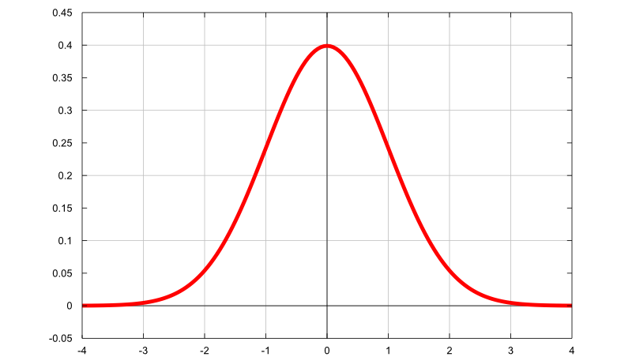
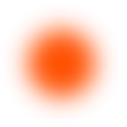
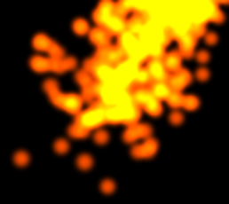
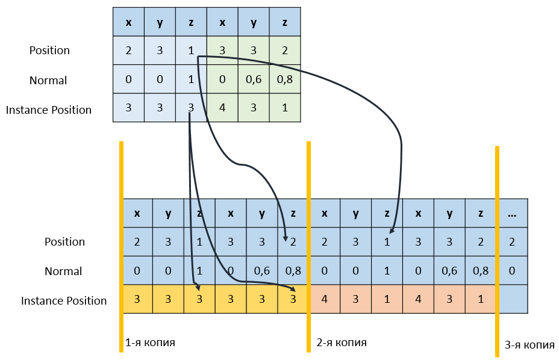
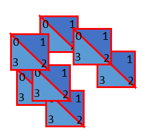
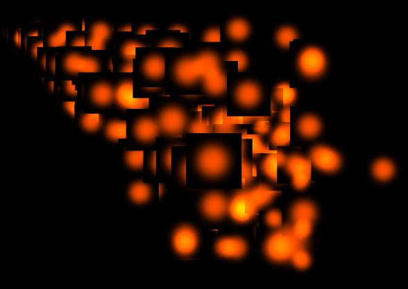
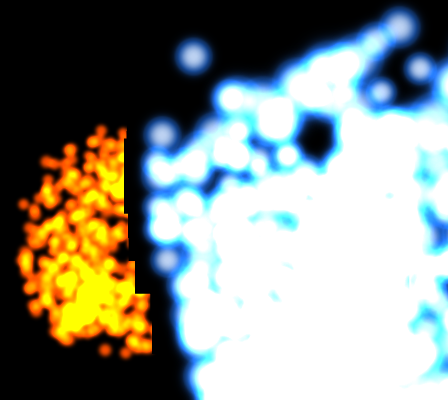
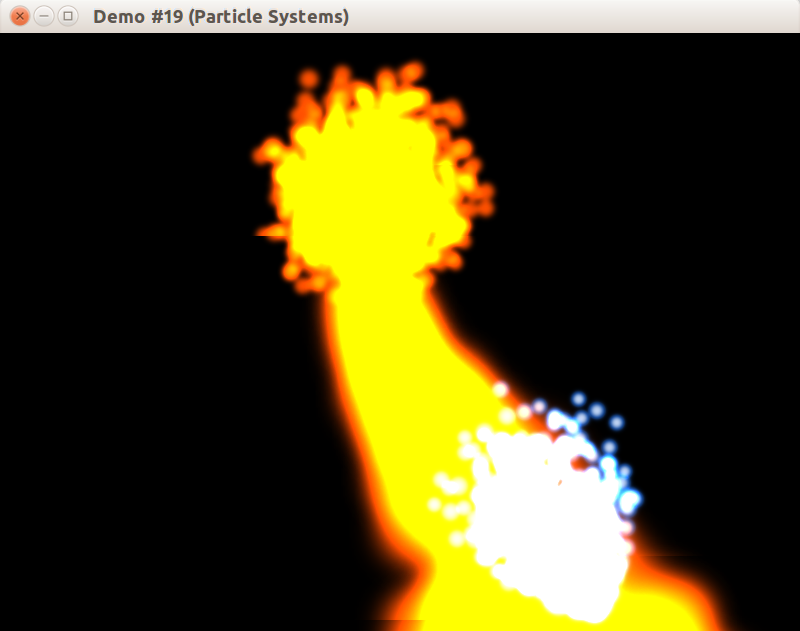

## Генератор частиц

Наш генератор частиц будет построен на основе [генератора 2D-частиц из 1-й главы](/opengl/lesson_5.html). Мы используем тот же самый способ генерации частиц &mdash; средства из заголовочного файла [random](http://en.cppreference.com/w/cpp/numeric/random).

Некоторые случайные значения будут заданы нормальным распределением:



Чтобы ограничить диапазон значений нормального распределения, мы воспользуемся классом CClampedNormalDistribution, также рассмотренным ранее. Определение класса CParticleEmitter сопровождается комментариями:

```cpp
// Класс источника частиц, создающего частицы,
//  вылетающие из заданного в заданном направлении.
// Случайным вариациям поддаются:
//  - дистанция от источника частиц, на которой появляется частица
//  - отклонение направления частицы от направления источника
//  - скорость частицы
//  - время жизни частицы
//  - интервал между генерацией двух частиц
class CParticleEmitter
{
public:
    CParticleEmitter();

    // @param dt - разница во времени с предыдущим вызовом Advance.
    void Advance(float dt);
    bool IsEmitReady()const;
    CParticle Emit();

    // Задаёт центр источника частиц.
    void SetPosition(const glm::vec3 &value);

    // Задаёт разброс расстояния от места появления частицы до центра источника.
    void SetDistanceRange(float minValue, float maxValue);

    // Задаёт направление вылета частиц.
    void SetDirection(const glm::vec3 &value);

    // Задаёт максимальный угол отклонения направления частицы
    //  от основного направления вылета частиц.
    void SetMaxDeviationAngle(float value);

    // Задаёт разброс времени жизни частиц.
    void SetLifetimeRange(float minValue, float maxValue);

    // Задаёт разброс времени между вылетом двух частиц.
    void SetEmitIntervalRange(float minValue, float maxValue);

    // Задаёт разброс скорости частицы.
    void SetSpeedRange(float minValue, float maxValue);

private:
    using linear_random_float = std::uniform_real_distribution<float>;
    using normal_random_float = CClampedNormalDistribution;

    glm::vec3 MakeRandomDirection();

    float m_elapsedSeconds = 0;
    float m_nextEmitTime = 0;
    glm::vec3 m_position;
    glm::vec3 m_direction = glm::vec3(0, 1, 0);
    linear_random_float m_distanceRange;
    linear_random_float m_deviationAngleRange;
    normal_random_float m_lifetimeRange;
    normal_random_float m_emitIntervalRange;
    normal_random_float m_speedRange;
    std::mt19937 m_random;
};
```

Реализации конструктора, метода-команды Advance и метода-запроса IsEmitReady не отличаются от аналогичного генератора из 1-й главы:

```cpp
CParticleEmitter::CParticleEmitter()
{
    std::random_device rd;
    m_random.seed(rd());
}

void CParticleEmitter::Advance(float dt)
{
    m_elapsedSeconds += dt;
}

bool CParticleEmitter::IsEmitReady() const
{
    return m_elapsedSeconds > m_nextEmitTime;
}
```

Однако, генерация частицы теперь устроена иным образом:

```cpp
CParticle CParticleEmitter::Emit()
{
    // Увеличиваем время следующего вылета частицы.
    m_nextEmitTime += m_emitIntervalRange(m_random);

    const vec3 direction = MakeRandomDirection();
    const vec3 position = m_position + direction * m_distanceRange(m_random);
    const vec3 velocity = direction * m_speedRange(m_random);
    const float lifetime = m_lifetimeRange(m_random);

    return CParticle(position, velocity, lifetime);
}

glm::vec3 CParticleEmitter::MakeRandomDirection()
{
    vec3 dir = m_direction;

    // Данный вектор будет ортогонален вектору dir, что несложно проверить,
    //  вычислив векторное произведение dir и normal.
    vec3 normal = glm::normalize(vec3(dir.y + dir.z, -dir.x, -dir.x));

    // Поворачиваем normal на произвольный угол (в диапазоне -M_PI..M_PI)
    //  вокруг вектора dir, чтобы получить случайную ось вращения.
    linear_random_float distribution(float(-M_PI), float(M_PI));
    normal = glm::rotate(normal, distribution(m_random), dir);

    // Поворачиваем dir вокруг повёрнутого normal (по-прежнему ортогонального)
    //  на случайный угол, ограниченный максимальным углом отклонения.
    const float deviationAngle = m_deviationAngleRange(m_random);
    dir = glm::rotate(dir, deviationAngle, normal);

    return dir;
}
```

## Вид отдельной частицы

Выпускаемые генератором частицы теперь будут устроены проще, потому что нам потребуется рисовать большое (свыше 1000) число частиц. Частица будет хранить лишь основные характеристики:

```cpp
class CParticle
{
public:
    CParticle(const glm::vec3 &position,
              const glm::vec3 &velocity,
              float lifetime)
        : m_position(position)
        , m_velocity(velocity)
        , m_lifetime(lifetime)
    {
    }

    void Advance(float deltaSeconds, const glm::vec3 &acceleration)
    {
        m_lifetime -= deltaSeconds;
        m_velocity += acceleration * deltaSeconds;
        m_position += m_velocity * deltaSeconds;
    }

    glm::vec3 GetPosition()const
    {
        return m_position;
    }

    bool IsAlive()const
    {
        return (m_lifetime > std::numeric_limits<float>::epsilon());
    }

private:
    glm::vec3 m_position;
    glm::vec3 m_velocity;
    float m_lifetime = 0;
};
```

Визуально частица будет представлять из себя *спрайт*, то есть прямоугольник с натянутой на него текстурой. Текстура не должна быть большой &mdash; 16x16 или 32x32 будет вполне достаточно. Ниже показан пример одной из текстур в четырёхкратном увеличении:



Текстура обладает альфа-каналом, то есть полупрозрачна. При выводе в режиме смешивания с формулой смешивания `particleAlpha * particleColor + destColor` цвета частиц складываются, что приводит к визуальному сложению интенсивности свечения этих частиц:



Включить такой режим вывода можно двумя командами (метод работает как в Core Profile, так и в старых версиях OpenGL):

```cpp
glEnable(GL_BLEND);
glBlendFunc(GL_SRC_ALPHA, GL_ONE);
```

## Расширение EXT_draw_instanced

При рисовании частиц стоит цель на каждом кадре отправлять на видеокарту как можно меньше геометрических данных. [Расширение EXT_draw_instanced](https://www.opengl.org/registry/specs/EXT/draw_instanced.txt) позволяет сократить количество передаваемых данных за счёт многократного создания почти одинаковых объектов.

Расширение, прежде всего, объявляет модифицированные функции рисования примитивов как с массивом индексов, так и без него:

```cpp
// параметр instancecount задаёт число рисуемых копий
void glDrawArraysInstanced(GLenum mode, GLint first, GLsizei count, GLsizei instancecount);
void glDrawElementsInstanced(GLenum mode, GLsizei count, GLenum type, const void *indices, GLsizei instancecount);
```

Очевидно, что копии должны всё-таки отличаться по каким-то параметрам, иначе они будут отрисованы в одном месте с одним и тем же внешним видом. Проблему решает простой механизм: мы передаём вершинному шейдеру *особенные* атрибуты, которые

- для всех вершин одной копии имеют одинаковые значения
- для разных копий становятся разными

Для создания таких атрибутов введена функция [void glVertexAttribDivisor(GLuint index, GLuint divisor)](https://www.opengl.org/sdk/docs/man/html/glVertexAttribDivisor.xhtml), которая устанавливает частоту повторения атрибута для разных копий. Нас интересуют два параметра:

- 0, если мы хотим оставить всё по-старому и передавать атрибут для каждой вершины, а в разных копиях переиспользовать атрибуты
- 1, если мы хотим 1 значение атрибута использовать для 1-й копии

Допустим, мы привязали три атрибута:

```cpp
int positionLocation = ...;
int normalLocation = ...;
int instancePositionLocation = ...;

glVertexAttribDivisor(positionLocation, 0);
glVertexAttribDivisor(normalLocation, 0);
glVertexAttribDivisor(instancePositionLocation, 1);
```

Распределение данных окажется таким:



Новая функциональность будет отражена в классе CVertexAttribute:

```cpp
class CVertexAttribute
{
public:
    // Устанавливает частоту наложения атрибута в решиме "draw instanced"
    //  - 0 (по умолчанию) - атрибут сопутствует каждой вершине
    //  - 1 (по умолчанию) - атрибут меняется только при смене экземпляра
    void SetDivisor(unsigned divisor)
    {
        if (m_location != -1)
        {
            glVertexAttribDivisor(GLuint(m_location), divisor);
        }
    }
};
```

Следует помнить, что значение `glVertexAttribDivisor` сохраняется даже при переключении шейдерной программы. Поэтому после вывода всех объектов, для которых изменялся `glVertexAttribDivisor`, следует вызвать `glVertexAttribDivisor(location, 0)`.

## Рисуем копии спрайтов с EXT_draw_instanced

Для вывода спрайта незачем вводить индексацию вершин &mdash; в нём всего лишь 6 вершин и 2 треугольника. Поэтому для рисования применим функцию [glDrawArraysInstanced](https://www.opengl.org/sdk/docs/man/html/glDrawArraysInstanced.xhtml). Схематически процесс выглядит так:



```cpp
namespace
{
// Двумерные координаты двух треугольников, задающих квадратный спрайт.
vec2 SPRITE_VERTECIES[] = {
    { -1.f, -1.f }, // вершина 3
    { +1.f, -1.f }, // вершина 2
    { -1.f, +1.f }, // вершина 0
    { -1.f, +1.f }, // вершина 0
    { +1.f, -1.f }, // вершина 2
    { +1.f, +1.f }, // вершина 1
};

const size_t SPRITE_VERTEX_COUNT = sizeof(SPRITE_VERTECIES) / sizeof(SPRITE_VERTECIES[0]);
}

// фрагмент процедуры рисования
void CParticleSystem::Draw(/*...*/)
{
    // ...привязка текстур и атрибутов шейдера...

    const GLsizei vertexCount = GLsizei(SPRITE_VERTEX_COUNT);
    const GLsizei instanceCount = GLsizei(m_particles.size());
    glDrawArraysInstanced(GL_TRIANGLES, 0, vertexCount, instanceCount);
}
```

Привязку атрибутов выполняет метод BindParticlePositions, который также обновляет позиции частиц после каждого изменения системы частиц.

- для "ленивого" обновления мы используем [приём оптимизации "Dirty Flag"](http://gameprogrammingpatterns.com/dirty-flag.html)
- поскольку буфер с позициями частиц обновляется на каждом кадре, он должен иметь соответствующий параметр BufferUsage, заданный при создании:

```cpp
// Конструирует систему частиц с двумя буферами данных:
//  один используется для статичного спрайта (текстурированного прямоугольника),
//  второй - для постоянно изменяющихся позиций частиц
// в связи с этим у них разные константы BufferUsage.
CParticleSystem::CParticleSystem()
    : m_spriteGeometry(BufferType::Attributes, BufferUsage::StaticDraw)
    , m_particlePositions(BufferType::Attributes, BufferUsage::StreamDraw)
{
    m_spriteGeometry.Copy(SPRITE_VERTECIES, sizeof(SPRITE_VERTECIES));
}

// Привязывает буфер с позициями частиц,
//  при необходимости обновляет его,
//  затем связывает с атрибутом шейдера.
void CParticleSystem::BindParticlePositions(IProgramAdapter &program, const glm::mat4 &worldView)
{
    m_particlePositions.Bind();

    if (m_isDirty)
    {
        UpdateParticlePositions(worldView);
        m_isDirty = false;
    }

    CVertexAttribute positionAttr = program.GetAttribute(AttributeId::INSTANCE_POSITION);
    positionAttr.SetVec3Offset(0, sizeof(vec3), false);
}
```

Флаг `m_isDirty` объявлен как bool и выставляется в true при каждом вызове `CParticleSystem::Update`. Метод UpdateParticlePositions мы рассмотрим позже.

## Сортировка частиц и порядок рисования

Частицы являются полупрозрачными объектами. В ранних статьях уже объяснялось, что:

- полупрозрачные грани поверхностей должны рисоваться после всех непрозрачных граней
- при взаимном наложении граней их нужно отсортировать в порядке удаления от наблюдателя

Если сортировку не выполнять, частицы будут нарисованы в хаотическом порядке. Если к тому же выполняется тест глубины, то расположенные сзади и выводимые позднее частицы ошибочно не пройдут тест глубины:



```cpp
void CParticleSystem::UpdateParticlePositions(const glm::mat4 &worldView)
{
    // Собираем массив позиций частиц
    std::vector<vec3> positions(m_particles.size());
    std::transform(m_particles.begin(), m_particles.end(),
                   positions.begin(), [](const CParticle &particle) {
        return particle.GetPosition();
    });

    // Сортируем частицы в порядке удалённости от камеры
    std::sort(positions.begin(), positions.end(), [&](const vec3 &a, vec3 &b) {
        const vec3 viewA = vec3(worldView * vec4(a, 1.0));
        const vec3 viewB = vec3(worldView * vec4(b, 1.0));
        return viewA.z < viewB.z;
    });

    // Отправляем данные на видеокарту
    m_particlePositions.Copy(positions);
}
```

Перед рисованием всех систем частиц следует не забыть включить смешивание:

```cpp
glEnable(GL_BLEND);
glBlendFunc(GL_SRC_ALPHA, GL_ONE);
```

После рисования смешивание стоит выключить, т.к. данный режим менее производительный, чем прямая запись нового цвета фрагмента в буфер. Корректно нарисованная система частиц выглядит примерно следующим образом:


Если на сцене имеется несколько систем частиц, то нужно сортировать и сами системы по их взаимному положению &mdash; иначе возникнут артефакты с тех позиций наблюдателя, где системы накладываются:



Решение данной проблемы вы найдёте в методе `CParticleRenderSystem::GetEntitesSortedByDepth` в исходном коде примеров.

Однако, сортировка систем частиц не исправляет артефакты в ситуации, когда частицы из разных систем пересекаются. Данный баг можно исправить путём сбора всех частиц из всех систем в единый массив, а всех текстур частиц &mdash; в единый атлас. Способ сложен, и программировать его мы конечно же не будем. Гораздо проще избегать пересечения разных систем частиц.

## Результат

Полный код к данной статье вы можете найти [в каталоге примера в репозитории на github](https://github.com/PS-Group/cg_course_examples/tree/master/lesson_19). Стоит также обратить внимание на классы CParticleSystem, CParticleEmitter и CVertexAttribute из библиотеки "libscene". А теперь ещё раз взглянем на результат:



## Ссылки

- [Реализация пояса астероидов с помощью Instanced Drawing (learnopengl.com)](http://learnopengl.com/#!Advanced-OpenGL/Instancing)
- [Использование BillBoard для реализации индикатора здоровья юнита (opengl-tutorial.org)](http://www.opengl-tutorial.org/intermediate-tutorials/billboards-particles/billboards/)
- [Рендеринг травы с помощью инстансинга трёх пересекающихся спрайтов (steps3d.narod.ru)](http://steps3d.narod.ru/tutorials/grass-tutorial.html)
