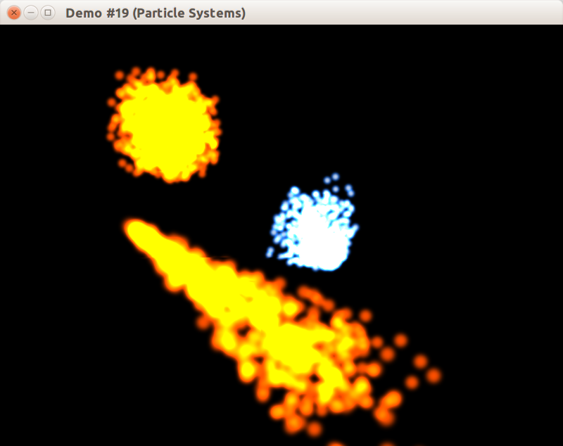

В данном примере мы создадим программный слой для загрузки элементов трёхмерных сцен из файлов в форматах различных 3D редакторов, таких как Blender или 3D Max. Мы также видоизменим загрузчик текстур, применив в нём более качественные методы интерполяции цвета текстур по поверхности.


## "Ручное" добавление компонентов в Anax

Создавать компоненты можно путём использования зашитых в код констант. Данный приём выглядел бы следующим образом:

```
void CWindowClient::InitScene()
{
    CTexture2DLoader loader;
    std::shared_ptr<CMeshP3NT2> pSphere = CTesselator::TesselateSphere(SPHERE_PRECISION);

    // Добавление сущности "Земля".
    {
        anax::Entity earth = m_world.createEntity();
        auto &mesh = earth.addComponent<CStaticMeshComponent>();
        mesh.m_pMesh = pSphere;
        mesh.m_pDiffuseMap = loader.Load("res/solar_system/earth_diffuse.jpg");
        mesh.m_pSpecularMap = loader.Load("res/solar_system/earth_specular.jpg");
        auto &transform = earth.addComponent<CTransformComponent>();
        transform.m_position = { 10.f, 0.f, 30.f };

        // Каждую сущность в Anax следует активировать.
        earth.activate();
    }

    // Добавление сущности "Луна".
    {
        anax::Entity moon = m_world.createEntity();
        auto &mesh = moon.addComponent<CStaticMeshComponent>();
        mesh.m_pMesh = pSphere;
        mesh.m_pDiffuseMap = loader.Load("res/solar_system/moon_diffuse.png");
        auto &transform = moon.addComponent<CTransformComponent>();
        transform.m_position = { 12.f, 0.f, 32.f };
        transform.m_scale = vec3(0.4f);
        moon.activate();
    }

    // Добавление сущности "Солнце".
    {
        anax::Entity sol = m_world.createEntity();
        auto &mesh = sol.addComponent<CStaticMeshComponent>();
        mesh.m_pMesh = pSphere;
        mesh.m_pEmissiveMap = loader.Load("res/solar_system/sol_emissive.jpg");
        auto &transform = sol.addComponent<CTransformComponent>();
        transform.m_position = vec3(SUNLIGHT_POSITION);
        transform.m_scale = vec3(3.0f);
        sol.activate();
    }

    // Добавляем систему, отвечающую за рендеринг планет.
    m_world.addSystem(m_renderSystem);

    // После активации новых сущностей или деактивации,
    //  а при добавления новых систем следует
    //  вызывать refresh() у мира.
    m_world.refresh();
}
```

## CTransform3D

## Реализация полётной камеры

В новом классе камеры, как и ранее, матрица вида будет лишь конечным продуктом, получаемым на каждом кадре. Исходные данные для построения матрицы будут храниться в том виде, который позволяет легче управлять камерой и не подвержен накоплению погрешности из-за неточного преставления действительных чисел в форматах с плавающей запятой.

Положение камеры описывается легко с помощью vec3. С ориентацией сложнее. Поможет задание ориентации в авиационных терминах:

- угол тангажа (*англ.* pitch, *греч. буква* θ)


- угол крена (*англ.* roll, *греч. буква* ϕ)


- угол рысканья (*англ.* yaw, *греч. буква* ψ)


Авиационные углы имеют огромное преимущество &mdash; исходные оси Ox, Oy, Oz фиксированы в мировых координатах (или в координатах диспетчерской станции аэропорта), и ориентация камеры задаётся лишь последовательным применением авиационных углов для получения вектора курса полёта (*англ.* heading):

- сначала считаем курс равным орту оси Ox (т.е. вектору `{1, 0, 0}`)
- поворачиваем курс на угол рысканья (yaw, ψ) вокруг оси Oy
- вычисляем нормаль к плоскости, образованной вектором курса и вектором Oy (назовём эту нормаль "right")
- поворачиваем курс на угол тангажа (pitch, θ) вокруг "right"
- вычисляем нормаль к плоскости, образованной вектором курса и вектором "right" (назовём эту нормаль "up")
- поворачиваем вектор "up" вокруг вектора курса на угол крена (roll, ϕ)
- теперь у нас есть вектор курса (heading, или front) и вектор направления вверх (up), и мы можем использовать уже привычную операцию lookAt для получения матрицы поворота

Данный метод проиллюстрирован на изображении:


## Разворачиваем окно на полный экран

## Результат



Полный код к данной статье вы можете найти [в каталоге примера в репозитории на github](https://github.com/PS-Group/cg_course_examples/tree/master/lesson_19).

## Ссылки

- [Tutorial 17 : Rotations (opengl-tutorial.org)](http://www.opengl-tutorial.org/intermediate-tutorials/tutorial-17-quaternions/)
- [What is the correct order to multiply scale, rotation and translation matrices for a proper world matrix? (gamedev.stackexchange.com)](http://gamedev.stackexchange.com/questions/16719/)
- [Модели освещения (steps3d.narod.ru)](http://steps3d.narod.ru/tutorials/lighting-tutorial.html)
