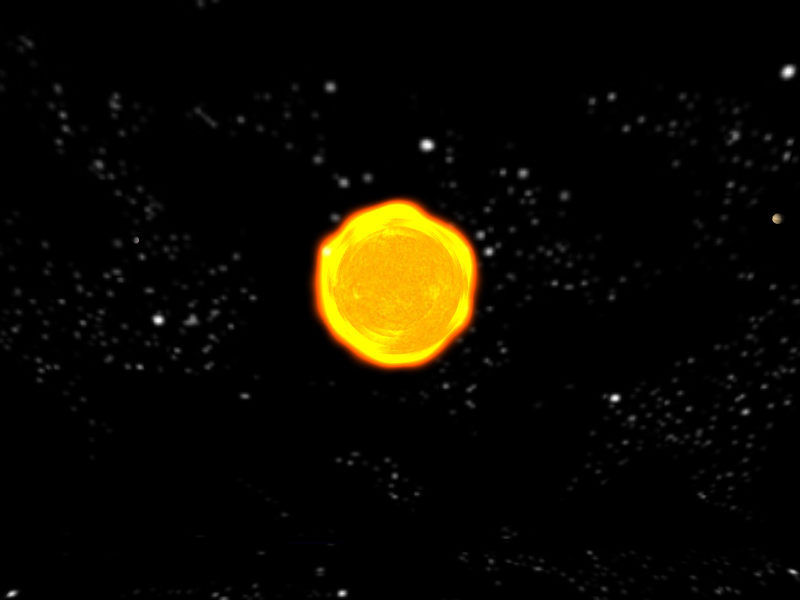

Подобный пример уже рассматривался в первой главе, но теперь мы реализуем целый ряд улучшений:

- трёхмерная система
- освещение на основе шейдеров
- работа в режиме OpenGL 3.2+ Core Profile
- для работы с объектами сцены мы применим подход Component-Entity-System

## Результат

Полный код к данной статье вы можете найти [в каталоге примера в репозитории на github](https://github.com/PS-Group/cg_course_examples/tree/master/lesson_19).

## Ссылки

- [Tutorial 17 : Rotations (opengl-tutorial.org)](http://www.opengl-tutorial.org/intermediate-tutorials/tutorial-17-quaternions/)
- [What is the correct order to multiply scale, rotation and translation matrices for a proper world matrix? (gamedev.stackexchange.com)](http://gamedev.stackexchange.com/questions/16719/)
- [Модели освещения (steps3d.narod.ru)](http://steps3d.narod.ru/tutorials/lighting-tutorial.html)
