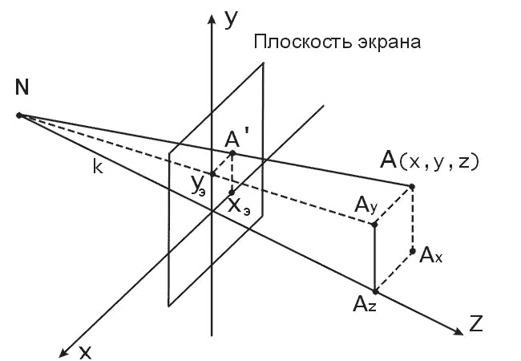
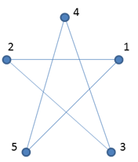
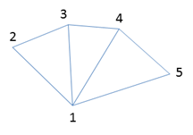
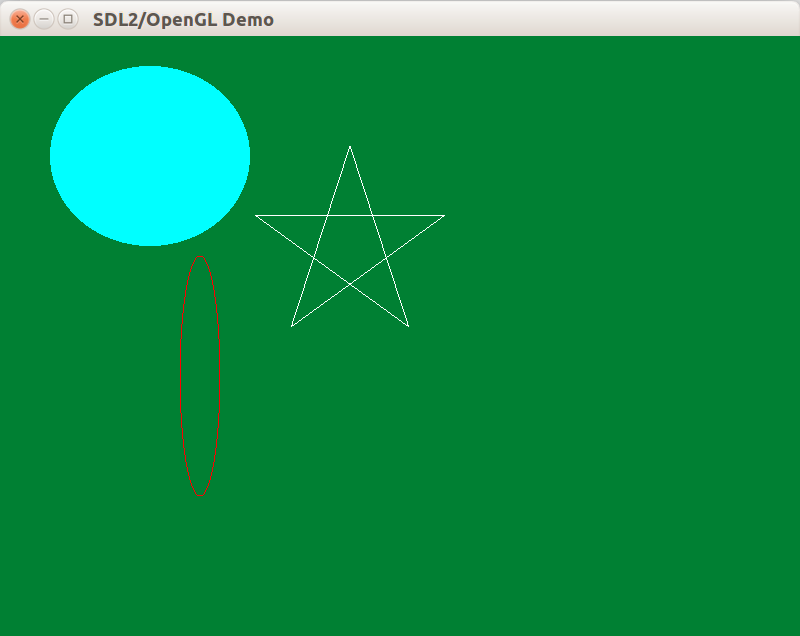

## CoreProfile и CompatibilityProfile

Начиная с OpenGL 3.0, стандарт OpenGL описывает два способа создания контекста:

- Compatibility Profile — контекст, совместимый с OpenGL 1.x и 2.x
- Core Profile — контекст, в котором большинство функций версий 1.x и 2.x не действуют, и доступна лишь современная высокопроизводительная модель рисования

Конечно, Core Profile гораздо больше подходит для современных приложений. Но у него высокий порог вхождения, и поэтому мы сначала освоимся в применении Compatibility Profile, где будем можно смешивать функциональность разных версий OpenGL.

Чтобы использовать Compatibility Profile, следует установить глобальный флаг SDL2 до создания контекста OpenGL:

```cpp
// Выбираем Compatiblity Profile
SDL_GL_SetAttribute(SDL_GL_CONTEXT_PROFILE_MASK,
                    SDL_GL_CONTEXT_PROFILE_COMPATIBILITY);

// Создаём контекст OpenGL, связанный с окном.
m_pGLContext.reset(SDL_GL_CreateContext(m_pWindow.get()));
```

## Трансляция событий ввода SDL2

SDL2 вводит единую абстракцию для разных устройств и операционных систем: Windows, MacOSX, Linux, Android, iOS. Есть существенные отличия в устройствах ввода на этих системах.

Например, на мобильных устройствах нет мыши и нет возможности навести курсор на кнопку, не нажимая её. Вместо событий мыши (*англ.* mouse events) используются события касания (*англ.* touch events), которые в целом соответствуют друг другу, но имеют различия. Для простоты мы пока что будем опираться на модель событий ввода настольных компьютеров, имеющих мышь и клавиатуру.

SDL2 передаёт события в виде [union](http://en.cppreference.com/w/cpp/language/union), а не структуры, в целях экономии памяти. В этот обобщённый union вложены структуры, предназначенные для различных категорий событий:

```cpp
union SDL_Event
{
    Uint32 type;                 // Тип события, общее поле всех событий
    SDL_WindowEvent window;      // Структура событий окна
    SDL_KeyboardEvent key;       // Структура событий клавиатуры
    SDL_MouseMotionEvent motion; // Структура событий перемещения курсора
    SDL_MouseButtonEvent button; // Структура событий кнопок мыши
    SDL_MouseWheelEvent wheel;   // Структура событий колеса мыши
    // и так далее
}
```

Чтобы выполнить диспетчеризацию событий в отдельные ветви выполнения, подойдёт инструкция `switch`. Чтобы не писать одинаковый и потенциально ошибочный код со `switch` в разных местах, вынесем диспетчеризацию отдельно от `CAbstractWindow`.

#### Листинг DispatchEvent.h

```cpp
#pragma once

#include "AbstractWindow.h"

class IEventAcceptor;
namespace sdl
{
// Совершает диспетчеризацию событий SDL по категориям.
void DispatchEvent(const SDL_Event & event, IEventAcceptor & acceptor);
}

// Принимает события SDL, разделённые по категориям.
// Деление условное и может быть изменено.
class IEventAcceptor
{
public:
    virtual ~IEventAcceptor();

    // window events group.
    virtual void OnResize(const glm::ivec2 &/*size*/) {}

    // input events group.
    virtual void OnMouseUp(const SDL_MouseButtonEvent &) {}
    virtual void OnMouseDown(const SDL_MouseButtonEvent &) {}
    virtual void OnMouseMotion(const SDL_MouseMotionEvent &) {}
    virtual void OnMouseWheel(const SDL_MouseWheelEvent &) {}
    virtual void OnKeyDown(const SDL_KeyboardEvent &) {}
    virtual void OnKeyUp(const SDL_KeyboardEvent &) {}
};

// Окно, совершающее диспетчеризацию событий SDL
class CAbstractEventDispatchWindow
        : public CAbstractWindow
        , public IEventAcceptor
{
protected:
    void OnWindowEvent(const SDL_Event &event) final
    {
        sdl::DispatchEvent(event, *this);
    }
};
```

## Реализуем транслятор ввода

Перебор возможных типов события может видоизменяться в зависимости от нужд и модели работы приложения. В данный момент мы не будем заниматься трансляцией touch events в mouse events и обеспечим только базовую диспетчеризацию.

```cpp
void sdl::DispatchEvent(const SDL_Event &event, IInputEventAcceptor &acceptor)
{
    switch (event.type)
    {
    case SDL_KEYDOWN:
        acceptor.OnKeyDown(event.key);
        break;
    case SDL_KEYUP:
        acceptor.OnKeyUp(event.key);
        break;
    case SDL_MOUSEBUTTONDOWN:
        acceptor.OnMouseDown(event.button);
        break;
    case SDL_MOUSEBUTTONUP:
        acceptor.OnMouseUp(event.button);
        break;
    case SDL_MOUSEMOTION:
        acceptor.OnMouseMotion(event.motion);
        break;
    case SDL_MOUSEWHEEL:
        acceptor.OnMouseWheel(event.wheel);
        break;
    }
}
```

Теперь получается, что мы можем обработать событие SDL_QUIT в пределах класса `CAbstractWindow` и рассылаем события ввода по категориям в дочерних классах, унаследованных от `CAbstractEventDispatchWindow`.

## Изменение размеров окна

Теперь нам пора изменить класс `CAbstractWindow`, чтобы получить нормальную рамку окна без фиксации размера окна. Прежде всего, при создании окна надо указать новый флаг `SDL_WINDOW_RESIZABLE`:

```cpp
// Специальное значение SDL_WINDOWPOS_CENTERED вместо x и y заставит SDL2
// разместить окно в центре монитора по осям x и y.
// Для использования OpenGL вы ДОЛЖНЫ указать флаг SDL_WINDOW_OPENGL.
SDL_CreateWindow(WINDOW_TITLE, SDL_WINDOWPOS_CENTERED, SDL_WINDOWPOS_CENTERED,
                 size.x, size.y, SDL_WINDOW_OPENGL | SDL_WINDOW_RESIZABLE));
```

Теперь мы должны добавить обработку оконных событий, помеченных категорией `SDL_WINDOWEVENT`. Данные этой категории событий хранятся в структуре `SDL_WindowEvent`, у которой есть поле `event`, описывающее подкатегорию события окна. Для события изменения размера `event == SDL_WINDOWEVENT_RESIZED`, а поля `data1` и `data2` хранят новые значения ширины и высоты соответственно.

Чтобы не нагружать обработкой этих событий метод `CAbstractWindow::DoGameLoop`, сделаем следующее: добавим классу `CAbstractWindow::Impl` свойство `IsTerminated`, которое указывает, был основной цикл окна остановлен или нет. Теперь мы можем переписать `DoGameLoop`:

```cpp
void CAbstractWindow::DoGameLoop()
{
    SDL_Event event;
    CChronometer chronometer;
    while (true)
    {
        while (SDL_PollEvent(&event) != 0)
        {
            if (!m_pImpl->ConsumeEvent(event))
            {
                OnWindowEvent(event);
            }
        }
        if (m_pImpl->IsTerminated())
        {
            break;
        }
        // Очистка буфера кадра, обновление и рисование сцены, вывод буфера кадра.
        m_pImpl->Clear();
        const float deltaSeconds = chronometer.GrabDeltaTime();
        OnUpdateWindow(deltaSeconds);
        OnDrawWindow(m_pImpl->GetWindowSize());
        CUtils::ValidateOpenGLErrors();
        m_pImpl->SwapBuffers();
    }
}
```

Метод `Impl::ConsumeEvent` реализован следующим образом:

```cpp
public:
    bool ConsumeEvent(const SDL_Event &event)
    {
        bool consumed = false;
        if (event.type == SDL_QUIT)
        {
            m_isTerminated = true;
            consumed = true;
        }
        else if (event.type == SDL_WINDOWEVENT)
        {
            OnWindowEvent(event.window);
            consumed = true;
        }
        return consumed;
    }

private:
    void OnWindowEvent(const SDL_WindowEvent &event)
    {
        if (event.event == SDL_WINDOWEVENT_RESIZED)
        {
            m_size = {event.data1, event.data2};
        }
    }
```

Размер окна следует всего лишь запомнить, изменение самого окна операционная система и SDL2 совершат самостоятельно. Далее размер окна будет передан в метод `OnDrawWindow(const glm::ivec2 &size)`, который вызывается при рисовании очередного кадра — именно так класс `CWindow` узнает о размерах области рисования.

## Порт просмотра, матрица проецирования

OpenGL рассчитан на проецирование трёхмерной сцены на плоскость объектива виртуальной камеры и не имеет специального режима для 2D. Поэтому мы должны настроить симуляцию трёхмерной камеры, чтобы получить ортографическое проецирование плоскости, в которой мы рисуем фигуры, на клиентскую область окна программы.

В OpenGL всё рисование происходит в трёхмерных координатах. Затем, в процессе обработки данных, видеодрайвер преобразует все поверхности и другие объекты виртуального трёхмерного мира в нормализованную систему координат. Существует два основных способа преобразования:

- ортографическое преобразование отбрасывает одну координату и вписывает некоторый прямоугольник в нормализованный куб
- перспективное проецирование искажает координаты, чтобы учесть перспективу, при этом некоторое пространство, описанное усечённой пирамидой, вписывается в нормализованный куб



Нормализованная система координат устройства – система координат, получаемая после выполнения операции перспективного или ортографического преобразования, в которой левому краю видового порта соответствует координатная плоскость X=-1, правому краю – X=1, нижнему краю – Y=-1, верхнему – Y=1, ближней плоскости отсечения – Z=-1, а дальней – Z=+1. Для установки матрицы ортографического преобразования следует сделать три вещи:

- переключить режим операций с матрицами с GL_MODELVIEW, включённого по умолчанию, на GL_PROJECTION вызовом функции-команды `glMatrixMode(GL_PROJECTION)`
- создать или загрузить готовую матрицу ортографического преобразования
- переключить режим операций с матрицами обратно на GL_MODELVIEW вызовом функции-команды `glMatrixMode(GL_MODELVIEW)`

При помощи преобразования в порт просмотра координаты вершин примитивов из нормализованной системы координат устройства преобразовываются в оконные координаты. Порт просмотра (*англ.* viewport) обычно занимает всю клиентскую область окна, но это не обязательно. Установка размеров видового порта в координатах клиентской области окна производится функцией-командой `glViewport(x, y, width, height)`.

Для установки видового порта и матрица проецирования введём вспомогательный метод `SetupView`, принимающий один параметр — размер окна в виде вектора 2-х целых чисел.

#### 1-я реализация SetupView

```cpp
void CWindow::SetupView(const glm::ivec2 &size)
{
    glViewport(0, 0, size.x, size.y);
    glMatrixMode(GL_PROJECTION);
    // Загружаем единичную матрицу
    glLoadIdentity();
    // Умножаем текущую матрицу на матрицу ортографического
    // проецирования из параллелепипеда с размером, равным size,
    // с отбрасыванием координаты z; по координате z параллепипед
    // ограничен параметрами zNear и zFar, которые также называются
    // "ближняя плоскость отсечения" и "дальняя плоскость отсечения".
    glOrtho(/*left*/ 0, /*right*/ size.x, /*bottom*/ size.y,
            /*top*/ 0, /*zNear*/ -1, /*zFar*/ 1);
    glMatrixMode(GL_MODELVIEW);
}
```

Здесь мы воспользовались встроенными в OpenGL 1.x функциями для работы с матрицами. Существует целое семейство таких функций:

- glLoadIdentity() для загрузки единичной матрицы
- glTranslatef() и glTranslated() для трансформации перемещения
- glRotatef() и glRotated() для трансформации вращения
- glScalef() и glScaled() для трансформации масштабирования
- glOrtho() для матрицы ортографического проецирования
- glFrustum() для матрицы перспективного проецирования
- glPushMatrix() для сохранения матрицы на вспомогательный стек
- glPopMatrix() для восстановления матрицы из вспомогательного стека
- glLoadMatrixf() и glLoadMatrixd() для явной установки матрицы

## Перепишем код на GLM

К сожалению, в будущем мы потеряем возможность прямой работы с матрицами: в Core Profile эта функциональность не работает. Поэтому мы постараемся максимально избегать работы с матрицами средствами OpenGL, и применим только две функции-команды: `glMatrixMode` и `glLoadMatrixf`. Всё остальное сделаем с помощью библиотеки GLM.

#### 2-я реализация SetupView
```cpp
void CWindow::SetupView(const glm::ivec2 &size)
{
    // Матрица ортографического проецирования изображения в трёхмерном пространстве
    // из параллелепипеда с размером, равным (size.X x size.Y x 2).
    const glm::mat4 matrix = glm::ortho<float>(0, size.x, size.y, 0);
    glViewport(0, 0, size.x, size.y);
    glMatrixMode(GL_PROJECTION);
    glLoadMatrixf(glm::value_ptr(matrix));
    glMatrixMode(GL_MODELVIEW);
}
```

## Immediate mode в OpenGL

Основные особенности OpenGL до версии 3.0 — это фиксированный конвейер (*англ.* fixed graphics pipeline) и безотлагательный режим исполнения (*англ.* immediate mode).

Основным принципом работы OpenGL является получение набора векторных примитивов в виде точек, отрезков прямых, треугольников, многоугольников с последующей математической обработкой полученных данных и визуализацией в виде растрового изображения на экране или в памяти. Трансформации векторов и растеризация выполняются фиксированным конвейером, представляющим из себя дискретный автомат. Команды OpenGL версий 1.x и 2.x либо добавляют графические примитивы на вход конвейера, либо конфигурируют конвейер для выполнения различных трансформаций.

Immediate mode в OpenGL требует от программиста диктовать точную последовательность шагов для построения результирующего растрового изображения. В отличие от декларативных подходов, когда вся трехмерная сцена передается в виде структуры данных (например, дерева), которое обрабатывается и строится на экране, императивный подход, используемый в OpenGL, требует от программиста глубокого знания трехмерной графики и математических моделей. С другой стороны, программисту предоставляется большая гибкость и свобода действий.

## Рисование контура звезды

Следующим нашим шагом будет рисование синей пятиконечной звезды. Звезда будет задана в виде замкнутой ломаной линии из пяти вершин:



OpenGL 1.x позволяет рисовать группы различных примитивов путем перечисления вершин примитивов в нужном порядке между вызовами функций [glBegin](https://www.opengl.org/sdk/docs/man2/xhtml/glBegin.xml) и glEnd. Координаты вершин задаются при помощи семейства функций [glVertex](https://www.opengl.org/sdk/docs/man2/xhtml/glVertex.xml).

Вершины нашей пятиконечной звезды располагаются на окружности в точках, соответствующих углам -90°, 54°, 198°, 342° и 486° (126°) – каждая последующая вершина сдвинута на 360 * 2 / 5 = 144° относительно предыдущей. Оформим рисование пятиконечной звезды в виде функции Stroke5PointStar:

```cpp
// Рисуем пятиконечную звезду
void Stroke5PointStar(float xCenter, float yCenter, float radius)
{
    const float STEP = float(M_PI * 4 / 5);

    // Начинаем новую группу примитивов (замкнутая ломаная линия)
    glBegin(GL_LINE_LOOP);

    float angle = float(-M_PI_2);

    // Соединяем отрезками прямой линии точки, расположенные на окружности
    // в точках, с углами: -90, 54, 198, 342, 486 (126) градусов
    for (int i = 0; i < 5; ++i, angle += STEP)
    {
        float x = xCenter + radius * cosf(angle);
        float y = yCenter + radius * sinf(angle);
        // функция glVertex2f добавляет в текущую группу примитивов
        // точку, лежащую на плоскости z = 0
        // суффикс 2f в названии функции обозначает, что задаются 2 координаты
        // x и y типа GLfloat
        glVertex2f(x, y);
    }

    // Заканчиваем группу примитивов
    glEnd();
}
```

Если после вызова этой функции с подходящими аргументами звезда всё ещё не нарисована, следует проверить:

- нет ли ошибок, возвращённых запросом `glGetError`
- правильно ли настроена матрица ортографического проецирования
- установлен ли цвет рисования, отличный от цвета заливки. Установить цвет рисования внутри glBegin/glEnd можно функцией [glColor3f](https://www.opengl.org/sdk/docs/man2/xhtml/glColor.xml).

## Рисование контура эллипса

В OpenGL отсутствуют функции для рисования криволинейных фигур (сделано это с целью повышения производительности), поэтому эллипс будет аппроксимирован в виде незамкнутой ломаной линии (примитив GL_LINE_STRIP), содержащей в нашем случае 360 вершин.

```cpp
// Рисуем контур эллипса
void StrokeEllipse(float xCenter, float yCenter, float rx, float ry, int pointCount = 360)
{
    const float step = float(2 * M_PI / pointCount);

    // Эллипс представлен в виде незамкнутой ломаной линии, соединяющей
    // pointCount точек на его границе с шагом 2*PI/pointCount
    glBegin(GL_LINE_STRIP);
    for (float angle = 0; angle < float(2 * M_PI); angle += step)
    {
        const float dx = rx * cosf(angle);
        const float dy = ry * sinf(angle);
        glVertex2f(dx + xCenter, dy + yCenter);
    }
    glEnd();
}
```

## Рисование залитого цветом эллипса

Функция FillEllipse рисования эллипса использует группу примитивов GL_TRIANGLE_FAN (веер из треугольников) для рисования закрашенного эллипса. Способ задания вершин группы примитивов Triangle Fan показан на следующем рисунке:



```cpp
// Рисуем закрашенный эллипс
void FillEllipse(float xCenter, float yCenter, float rx, float ry, int pointCount = 360)
{
    const float step = float(2 * M_PI) / pointCount;

    // Эллипс представлет в виде "веера" из треугольников
    glBegin(GL_TRIANGLE_FAN);
    // Начальная точка веера располагается в центре эллипса
    glVertex2f(xCenter, yCenter);
    // Остальные точки - равномерно по его границе
    for (float angle = 0; angle <= float(2 * M_PI); angle += step)
    {
        float a = (fabsf(angle - float(2 * M_PI)) < 0.00001f) ? 0.f : angle;
        const float dx = rx * cosf(a);
        const float dy = ry * sinf(a);
        glVertex2f(dx + xCenter, dy + yCenter);
    }
    glEnd();
}
```

## Результат

В конечном счёте, методы рисования окна и настройки проецирования можно добавить в класс CWindow, а три функции рисования примитивов — разместить в анонимном пространстве имён в `Window.cpp`. Тогда тела методов могут выглядеть следующим образом:

```cpp
void CWindow::OnDrawWindow(const glm::ivec2 &size)
{
    SetupView(size);

    // Рисуем эллипс (как ломаную линию)
    glColor3f(1, 0, 0);
    StrokeEllipse(200, 340, 20, 120);

    // Рисуем закрашенный эллипс
    glColor3f(0, 1, 1);
    FillEllipse(150, 120, 100, 90);

    // Рисуем пятиконечную звезду (как ломаную линию)
    glColor3f(1, 1, 1);
    Stroke5PointStar(350, 210, 100);
}

void CWindow::SetupView(const glm::ivec2 &size)
{
    // Матрица ортографического проецирования изображения в трёхмерном пространстве
    // из параллелепипеда с размером, равным (size.X x size.Y x 2).
    const glm::mat4 matrix = glm::ortho<float>(0, size.x, size.y, 0);
    glViewport(0, 0, size.x, size.y);
    glMatrixMode(GL_PROJECTION);
    glLoadMatrixf(glm::value_ptr(matrix));
    glMatrixMode(GL_MODELVIEW);
}
```

После запуска получаем:


