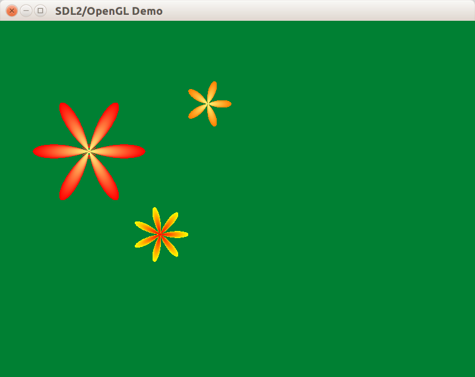
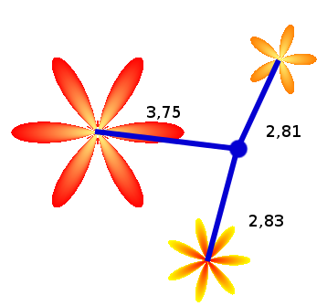
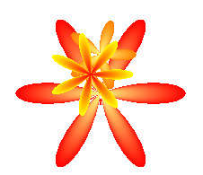

---
---
# Тригонометрия и цветы

В данном уроке мы научимся рисовать цветы с помощью тригонометрии и линейной алгебры, а также добавим к цветам возможность перетаскивания в окне.

## Дисплейные списки

На этот раз мы нарисуем что-нибудь более интересное, а именно вращающиеся «цветочки». Каждый цветочек будет представлен в виде искаженного круга, радиус которого – функция, зависящая от угла. Поскольку рисование круга вовлекает достаточно большое количество вычислений, воспользуемся дисплейными списками ([Display Lists](https://msdn.microsoft.com/en-us/library/dd374300%28v=VS.85%29.aspx)) - возможностью OpenGL, позволяющей сохранить последовательность вызовов функций OpenGL, а затем воспроизвести их произвольное количество раз. Такой подход может ускорить работу нашего приложения в некоторых реализациях OpenGL.

Использовать дисплейные списки очень просто. Сначала нужно сгенерировать имя для дисплейного списка (или нескольких дисплейных списков) при помощи функции [glGenLists](https://msdn.microsoft.com/en-us/library/dd373538%28v=VS.85%29.aspx). Затем вызвать команды OpenGL между вызовами функций [glNewList](https://msdn.microsoft.com/en-us/library/dd373951%28v=VS.85%29.aspx) и glEndList. Воспроизвести записанную последовательность команд OpenGL можно при помощи функции [glCallList](https://msdn.microsoft.com/en-us/library/dd318369%28v=VS.85%29.aspx) или glCallLists.

Реализуем данный функционал внутри класса CFlower:

```cpp
#pragma once

#include <glm/vec3.hpp>
#include <boost/noncopyable.hpp>

class CFlower : private boost::noncopyable
{
public:
    CFlower() = default;
    virtual ~CFlower();

    void SetupShape(float minRadius, float maxRadius, int petalCount);
    void SetCenterColor(const glm::vec3 &centerColor);
    void SetPetalColor(const glm::vec3 &petalColor);

    virtual void Draw()const;
    virtual bool HitTest(const glm::vec2 &point)const;

private:
    void DeleteList();
    void Redraw()const;
    float GetRadiusByAngle(float angle) const;

    mutable unsigned m_displayList = 0;
    float m_minRadius = 0;
    float m_maxRadius = 0;
    int m_petalCount = 0;
    glm::vec3 m_centerColor;
    glm::vec3 m_petalColor;
};
```

Дисплейный список &mdash; это ресурс, который нуждается в удалении. Поэтому в деструкторе мы будем проверять и очищать ресурс.

```cpp
CFlower::~CFlower()
{
    if (m_displayList)
    {
        glDeleteLists(m_displayList, 1);
        m_displayList = 0;
    }
}
```

Метод Draw не занимается непосредственным рисованием: вместо этого он проверяет наличие дисплейного списка, заполняет его при необходимости, а затем просто выполняет список.

```cpp
void CFlower::Draw() const
{
    // если дисплейный список еще не был создан, то для начала создаем его
    if (!m_displayList)
    {
        // Генерируем новый дисплейный список для цветка
        m_displayList = glGenLists(1);
        glNewList(m_displayList, GL_COMPILE);
        // Для заполнения списка вызываем redraw.
        Redraw();
        // завершаем дисплейный список
        glEndList();
    }

    // вызываем ранее созданный дисплейный список
    glCallList(m_displayList);
}
```

## Рисуем цветок

Метод Redraw выполняет прямое рисование цветка. Отметим, что центр цветка в его локальной системе координат всегда лежит в точке (0, 0, 0). Для помещения цветка в нужное место мы в дальнейшем воспользуемся матрицей моделирования вида (но об этом чуть позже).

```cpp
void CFlower::Redraw() const
{
    // угловой шаг (для рисования каждого лепестка
    // нам понадобится как минимум 20 вершин)
    const float step = float(2 * M_PI) / float(m_petalCount * 20);

    glBegin(GL_TRIANGLE_FAN);

    // центральная вершина будет иметь цвет m_centerColor
    glColor3f(m_centerColor.x, m_centerColor.y, m_centerColor.z);
    glVertex2f(0, 0);

    // вершины лепестка будут иметь цвет m_petalColor
    glColor3f(m_petalColor.x, m_petalColor.y, m_petalColor.z);
    for (float angle = 0; angle <= float(2 * M_PI) + 0.5f * step; angle += step)
    {
        // в дискретном мире компьютеров sin(2 * PI) может отличаться
        // от sin(0). Поэтому если angle подошел близко к 2*PI,
        // считаем его равным 0
        // это нужно для того, чтобы начало и конец веера
        // сошлись в одной точке
        float fixedAngle = (fabsf(angle - float(2 * M_PI)) < 1e-4f) ? 0 : angle;

        // вычисляем радиус искривленной окружности для данного угла
        float radius = GetRadiusByAngle(fixedAngle);
        float x = radius * cosf(fixedAngle);
        float y = radius * sinf(fixedAngle);

        // создаем новую вершину
        glVertex2f(x, y);
    }

    glEnd();
}

float CFlower::GetRadiusByAngle(float angle)const
{
    // вычисляем радиус искривленной окружности для данного угла.
    return 0.5f * (m_maxRadius - m_minRadius)
            * cosf(angle * m_petalCount) + m_minRadius;
}
```

Теперь можно создать несколько цветов:

```cpp
const glm::vec3 LIGHT_YELLOW = { 1.f, 1.f, 0.5f};
const glm::vec3 RED = {1, 0, 0};
const glm::vec3 ORANGE = {1.f, 0.5f, 0.f};
const glm::vec3 YELLOW = {1.f, 1.f, 0.f};
const glm::vec4 QUIET_GREEN = {0.f, 0.5f, 0.2f, 1.f};
{
    auto pFlower = std::make_unique<CMovableFlower>();
    pFlower->SetupShape(40, 150, 6);
    pFlower->SetCenterColor(LIGHT_YELLOW);
    pFlower->SetPetalColor(RED);
    m_flowers.push_back(std::move(pFlower));
}
{
    auto pFlower = std::make_unique<CMovableFlower>();
    pFlower->SetupShape(20, 60, 5);
    pFlower->SetCenterColor(LIGHT_YELLOW);
    pFlower->SetPetalColor(ORANGE);
    m_flowers.push_back(std::move(pFlower));
}
{
    auto pFlower = std::make_unique<CMovableFlower>();
    pFlower->SetupShape(25, 70, 7);
    pFlower->SetCenterColor(RED);
    pFlower->SetPetalColor(YELLOW);
    m_flowers.push_back(std::move(pFlower));
}
SetBackgroundColor(QUIET_GREEN);
```

После запуска увидим такой результат:


## Помещаем цветок на клумбе

Очевидно, нас не устраивает ситуация, когда все цветы сжались в левом верхнем углу экрана. Можно создать новый класс `CMovableFlower`, который даст цветам возможность перемещения. Линейная алгебра и OpenGL дают нам возможность реализовать перемещение, не модифицируя код класса `CFlower`! Таким будет объявление класса:

```cpp
#pragma once

#include "Flower.h"
#include <glm/vec2.hpp>

class CMovableFlower : public CFlower
{
public:
    CMovableFlower() = default;

    void Draw()const override;
    bool HitTest(const glm::vec2 &point)const  override;

    const glm::vec2 &GetPosition()const;
    void SetPosition(const glm::vec2 &position);

private:
    glm::vec2 m_position;
};
```

Для этого мы воспользуемся возможностью установки матриц, которую раньше применяли для настройки проецирования изображения в кадр. Сейчас мы установим матрицу GL_MODELVIEW, при этом переключать режим матрицы с помощью `glMatrixMode(GL_MODELVIEW)` не надо, потому что по умолчанию этот режим уже выставлен.

Для смещения позиции цветка нам нужна трансформация перемещения (*англ.* translate transform) на вектор (x, y, 0). Эту матрицу мы установим как текущую, и в целях простоты проигнорируем ранее существовавшую матрицу.

```cpp
void CMovableFlower::Draw() const
{
    // Модифицируем Model-View матрицу,
    // теперь она задаёт перемещение на вектор (x, y, 0)
    glm::vec3 offset = { m_position.x, m_position.y, 0.f };
    glm::mat4 transform = glm::translate(glm::mat4(), offset);
    // Сохраняем старую матрицу в стек матриц драйвера
    glPushMatrix();
    glLoadMatrixf(glm::value_ptr(transform));
    // Способ рисования не изменился
    CFlower::Draw();
    // Извлекаем старую матрицу из стека матриц драйвера
    glPopMatrix();
}
```

После замены `CFlower` на `CMovableFlower`, установки позиций трём цветкам и запуска программы получим:



## Drag&Drop для цветов

Садоводы вряд ли обрадуются клубме, которую нельзя улучшить. Давайте добавим возможность перетаскивания цветов мышью, чтобы обрадовать всех садоводов страны. Вот что следует сделать:

- Добавить в классы `CFlower` и `CMovableFlower` виртуальный метод HitTest, который будет производить pixel-perfect проверку пересечения точки и цветка.
- Изменить функцию `sdl::DispatchEvent`, чтобы обработка Drag&Drop была удобнее
- Добавить в `CWindow` обработчики событий, позволяющие реализовать захват и перетаскивание цветка.

Спецификация метода HitTest будет выглядеть примерно так:
```cpp
class CFlower
{
public:
    // остальной код пропущен
    virtual bool HitTest(const glm::vec2 &point)const;
};

class CMovableFlower
{
public:
    // остальной код пропущен
    bool HitTest(const glm::vec2 &point)const override;
};
```

Реализовать `CMovableFlower::HitTest` легко:

```cpp
bool CMovableFlower::HitTest(const glm::vec2 &point) const
{
    // вызываем CFlower::HitTest со смещённой проверяемой точкой.
    return CFlower::HitTest(point - m_position);
}
```

В случае с `CFlower`, точная проверка попадания точки требует применения тригонометрии. Общая идея такова: возьмём вектор от центра цветка к позиции курсора, и переведём этот вектор в полярные координаты, т.е. представим вектор как пару `{угол, длина вектора}`. Зная угол, мы можем вычислить переменный радиус цветка для этого угла. Зная радиус и длину вектора, мы можем просто сравнить их и точно определить, попадает ли точка в цветок. Проиллюстрируем идею:



#### метод CFlower::HitTest
```cpp
bool CFlower::HitTest(const glm::vec2 &point) const
{
    // центр всегда в точке (0, 0), так что вектор от центра
    // к point равен point; извлекаем полярный угол этого вектора.
    const float angle = std::atan2(point.y, point.x);
    const float radius = GetRadiusByAngle(angle);

    // Если длина вектора меньше радиуса, есть попадание.
    // Мы используем `glm::length` вместо point.length(), потому что
    // point.length() вернёт число компонентов вектора, т. е. число 2.
    return (glm::length(point) < radius);
}
```

Теперь изменим `sdl::DispatchEvent`, но сначала упростим интерфейс `IInputEventAcceptor`:

#### класс IInputEventAcceptor
```cpp
// Принимает события SDL, разделённые по категориям.
// Деление условное и может быть изменено.
class IInputEventAcceptor
{
public:
    virtual ~IInputEventAcceptor() = default;

    virtual void OnDragBegin(const glm::vec2 &pos) { (void)pos; }
    virtual void OnDragMotion(const glm::vec2 &pos) { (void)pos; }
    virtual void OnDragEnd(const glm::vec2 &pos) { (void)pos; }
    virtual void OnKeyDown(const SDL_KeyboardEvent &) {}
    virtual void OnKeyUp(const SDL_KeyboardEvent &) {}
};
```

Новая диспетчеризация событий:

#### листинг DispatchEvent.cpp
```cpp
#include "stdafx.h"
#include "DispatchEvent.h"

namespace
{
glm::vec2 GetMousePosition(const SDL_MouseButtonEvent &event)
{
    return { event.x, event.y };
}

glm::vec2 GetMousePosition(const SDL_MouseMotionEvent &event)
{
    return { event.x, event.y };
}
}

void sdl::DispatchEvent(const SDL_Event &event, IInputEventAcceptor &acceptor)
{
    switch (event.type)
    {
    case SDL_KEYDOWN:
        acceptor.OnKeyDown(event.key);
        break;
    case SDL_KEYUP:
        acceptor.OnKeyUp(event.key);
        break;
    case SDL_MOUSEBUTTONDOWN:
        acceptor.OnDragBegin(GetMousePosition(event.button));
        break;
    case SDL_MOUSEBUTTONUP:
        acceptor.OnDragEnd(GetMousePosition(event.button));
        break;
    case SDL_MOUSEMOTION:
        acceptor.OnDragMotion(GetMousePosition(event.motion));
        break;
    }
}
```

#### класс CWindow

```cpp
class CWindow : public CAbstractInputControlWindow
{
public:
    CWindow();

protected:
    // CAbstractWindow interface
    void OnUpdateWindow(float deltaSeconds) override;
    void OnDrawWindow(const glm::ivec2 &size) override;
    
    // IInputEventAcceptor interface
    void OnDragBegin(const glm::vec2 &pos) override;
    void OnDragMotion(const glm::vec2 &pos) override;
    void OnDragEnd(const glm::vec2 &pos) override;

private:
    void SetupView(const glm::ivec2 &size);

    std::vector<std::unique_ptr<CMovableFlower>> m_flowers;
    CMovableFlower *m_draggingFlower = nullptr;
};
```

В методе OnDragBegin мы должны найти цветок, который задет курсором, при этом массив цветов следует обходить в порядке, обратном рисованию &mdash; иначе при наложении цветов не получится схватить тот цветок, который визуально лежит сверху:



Реализовать такой обход можно на итераторах и сырых циклах, но в современном C++ принято вместо этого использовать функциональные алгоритмы и интервалы. Воспользуемся инвертирующим адаптером `boost::adaptors::reverse` и алгоритмом `find_if`, соединённым с лямбда-функцией:

#### методы OnDrag*
```cpp
#include <boost/range/algorithm/find_if.hpp>
#include <boost/range/adaptor/reversed.hpp>

void CWindow::OnDragBegin(const glm::vec2 &pos)
{
    auto flowers = boost::adaptors::reverse(m_flowers);
    auto it = boost::find_if(flowers, [&](const auto &pFlower) {
        return pFlower->HitTest(pos);
    });
    if (it != flowers.end())
    {
        m_draggingFlower = it->get();
    }
}

void CWindow::OnDragMotion(const glm::vec2 &pos)
{
    if (m_draggingFlower)
    {
        m_draggingFlower->MoveTo(pos);
    }
}

void CWindow::OnDragEnd(const glm::vec2 &pos)
{
    if (m_draggingFlower)
    {
        m_draggingFlower->MoveTo(pos);
        m_draggingFlower = nullptr;
    }
}
```

## Финальные улучшения

Текущая реализация содержит один баг: при захвате цветка происходит скачок. Баг связан с тем, что мы хватаем цветок за произвольную точку, а перемещение применяем к центру, не учитывая разницу между точкой захвата и центром цвета.

Подумайте, как можно исправить этот баг с помощью нового поля `glm::vec2 m_dragOffset` класса `CWindow`.

Своё решение можете сравнить с [полным примером к уроку на github](https://github.com/PS-Group/cg_course_examples/tree/master/lesson_4).
