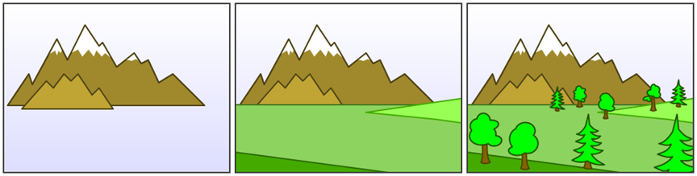
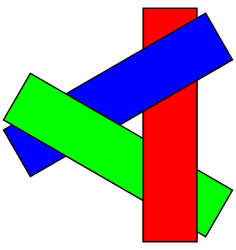
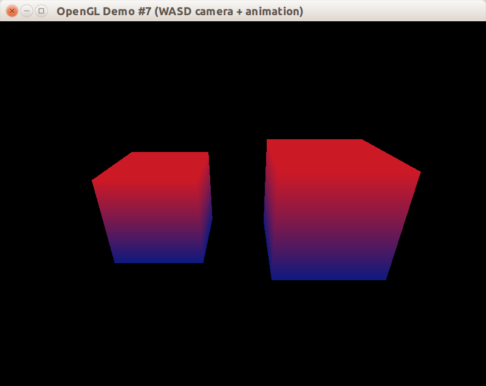

В этом уроке мы научимся рисовать простой трёхмерный объект &mdash; куб. Также мы установим неподвижную виртуальную камеру, позволяющую взглянуть на куб от лица зрителя в трёхмерном мире.

## Вершины куба

В чём OpenGL измеряет расстояния в трёхмерном мире? В 2D графике всё понятно: у нас есть пиксели. На трёхмерной проекции объекты одинакового размера могут дать разные проекции из-за перспективного искажения: чем дальше поверхность или линия, тем она меньше. Поэтому OpenGL измеряет расстояния в единицах измерения, не уточняя, в каких именно. Вы можете измерять в метрах, попугаях или в футах &mdash; на картинке это не имеет разницы, потому что исходные размеры не совпадают с проекциями.

Кроме того, трёхмерные тела поддаются преобразованиям. Поэтому мы будем рисовать только единичный куб и не станем заботиться о поддержке масштаба, вращения и положения центра куба. Единичный куб лежит в координатах от -1 до +1, т.е. каждое ребро имеет длину 2.

```cpp
struct Vertex
{
    glm::vec3 pos;
    glm::vec3 color;
};

const glm::vec3 DARK_GREEN = {0.05f, 0.45f, 0.1f};
const glm::vec3 LIGHT_GREEN = {0.1f, 0.8f, 0.15f};

// Вершины куба служат материалом для формирования треугольников,
// составляющих грани куба.
const Vertex CUBE_VERTICIES[] = {
    { {-1, +1, -1}, DARK_GREEN},
    { {+1, +1, -1}, DARK_GREEN},
    { {+1, -1, -1}, DARK_GREEN},
    { {-1, -1, -1}, DARK_GREEN},
    { {-1, +1, +1}, LIGHT_GREEN},
    { {+1, +1, +1}, LIGHT_GREEN},
    { {+1, -1, +1}, LIGHT_GREEN},
    { {-1, -1, +1}, LIGHT_GREEN},
};
```

## Триангуляция куба

После того, как выписали список вершин куба, следует разпределить вершины по треугольникам. У куба 6 квадратных граней, их можно описать 12-ю треугольниками. При этом вершины каждого треугольника следует перечислять по часовой стрелке для наблюдателя, смотрящего снаружи куба на этот треугольник. В противном случае треугольник станет поверхностью, видимой изнутри куба, что нарушает физические законы.

Процесс разделения поверхности на треугольники называют *триангуляцией* (*англ.* triangulation). Для упрощения этого процесса сделаем визуализацию куба с вершинами, нумерованными в том же порядке, в котором они были перечислены ранее:


Теперь, глядя на иллюстрацию, можно перечислить все 12 треугольников, составляющих 6 граней.

```cpp
// Привыкаем использовать 16-битный unsigned short,
// чтобы экономить память на фигурах с тысячами вершин.
const uint16_t CUBE_INDICIES[] = {
    0, 1, 2,
    0, 2, 3,
    2, 1, 5,
    2, 5, 6,
    3, 2, 6,
    3, 6, 7,
    0, 3, 7,
    0, 7, 4,
    1, 0, 4,
    1, 4, 5,
    6, 5, 4,
    6, 4, 7,
};
```

## Рисование в Immediate Mode

Для непосредственного рисования граней куба мы применим не самый производительный метод, который к тому же устарел в современных версиях OpenGL: рисование в блоке glBegin/glEnd, также известное как OpenGL Immediate Mode.

```cpp
void CIdentityCube::Draw()
{
    // менее оптимальный способ рисования: прямая отправка данных
    // могла бы работать быстрее, чем множество вызовов glColor/glVertex.
    glBegin(GL_TRIANGLES);
    for (uint16_t i : CUBE_INDICIES)
    {
        const Vertex &v = CUBE_VERTICIES[i];
        glColor3f(v.color.x, v.color.y, v.color.z);
        glVertex3f(v.pos.x, v.pos.y, v.pos.z);
    }
    glEnd();
}
```

## Настройка камеры

В OpenGL с фиксированным конвейером всего две матрицы, относящихся к трансформациям точек и объектов:

- GL_PROJECTION моделирует ортографическое или перспективное преобразование
- GL_MODELVIEW сочетает в себе два преобразования: от локальных координат объекта к мировым координатам, а также от мировых координат к координатам камеры.

За рамками фиксированного конвейера можно использовать столько матриц, сколько захочется &mdash; но сейчас мы ограничены. Кроме того, нам приходится смешивать матрицы: поведение камеры описывается как ортографическим или перспективным преобразованием, так и положением камеры в мировом пространстве, то есть для моделирования камеры нужны GL_PROJECTION и GL_MODELVIEW одновременно. С другой стороны, для трансформаций над телами &mdash; например, вращения куба с помощью умножения координат на матрицу &mdash; нам нужна матрица GL_MODELVIEW. Получается такая картина:

- матрицу GL_PROJECTION обычно настраивают один раз для перспективного преобразования
- матрицу GL_MODELVIEW постоянно модифицируют, когда локальная система координат очередного объекта не совпадает с мировой системой координат

Начнём с GL_MODELVIEW: зададим матрицу так, как будто бы камера смотрит с позиции `eye` на точку `center`, при этом направление "вверх" камеры задаёт вектор `up`:


```cpp
void CWindow::SetupView(const glm::ivec2 &size)
{
    glViewport(0, 0, size.x, size.y);

    const glm::vec3 eye = {4, -4, 2};
    const glm::vec3 center = {0, 0, 0};
    const glm::vec3 up = {0, 0, 1};
    // Матрица моделирования-вида вычисляется функцией glm::lookAt.
    const glm::mat4 mv = glm::lookAt(eye, center, up);
    glLoadMatrixf(glm::value_ptr(mv));
    // ... настройка матрицы GL_PROJECTION
}
```

Для перспективного преобразования достаточно создать матрицу с помощью функции `glm::perspective`. Она принимает на вход несколько удобных для программиста параметров преобразования: горизонтальный угол обзора камеры (*англ.* field of view), соотношение ширины и высоты (*англ.* aspect), а также две граничных координаты для отсечения слишком близких к камере и слишком далёких от камеры объектов. Для лучшего понимания взгляните на иллюстрацию:


```cpp
void CWindow::SetupView(const glm::ivec2 &size)
{
    glViewport(0, 0, size.x, size.y);

    // ... настройка матрицы GL_MODELVIEW

    // Матрица перспективного преобразования вычисляется функцией
    // glm::perspective, принимающей угол обзора, соотношение ширины
    // и высоты окна, расстояния до ближней и дальней плоскостей отсечения.
    const float fieldOfView = glm::radians(70.f);
    const float aspect = float(size.x) / float(size.y);
    const float zNear = 0.01f;
    const float zFar = 100.f;
    const glm::mat4 proj = glm::perspective(fieldOfView, aspect, zNear, zFar);
    glMatrixMode(GL_PROJECTION);
    glLoadMatrixf(glm::value_ptr(proj));
    glMatrixMode(GL_MODELVIEW);
}
```

## Решение проблем невидимых поверхностей

При программном рисовании трёхмерного мира, состоящего из объемных тел с непрерывной поверхностью (*англ.* solid bodies), возникает вопрос: как не нарисовать невидимые поверхности? Например, на рисунке горы, покрытой лесом, мы не должны увидеть ни деревьев на противоположном к нам склоне, ни поверхности самого склона.

У художников для решения задачи есть свой алгоритм: сначала они рисуют композицию заднего фона, затем сверху покрывают средний фон, и, наконец, выводят передний фон:



Этот алгоритм так и называется &mdash; "алгоритм художника" (*англ.* painter's algorithm). В компьютерной графике он иногда применим, но с модификацией: вместо деления объектов на три группы (задний фон, средний фон и передний фон) придётся отсортировать все объекты и вывести их в порядке приближения. К сожалению, не всегда объекты воможно отсортировать: это известно как "проблема художника" (*англ.* painter's problem).



Для решения проблемы художника в OpenGL сделано следующее:

- все поверхности представляются как базовые примитивы: в ранних версиях OpenGL это были точки, линии, треугольники и четырёхугольники, а в более поздних остались только треугольники
- используется тест буфера глубины, т.е. модификация алгоритма художника, работающая с неделимыми фрагментами фигур
- используется отсечение граней, развернувшихся невидимой стороной после умножения на матрицы GL_MODELVIEW и GL_PROJECTION

## Тест буфера глубины


Буфер глубины OpenGL &mdash; это двумерная матрица дополнительных данных, где каждому пикселю соответствует одно значение float: глубина фрагмента примитива, оказавшегося ближе к пикселю, чем остальные фрагменты примитивов, проецируемые на тот же пиксель. Это позволяет реализовать попиксельный алгоритм художника: после приведения в нормализованное пространство каждая примитивная фигура будет разбита на фрагменты, для которых будет проведён тест глубины.

Фрагмент &mdash; это атомарная, то есть неделимая, часть фигуры. Если видеокарта не совершает сглаживание, то один фрагмент станет одним пикселем фигуры.

Тест глубины прост: если фрагмент в нормализованном пространтсве стал ближе, чем последнее значение буфера глубины, то мы выбираем его и обновляем значение в буфере глубины, иначе мы отбрасываем фрагмент. В псевдокоде способ выглядит так:

```python
for fragment in triangle.rasterize():
    index = (round(fragment.x), round(fragment.y))
    if depthBuffer[index] > fragment.depth:
        depthBuffer[index] = fragment.depth
    else
        discard fragment
```

Как и любой буфер, буфер глубины следует очищать: для этого вызов `glClear` должен получать ещё один флаг `GL_DEPTH_BUFFER_BIT`:
```cpp
void Clear()const
{
    // Заливка кадра цветом фона средствами OpenGL
    glClearColor(m_clearColor.x, m_clearColor.y, m_clearColor.z, m_clearColor.w);
    glClear(GL_COLOR_BUFFER_BIT | GL_DEPTH_BUFFER_BIT);
}
```

Также нужно после создания контекста включить режим теста глубины командой glEnable:
```cpp
glEnable(GL_DEPTH_TEST);
```

## Отсечение задних граней

OpenGL расчитан на дополнительное отсечение невидимых поверхностей, построенное по принципу отсечения задних граней. По умолчанию включён режим, аналогичный вызову `glFrontFace(GL_CCW)`, и OpenGL делит примитивы на две группы:

- те, вершины которых перечисляются против часовой стрелки (GL_CCW), становятся передними гранями (GL_FRONT)
- те, вершины которых перечисляются по часовой стрелке (GL_CW), становятся задним гранями (GL_BACK)

Вызов `glFrontFace(GL_CW)` изменит классификацию на обратную: перечисление по часовой даст переднюю грань, перечисление против часовой даст заднюю.

Независимо от того, в каком порядке были заданы исходные вершины, если после всех преобразований грань объёмного тела повёрнута к нам лицевой стороной &mdash; порядок обхода сохранится, а если её перекроют другие грани &mdash; порядок обхода сменится на противоположный.

Режим отсечения граней можно включить командой `glEnable(GL_CULL_FACE)`, после чего можно выбрать способ отсечения: убирать задние грани (GL_BACK), передние грани (GL_FRONT) или оба вида граней (GL_FRONT_AND_BACK).

Соберём всю инициализацию состояния OpenGL в метод OnWindowInit, который будет вызываться один раз поле инициализации окна

```cpp
void CWindow::OnWindowInit(const glm::ivec2 &size)
{
    (void)size;
    glEnable(GL_DEPTH_TEST);
    glEnable(GL_CULL_FACE);
    glFrontFace(GL_CCW);
    glCullFace(GL_BACK);
}
```

Чтобы метод `OnWindowInit` был вызван своевременно, его можно объявить виртуальным в классе CAbstractWindow и вызывать в методе Show:

```cpp
void CAbstractWindow::Show(const glm::ivec2 &size)
{
    m_pImpl->Show(size);
    OnWindowInit(size);
}
```

## Диагностика проблем

При выводе трёхмерных тел встречается ряд типовых ошибок. Если что-то не работает, пройдитесь по следующему чеклисту:

- вы не забыли вызвать glBegin/glEnd до и после вызова glColor/glVertex?
- тело не выпадает из порта просмотра из-за матрицы GL_PROJECTION?
- тело не обрезается дальней и ближней плоскостями отсечения из-за матрицы GL_PROJECTION?
- в массиве индексов нумерация вершин начинается с нуля?
- включён тест глубины и режим отсечения задних граней?
- в массиве индексов вершины примитивов (треугольников и четырёхугольников) перечислены по часовой стрелке для внешнего наблюдателя?

## Результат

Вы можете взять [полный пример к уроку на github](https://github.com/PS-Group/cg_course_examples/tree/master/lesson_7). А вот так выглядит окно после запуска, без освещения и настройки камеры:


