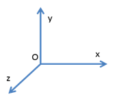
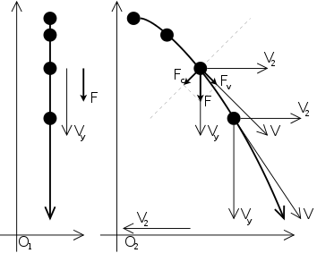
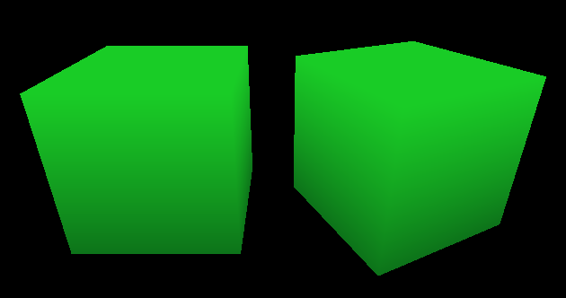

В этом уроке мы разберём математические приниципы, стоящие за преобразованиями координат в OpenGL. Также мы научимся применять простые трансформации к объектам и придавать движение камере.

## Трёхмерная система координат

В OpenGL используется правосторонняя система координат, в которых пользователь может задавать вершины примитивов, из которых состоят трехмерные объекты. Правосторонней система координат называется потому, что ее можно образовать при помощи большого, указательного и среднего пальцев правой руки, задающих направления координатных осей X, Y и Z соответственно.



Система координат задаётся точкой отсчёта и координатными осями, которые, в свою очередь, задают направления и длины трёх единичных векторов (1, 0, 0), (0, 1, 0) и (0, 0, 1). Как точка отсчёта, так и координатные оси могут меняться при переходе из одной системы координат в другую.

Например, представьте себе систему координат комнаты, где в качестве центра взята точка в геометрическом центре пола, а ось z указывает вверх, и расстояния измеряются в метрах. Тогда точки головы человека в комнате всегда будут иметь координату z, большую нуля, обычно в диапазоне `(1.6; 1.8)`. Если же перейти в другую систему отсчёта, где центром служит точка в геометрическом центре потолка, то голова человека в комнате будет иметь отрицательную координату z.

В любой трёхмерной сцене есть система координат, которую можно считать **мировой** системой коодинат. Это очень удобно: любая точка или вектор в мировой системе координат представляется однозначно. Благодаря этому, если у нас есть несколько **локальных** систем координат (например: комната, салон автомобиля, камера), и мы знаем способ преобразования из любой системы в мировые координаты, то мы можем спокойно перейти, например, от системы координат комнаты к системе координат камеры.

О локальных системах координат можно сказать следующее:

- для перехода к мировой системе координат всегда есть афинное преобразование, состоящее из некоторого числа перемещений, вращений и масштабирований
- если точка отсчёта в разных координатах разная, это можно представить перемещением (*англ.* translate)
- если координатные оси направлены в другие стороны, это можно представить вращением (*англ.* rotate)
- если единицы измерения разные, например, метры в одной системе и километры в другой, это можно представить масштабированием (*англ.* scale)

Самый удивительный факт: любое элементарное трёхмерное преобразование, а также их комбинацию можно представить в виде матрицы 4x4! Чтобы понять, как это происходит, разберёмся с однородным представлением точек и векторов.

## Единый тип данных для точек и векторов

Давайте представим, что нам поставили задачу: создать единый тип данных, способный хранить как трёхмерную точку, так и трёхмерный вектор. Этот тип данных должен поддерживать операции вращения, перемещения и масштабирования, причём по-разному для векторов и точек: например, перемещение вектора никак не меняет его, а перемещение точки изменяет эту точку.

Если использовать процедурную парадигму программирования, получится нечто такое:

```cpp
struct SPointOrVector
{
    float x = 0;
    float y = 0;
    float z = 0;
    bool isVector = false;
};

void RotateZ(const SPointOrVector &x, float angle);
void Translate(const SPointOrVector &x, float x, float y, float z);
void Scale(const SPointOrVector &x, float scale);
```

Объектно-ориентированный подход предлагает такой вариант:

```cpp
class IPrimitive3D
{
public:
    void RotateZ(float angle);
    void Translate(float x, float y, float z);
    void Scale(float scale);
};

class CVector3D : IPrimitive3D
{
    // реализация операций для вектора
};

class CPoint3D : IPrimitive3D
{
    // реализация операций для точки
};
```

Оба подхода одинаково плохи: во-первых, мы в любом случае дублируем код. Во-вторых, на видеокартах с современной архитектурой любое ветвление или условное выполнение оборачивается огромным падением производительности, и желательно его избегать; в данных двух реализациях мы не сможем избежать ветвлений при выполнении трансформаций точек и векторов прямо на видеокарте.

Проблема решается с помощью математического приёма &mdash; однородного представления точек и векторов.

## Однородное представление точек и векторов.

Давайте будем считать, что трёхмерная точка `(x, y, z)` хранится как четырёхкомпонентный вектор `(x, y, z, 1)`. А вектор хранится как `(x, y, z, 0)`. Всего лишь одно флаговое значение в конце позволяет избежать любых ветвлений в алгоритмах трансформации векторов и точек. Это происходит благодаря свойствам алгебры матриц.

Как известно, можно умножить матрицу на матрицу при условии, что ширина одной матрицы равна высоте другой (иначе операция просто недопустима). Для получения элемента с позицией i,j в новой матрице достаточно взять i-ю строку левой матрицы и j-й столбец правой матрицы. Вот пример:

```
| 1 0 0 |   | x 1 |   | 1*x+0*y+0*z 1*1+1*0+0*0 |
| 1 1 1 | * | y 1 | = | 1*x+1*y+1*z 1*1+1*1+1*0 |
| 2 1 1 |   | z 0 |   | 2*x+1*y+1*z 2*1+1*1+1*0 |
```

Как ни странно, умножение 4-х компонентного вектора на матрицу 4x4 тоже возможно! Для этого достаточно считать 4-х компонентный вектор матрицей 4x1. После умножения получится новый 4-х компонентный вектор.

Ещё более удивительно, что любую комбинацию трёхмерных перемещений, поворотов, вращений (и не только их!) можно представить как всего лишь одну матрицу 4x4, называемую матрицей трёхмерной трансформации. При этом умножение матрицы на трёхмерную точки или вектор, записанный в однородном представлении, даёт новую точку или вектор именно так, как этого требуют правила преобразования точек и векторов. Никаких ветвлений, и никакой магии!

## Класс CAnimatedCube

Давайте запомним несколько простых правил. Некоторые из них даже будут доказаны чуть ниже.

- умножение матрицы преобразования на вектор или точку в однородном представлении даёт преобразованный вектор или точку
- можно легко составить базовую матрицу, представляющих одно элементарное афинное преобразование
- умножение матрицы A на матрицу B даёт новую матрицу, которая описывает новую трансформацию, созданную путём применения трансформации B, а затем A (именно в таком порядке)
- умножение матриц не коммутативно: вы не можете заменить `A*B` на `B*A`
- инвертирование матрицы (например, с помощью детерминанта матрицы) даёт матрицу обратной трансформации, которая вернёт точку или вектор в исходное состояние &mdash; в идеальном мире. В дискретном мире компьютеров обратное преобразование может быть чуть-чуть неточным из-за особенностей представления типов float и double.

Для демонстрации этих правил расширим класс CIdentityCube из предыдущего урока. Новый класс будет называться CAnimatedCube, и он будет демонстрировать работу трёх базовых афинных трансформаций. Смена и продвижение анимации будет выполняться в методе Update, вызываемом периодически снаружи.

```cpp
class CAnimatedCube : public CIdentityCube
{
public:
    void Update(float deltaTime);
    void Draw()const;

private:
    enum Animation
    {
        Rotating,
        Pulse,
        Bounce,
    };

    glm::mat4 GetAnimationTransform()const;

    static const float ANIMATION_STEP_SECONDS;
    Animation m_animation = Rotating;
    float m_animationPhase = 0;
};
```

С учётом перечисленных выше правил, мы можем написать метод Draw для анимированного куба. При этом вместо glLoadMatixf следует применить glMultMatrixf, чтобы вместо замены уже существующей трансформации всего лишь модифицировать её. Если мы заменим матрицу GL_MODELVIEW, камера будет работать некорректно.

```cpp
void CAnimatedCube::Draw() const
{
    // метод GetAnimationTransform вычисляет матрицу трансформации.
    const glm::mat4 matrix = GetAnimationTransform();
    glPushMatrix();
    glMultMatrixf(glm::value_ptr(matrix));
    CIdentityCube::Draw();
    glPopMatrix();
}
```

Функции для работы с афинными трансформациями (и не только!) можно найти в GML:

```cpp
#include <glm/gtc/matrix_transform.hpp>

// Документация по функциям для модификации матриц:
// http://glm.g-truc.net/0.9.2/api/a00245.html
```

## Единичная матрица

Единичная матрица (матрица идентичности, *англ.* identity matrix) задает преобразование, при котором точки и векторы остаются без изменений, отображаясь сами в себя. Посмотрите сами на перемножение этой матрицы и точки/вектора:

```
    точка (x, y, z)
| 1 0 0 0 |   | x |   | x |
| 0 1 0 0 |   | y |   | y |
| 0 0 1 0 | * | z | = | z |
| 0 0 0 1 |   | 1 |   | 1 |
    вектор (x, y, z)
| 1 0 0 0 |   | x |   | x |
| 0 1 0 0 |   | y |   | y |
| 0 0 1 0 | * | z | = | z |
| 0 0 0 1 |   | 0 |   | 0 |
```

Если мы не хотим возвращать из метода GetAnimationTransform() какую-либо преобразующую трансформацию, мы можем просто вернуть единичную матрицу. Именно такую матрицу создаёт конструктор по умолчанию класса glm::mat4. Теперь мы можем заложить каркас метода GetAnimationTransform:

```cppч
glm::mat4 CAnimatedCube::GetAnimationTransform() const
{
    switch (m_animation)
    {
    case Rotating:
        return GetRotateZTransfrom(m_animationPhase);
    case Pulse:
        return GetScalingPulseTransform(m_animationPhase);
    case Bounce:
        return GetBounceTransform(m_animationPhase);
    }
    // Недостижимый код - вернём единичную матрицу.
    return glm::mat4();
}
```

## Матрица перемещения

Матрица перемещения воздействует на точку, но вектор сохраняет неизменным. Действует она так:

```
    точка (x, y, z)
| 1 0 0 dx |   | x |   | x + dx |
| 0 1 0 dy |   | y |   | y + dy |
| 0 0 1 dz | * | z | = | z + dz |
| 0 0 0 1  |   | 1 |   | 1      |

    вектор (x, y, z)
| 1 0 0 dx |   | x |   | x |
| 0 1 0 dy |   | y |   | y |
| 0 0 1 dz | * | z | = | z |
| 0 0 0 1  |   | 0 |   | 0 |
```

В GLM есть функция [glm::translate](http://glm.g-truc.net/0.9.2/api/a00245.html#ga4683c446c8432476750ade56f2537397), умножающая переданную матрицу на матрицу перемещения. Чтобы анимировать куб, будем вычислять смещение по оси Ox в каждый момент времени. После этого получение матрицы перемещения будет очень простым:

```cpp
return glm::translate(glm::mat4(), {offset, 0.f, 0.f});
```

Для гладкого движения куба будем использовать прямолинейное равномерно ускоренное движение, аналогичное обычному прыжку или движению мача, брошенного вверх. Вот его иллюстрация в неинерциальной и инерциальной системах отсчёта:



В процессе анимации от 0% до 100% куб должен один или несколько раз прыгнуть в сторону и затем вернуться обратно. Для этого воспользуемся делением с остатком, а также формулой расчёта расстояния на основе начальной скорости и противоположно направленного ускорения. Можно написать так:

```cpp
/// @param phase - Фаза анимации на отрезке [0..1]
glm::mat4 GetBounceTransform(float phase)
{
    // начальная скорость и число отскоков - произвольные константы.
    const int bounceCount = 4;
    const float startSpeed = 15.f;
    // "время" пробегает bounceCount раз по отрезку [0...1/bounceCount].
    const float time = fmodf(phase, 1.f / float(bounceCount));
    // ускорение подбирается так, чтобы на 0.25с скорость стала
    // противоположна начальной.
    const float acceleration = - (startSpeed * 2.f * float(bounceCount));
    // расстояние - результат интегрирования функции скорости:
    //  speed = startSpeed + acceleration * time;
    float offset = time * (startSpeed + 0.5f * acceleration * time);

    // для отскоков с нечётным номером меняем знак.
    const int bounceNo = int(phase * bounceCount);
    if (bounceNo % 2)
    {
        offset = -offset;
    }

    return glm::translate(glm::mat4(), {offset, 0.f, 0.f});
}
```

## Матрица масштабирования

Матрица масштабирования воздействует как на точку, так и на вектор, изменяя соответственно удалённость точки от начала координат и длину вектора. Действует так:

```
    точка (x, y, z)
| sx 0  0  0 |   | x |   | sx*x |
| 0  sy 0  0 |   | y |   | sy*y |
| 0  0  sz 0 | * | z | = | sz*z |
| 0  0  0  1 |   | 1 |   | 1    |

    вектор (x, y, z)
| sx 0  0  0 |   | x |   | sx*x |
| 0  sy 0  0 |   | y |   | sy*y |
| 0  0  sz 0 | * | z | = | sz*z |
| 0  0  0  1 |   | 0 |   | 0    |
```

В GLM есть функция [glm::scale](http://glm.g-truc.net/0.9.2/api/a00245.html#ga6da77ee2c33d0d33de557a37ff35b197), умножающая переданную матрицу на матрицу масштабирования, имеющую потенциально разные коэффициенты масштабирования для трёх разных компонентов вектора.

Давайте используем эту функцию, чтобы реализовать пульсирование куба &mdash; сжатие от нормальных размеров к нулевым и обратно:

```cpp
/// @param phase - Фаза анимации на отрезке [0..1]
glm::mat4 GetScalingPulseTransform(float phase)
{
    // число пульсаций размера - произвольная константа.
    const int pulseCount = 4;
    float scale = fabsf(cosf(float(pulseCount * M_PI) * phase));

    return glm::scale(glm::mat4(), {scale, scale, scale});
}
```


## Матрица поворота

Матрица поворота воздействует и на точку, и на вектор, при этом удалённость точки от начала координат и длина вектора не меняются. Перечислим три матрицы поворота на угол "a" вокруг трёх осей системы координат (посмотреть, что получается при перемножении, вы можете самостоятельно):

```
 поворот вокруг Ox
| 1 0      0       0 |
| 0 cos(a) -sin(a) 0 |
| 0 sin(a) cos(a)  0 |
| 0 0      0       1 |

 поворот вокруг Oy
| cos(a)  0 sin(a) 0 |
| 0       1 0      0 |
| -sin(a) 0 cos(a) 0 |
| 0       0 0      1 |

 поворот вокруг Oz
| cos(a) -sin(a) 0 0 |
| sin(a) cos(a)  0 0 |
| 0      0       1 0 |
| 0      0       0 1 |
```

В GLM есть функция [glm::rotate](http://glm.g-truc.net/0.9.2/api/a00245.html#ga48168ff70412019857ceb28b3b2b1f5e), умножающая переданную матрицу на матрицу поворота вокруг переданного произвольного вектора оси на переданный угол. Как уже было сказано ранее, следует настроить GLM так, чтобы углы выдавались в радианах &mdash; иначе вы будете получать предупреждения об использовании устаревшего API. Проверьте, что в `stdafx.h` перед включением GLM объявлен макрос GLM_FORCE_RADIANS:

```cpp
#define GLM_FORCE_RADIANS
#include <glm/vec2.hpp>
#include <glm/vec3.hpp>
#include <glm/vec4.hpp>
#include <glm/mat4x4.hpp>
#include <glm/gtc/type_ptr.hpp>
#include <glm/gtc/matrix_transform.hpp>
```

Матрицы поворота сложнее масштабирования или перемещения, но применить их для анимации проще: нужно всего лишь задать скорость поворота такой, чтобы за время анимации куб повернулся целое число раз:

```cpp
/// @param phase - Фаза анимации на отрезке [0..1]
glm::mat4 GetRotateZTransfrom(float phase)
{
    // угол вращения вокруг оси Z лежит в отрезке [0...2*pi].
    const float angle = float(2 * M_PI) * phase;

    return glm::rotate(glm::mat4(), angle, {0, 0, 1});
}
```

Вот так это будет выглядеть к концу урока:



## Как создать камеру

В OpenGL в режиме версии 1.x есть две трансформирующих вершины матрицы: GL_MODELVIEW и GL_PROJECTION. Матрица GL_MODELVIEW объединяет к себе как переход от локальной системы координат к мировой (Model), так и переход от мировых координат к системе коодинат камеры (View). Класс `CCamera` будет возвращать только одну компоненту GL_MODELVIEW: матрицу вида, созданную функцией [glm::lookAt](http://glm.g-truc.net/0.9.2/api/a00245.html#ga2d6b6c381f047ea4d9ca4145fed9edd5).

Правила движения камеры будут следующими:

- камера всегда смотрит на точку (0, 0, 0), вращается вокруг неё, приближается к ней или отдаляется
- для вращения камеры служат клавиши "Влево" и "Вправо" либо "A" и "D" на клавиатуре
- для приближения и отдаления служат клавиши "Вперёд" и "Назад" либо "W" и "S" на клавиатуре
- камера не может приближаться ближе чем на `1.5f` и не может отдаляться дальше чем на `30.f`
- камера не должна двигаться рывками, и даже при неравных интервалах перерисовки кадра движение должно оставаться плавным, т.е. зависет от `deltaTime` между кадрами

С учётом сказанного, спроектируем следующий интерфейс класса:

```cpp
#pragma once

#include <glm/fwd.hpp>
#include <SDL2/SDL_events.h>
#include <boost/noncopyable.hpp>
#include <set>

class CCamera : private boost::noncopyable
{
public:
    explicit CCamera(float rotationRadians, float distance);

    void Update(float deltaSec);
    bool OnKeyDown(const SDL_KeyboardEvent &event);
    bool OnKeyUp(const SDL_KeyboardEvent &event);

    glm::mat4 GetViewTransform() const;

private:
    float m_rotationRadians = 0;
    float m_distance = 1;
    std::set<unsigned> m_keysPressed;
};
```

Методы Update, OnKeyDown, OnKeyUp должны вызываться извне &mdash; например, из класса окна. При этом методы обработки событий возвращают true, если событие было обработано, чтобы класс окна мог не рассылать это событие далее другим объектам.

Внутри класс хранит угол поворота камеры, отдаление от центра мира и подмножество клавиш, которые сейчас нажаты. Хранение подмножества нажатых клавиш позволяет легко устранить ряд непростых случаев:

- пользователь нажал "Влево", затем "Вправо", потом отпустил "Влево"; после этого камера должна вращаться вправо
- пользователь нажал "Влево" и "Вперёд"; после этого камера должна вращаться влево и при этом приближаться
- пользователь нажал "Вперёд" и "Назад"; при этом камера может не двигаться или двигаться в одном приоритетном направлении &mdash; оба варианта хороши

Чтобы отслеживать нажатие только нужных клавиш, создадим функцию-предикат ShouldTrackKeyPressed:

```cpp
bool ShouldTrackKeyPressed(const SDL_Keysym &key)
{
    switch (key.sym)
    {
    case SDLK_LEFT:
    case SDLK_RIGHT:
    case SDLK_UP:
    case SDLK_DOWN:
    case SDLK_w:
    case SDLK_a:
    case SDLK_s:
    case SDLK_d:
        return true;
    }
    return false;
}
```

Также подключим заголовок с функциями вращения вектора, введём вспомогательные константы и функции, позволяющие получить скорость поворота и скорость приближения (возможно, нулевые или отрицательные) на основе информации о нажатых клавишах:

```cpp
#include <glm/gtx/rotate_vector.hpp>

namespace
{
const float ROTATION_SPEED_RADIANS = 1.f;
const float LINEAR_MOVE_SPEED = 5.f;
const float MIN_DISTANCE = 1.5f;
const float MAX_DISTANCE = 30.f;

float GetRotationSpeedRadians(std::set<unsigned> & keysPressed)
{
    if (keysPressed.count(SDLK_RIGHT) || keysPressed.count(SDLK_d))
    {
        return ROTATION_SPEED_RADIANS;
    }
    if (keysPressed.count(SDLK_LEFT) || keysPressed.count(SDLK_a))
    {
        return -ROTATION_SPEED_RADIANS;
    }
    return 0;
}

float GetLinearMoveSpeed(std::set<unsigned> & keysPressed)
{
    if (keysPressed.count(SDLK_UP) || keysPressed.count(SDLK_w))
    {
        return -LINEAR_MOVE_SPEED;
    }
    if (keysPressed.count(SDLK_DOWN) || keysPressed.count(SDLK_s))
    {
        return +LINEAR_MOVE_SPEED;
    }
    return 0;
}
} // anonymous namespace
```

После этого с небольшим применением линейной алгебры мы можем реализовать методы класса CCamera:

```cpp
CCamera::CCamera(float rotationRadians, float distance)
    : m_rotationRadians(rotationRadians)
    , m_distance(distance)
{
}

void CCamera::Update(float deltaSec)
{
    m_rotationRadians += deltaSec * GetRotationSpeedRadians(m_keysPressed);
    m_distance += deltaSec * GetLinearMoveSpeed(m_keysPressed);
    m_distance = glm::clamp(m_distance, MIN_DISTANCE, MAX_DISTANCE);
}

bool CCamera::OnKeyDown(const SDL_KeyboardEvent &event)
{
    if (ShouldTrackKeyPressed(event.keysym))
    {
        m_keysPressed.insert(unsigned(event.keysym.sym));
        return true;
    }
    return false;
}

bool CCamera::OnKeyUp(const SDL_KeyboardEvent &event)
{
    if (ShouldTrackKeyPressed(event.keysym))
    {
        m_keysPressed.erase(unsigned(event.keysym.sym));
        return true;
    }
    return false;
}

glm::mat4 CCamera::GetViewTransform() const
{
    glm::vec3 direction = {-1.f, 0.f, 0.5f};
    // Нормализуем вектор (приводим к единичной длине),
    // затем поворачиваем вокруг оси Z.
    // см. http://glm.g-truc.net/0.9.3/api/a00199.html
    direction = glm::rotateZ(glm::normalize(direction), m_rotationRadians);

    const glm::vec3 eye = direction * m_distance;
    const glm::vec3 center = {0, 0, 0};
    const glm::vec3 up = {0, 0, 1};

    // Матрица моделирования-вида вычисляется функцией glm::lookAt.
    // Она даёт матрицу, действующую так, как будто камера смотрит
    // с позиции eye на точку center, а направление "вверх" камеры равно up.
    return glm::lookAt(eye, center, up);
}
```

## Изменения в CWindow

Теперь класс CWindow должен хранить три объекта:

```cpp
CAnimatedCube m_dynamicCube;
CIdentityCube m_staticCube;
CCamera m_camera;
```

Конструктор CCamera требует два аргумента, их можно задать следующим образом:

CWindow::CWindow()
    : m_camera(CAMERA_INITIAL_ROTATION, CAMERA_INITIAL_DISTANCE)
{
    SetBackgroundColor(QUIET_GREEN);
}

В методе OnUpdateWindow мы должны вызывать метод Update у всех трёх объектов системы:

```cpp
void CWindow::OnUpdateWindow(float deltaSeconds)
{
    m_camera.Update(deltaSeconds);
    m_dynamicCube.Update(deltaSeconds);
    m_staticCube.Update(deltaSeconds);
}
```

В методе Draw немного схитрим: применим вызов glTranslate (вместо нормальной работы с функциями GLM), чтобы развести два куба в стороны:

```cpp
void CWindow::OnDrawWindow(const glm::ivec2 &size)
{
    SetupView(size);

    // Смещаем анимированный единичный куб в другую сторону
    glPushMatrix();
    glTranslatef(0, -1.5f, 0);
    m_dynamicCube.Draw();
    glPopMatrix();

    // Смещаем статический единичный куб в другую сторону
    glPushMatrix();
    glTranslatef(0, 1.5f, 0);
    m_staticCube.Draw();
    glPopMatrix();
}
```

Метод SetupView станет проще, потому что мы можем не вычислять матрицу GL_MODELVIEW, а получить её начальное (для кадра) значение у камеры.

```cpp
void CWindow::SetupView(const glm::ivec2 &size)
{
    glViewport(0, 0, size.x, size.y);

    // Матрица вида возвращается камерой и составляет
    // начальное значение матрицы GL_MODELVIEW.
    glLoadMatrixf(glm::value_ptr(m_camera.GetViewTransform()));

    // Матрица перспективного преобразования вычисляется функцией
    // glm::perspective, принимающей угол обзора, соотношение ширины
    // и высоты окна, расстояния до ближней и дальней плоскостей отсечения.
    const float fieldOfView = glm::radians(70.f);
    const float aspect = float(size.x) / float(size.y);
    const float zNear = 0.01f;
    const float zFar = 100.f;
    const glm::mat4 proj = glm::perspective(fieldOfView, aspect, zNear, zFar);
    glMatrixMode(GL_PROJECTION);
    glLoadMatrixf(glm::value_ptr(proj));
    glMatrixMode(GL_MODELVIEW);
}
```

Наконец, следует перегрузить методы OnKeyDown/OnKeyUp класса CAbstractInputControlWindow в классе CWindow:
```cpp
void CWindow::OnKeyDown(const SDL_KeyboardEvent &event)
{
    m_camera.OnKeyDown(event);
}

void CWindow::OnKeyUp(const SDL_KeyboardEvent &event)
{
    m_camera.OnKeyUp(event);
}
```

## Конец!

Теперь вы можете взять [полный пример (github.com)](https://github.com/PS-Group/cg_course_examples/tree/master/lesson_08) или посмотреть, каким будет результат запуска:


