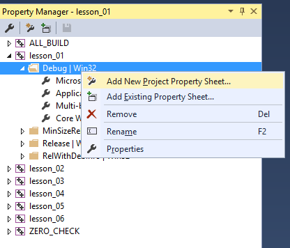
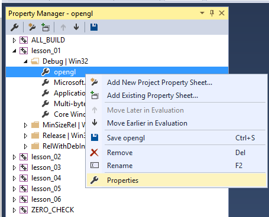
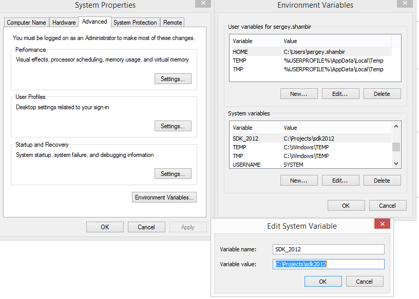

На Windows рекомендуется использовать IDE Visual Studio (в составе которой поставляется система сборки MSBuild).

## Установка CMake

Для сборки примеров потребуется CMake. Свои работы можно делать без CMake.

- Скачайте Cmake [с официального сайта](https://cmake.org/download/)
- При установке не забудьте поменять опцию, чтобы путь к CMake был добавлен в переменную [PATH](http://superuser.com/questions/284342/what-are-path-and-other-environment-variables-and-how-can-i-set-or-use-them)

- Переменные окружения, такие как [PATH](http://superuser.com/questions/284342/what-are-path-and-other-environment-variables-and-how-can-i-set-or-use-them), передаются приложению при старте. Если вы поменяли переменную PATH, изменения вступят в силу после перезапуска программ.

## Настройка локального окружения

Есть два важных критерия, которые надо соблюдать:

- Всё необходимое для сборки должно быть в репозитории Git, кроме самих библиотек (т.к. Git не предназначен для хранения постоянно меняющихся бинарных данных)
- В Git не должно быть настроек, специфичных для одного компьютера или для одного пользователя, тем более не должно быть абсолютных путей к файлам и каталогам

Соблюдать эти противоречивые требования можно с помощью [Property Sheets](https://msdn.microsoft.com/en-us/library/669zx6zc.aspx). Прежде всего, откройте вкладку "Property Manager" вместо "Solution Explorer" в панели Visual Studio:

Затем раскройте список Property Sheets (внешних файлов, которые среда сборки MSBuild интерпретирует при загрузке проекта vcxproj). Вы можете добавить туда новый Property Sheet:

Вы также можете вместо добавления изменить существующий Property Sheet с названием "Microsoft.Cpp.Win32.user" (или "Microsoft.Cpp.x64.user" для 64-битной конфигурации), поскольку этот Property Sheet лежит в личном каталоге пользователя и по умолчанию включается во все C++-проекты системой сборки MSBuild.

Выбранный Property Sheet можно настроить так же, как настраивается проект:

На выходе вы получите файл `*.props`, который представляет собой переносимые между проектами настройки сборки. В этот файл надо добавить пути к заголовочным файлам и библиотекам.

## Загрузка и настройка библиотек

- Загрузите SDL2 Development Libraries для Visual C++ [с официального сайта](https://www.libsdl.org/download-2.0.php)
- Загрузите GLM [с официального github-репозитория](https://github.com/g-truc/glm/releases)
- Загрузите GLEW [со страницы на Sourceforge](http://glew.sourceforge.net/index.html), также стоит прочитать [инструкцию по установке](http://glew.sourceforge.net/install.html)
- Загружать OpenGL32.dll или GLU не нужно, они поставляются вместе с операционной системой

После распаковки SDL2 рекомендуется изменить содержимое подкаталога `include`: создайте подкаталог `include/SDL2` и переместите все заголовочные файлы. Это позволит включать SDL как `#include <SDL2/SDL.h>` вместо `#include <SDL.h>`.

GLM является header-only библиотекой, то есть для подключения достаточно просто добавить в пути поиска заголовочных файлов путь к каталогу, родительскому для каталога `glm`. Это позволит включать GLM как `#include <glm/vec3.hpp>`.

SDL2 и GLEW являются библиотеками языка C и содержат не только заголовки, но и реализацию. Для потребуется настроить пути поиска заголовочных файлов, пути поиска библиотек (файлов `*.lib`) и Post-Build Event для копирования DLL. Следует изучить:

- [stackoverflow.com/questions/1568314](http://stackoverflow.com/questions/1568314/)
- [stackoverflow.com/questions/26325633](http://stackoverflow.com/questions/26325633/)

Рекомендуется не добавлять в свой Property Sheet абсолютные пути и вместо этого настроить переменную окружения `SDK_2015`, а в Property Sheet раскрывать её в абслютный путь поиска заголовков с помощью конструкции `$(SDK_2015)\include\`

## Сборка библиотеки GLEW

В дистрибутиве библиотеки GLEW предлагается в предсобранном виде только в конфигурации Release, да ещё и в виде DLL, которую придётся прикладывать к программе при её переносе на другие компьютеры.

Вы можете пересобрать GLEW в виде статической библиотеки для конфигураций Debug и Release самостоятельно. Для этого:

- скачайте архивс исходным кодом GLEW с официального сайта
- войдите в подкаталог `build\vc12` и откройте в Visual Studio 2015 sln-файл с названием `glew.sln`
- в появившемся при открытии диалоге, предлагающем миграцию на компилятор из состава VS2015, нажмите OK
- альтернативно, можно изменить toolset для проекта `glew_static`
- также необходимо для Debug-конфигурации (для Win32 и x64) изменить свойство "Program Database File Name", заменив путь "$(IntDir)/..." на "$(OutDir)". После этого файл с отладочной информацией будет располагаться рядом с собранной статической библиотекой, а не в директории промежуточных продуктов сборки:

[Скриншот](img/glew_static_pdb.png)

- соберите проект `glew_static` для конфигураций Debug и Release, для Win32 и x64
- после этого скопируйте подкаталог `lib` из каталога распакованного архива в свой каталог `SDK2015/glew`

## Проекты и Git

В Visual Studio управление настройками сборки производится в графическом режиме в окне настроек проекта, хотя сами настройки сохраняются в XML определённой схемы в файле `*.vcxproj`. Виртуальные папки (фильтры), по которым разложены файлы проекта, сохраняются в файле `*.vcxproj.filters`. Настройки проекта из раздела Debugging, а также некоторые неявные пользовательские настройки сохраняются в `*.vcxproj.user`. Есть общепринятые правила:

- Файлы `*.vcxproj` необходимы и достаточны для сборки проекта, их следует держать под контролем версий Git, а настройки проекта изменять аккуратно
- Файлы `*.vcxproj.filters` не нужны для сборки, но хранят фильтры файлов, их тоже следует держать под контролем версий Git
- Файлы `*.vcxproj.user` хранят специфичные для компьютера настройки, их не следует держать в Git
- Файлы `*.sln` хранят списки проектов и информацию о сборке всего списка проектов в разных конфигурациях. Их следует держать в Git.
