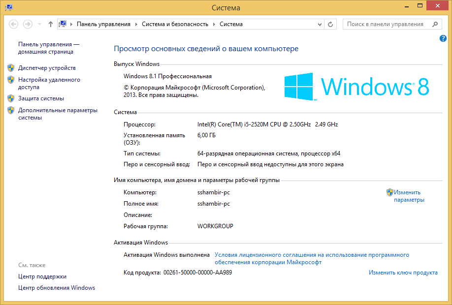
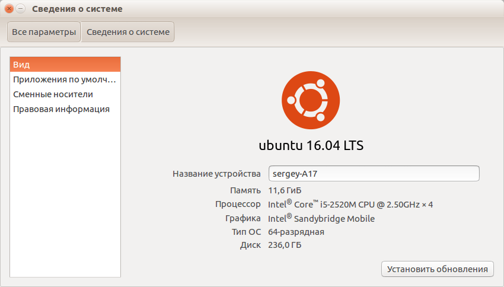
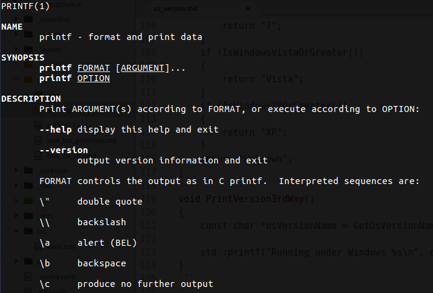

Каждая операционная система имеет свой способ версионирования. Очевидно, что способ определения версии системы завязан на особенности конкретной ОС. Мы рассмотрим способы определения версии на Windows, Linux и Mac OS X.

Попутно мы освоим более важную вещь: работу с API операционных систем. API — это сокращение от Application Programming Interface. Каждая ОС предоставляет программисту низкоуровневые библиотеки, формирующие цельный интерфейс, позволяющий приложению реагировать на события ОС, либо делегировать ей свои задачи, а также общаться с другими процессами. Этот интерфейс и называется API операционной системы.

## Структура API ОС

По историческим причинам большинство API ОС предоставляет средства в процедурном стиле и на языке C89. Такие API состоят из функций, макросов-констант и структур, представляющих объекты системы.

API ОС принято оставлять неизменными на протяжении десятилетий, чтобы даже скомпилированные программы продолжали работать, и не нужно было править исходники или перекомпилировать их заново. Расплата за это — неудобный, построенный по старым стандартам интерфейс. Но эта проблема легко решается с помощью написания фасадов, предоставляющих более удобный и высокоуровневый интерфейс. Готовые фасады есть во многих программных библиотеках.

Обычно функции в составе API ОС реализованы в динамических библиотеках, то есть их адреса и реализации становятся известны только после запуска программы, что и позволяет использовать новые версии ОС без перекомпиляции предназначенных для неё программ.

Кроме функций API есть также вызовы ядра ОС, которые работают с помощью системных прерываний (т.е. требуют помощи процессора), а не на основе стека и прыжка по адресу функции. Вызов ядра — дорогая операция, потому что в процессе вызова процессор переходит из защищённого режима (userspace mode) в режим прямой работы с памятью и устройствами (kernel mode), а затем возвращается обратно в защищённый режим.

Вызовы ядра — это единственный способ попросить систему об операции, выходящей за полномочия процесса программы, например, о создании нового процесса. Есть разница в отношении к системным вызовам в мире UNIX и в мире Windows

- В UNIX-системах вызовы ядра доступны программисту напрямую, и считается нормальным их использовать
- В Windows вызовы ядра обычно начинаются с префикса "Rtl", и не рекомендуются для использования программистом. Для любой функции с префиксом "Rtl" есть замена в составе WinAPI (обычно это функция с тем же именем за вычетом префикса "Rtl").

Функции API ОС и вызовы ядра вместе называют вызовами API ОС. Эти вызовы лежат в основе множества операций по работе с файлами, устройствами и сетью, но стоят дороже обычного вызова функции в собственном коде программы.

## API для получения версии в Windows

Версия Windows отображается в модуле настройки, доступном из панели управления:



Узнать версию ОС программно Windows можно с помощью WinAPI. WinAPI расшифровывается как Windows API. Он детально задокументирован на сайте [msdn.microsoft.com](https://msdn.microsoft.com/) — портале от компании Microsoft, предназначенном для сторонних разработчиков. Найти документацию по функциям WinAPI можно, передав в поисковик запрос "msdn FunctionName" или "FunctionName site:msdn.microsoft.com". Также помогают запросы из разряда "winapi how to ...".

Большая часть WinAPI доступна при подключении единственного заголовочного файла `Windows.h`. А это — небольшой пример:

```cpp
// Программа выводит строку
//   Running under Windows Major.Minor
// где Minor - старший кодовый номер версии,
//   а Major - младший кодовый номер версии

// В современном WinAPI функция GetVersion считается устаревшей,
//   поэтому пример годится лишь для демонстрации WinAPI.
int main()
{
    // Конструкция `::GetVersion()` указывает на вызов фукнции GetVersion
    //   из глобального пространства имён.
    const DWORD encodedVersion = ::GetVersion();
    const unsigned majorVersion = unsigned(LOBYTE(LOWORD(encodedVersion)));
    const unsigned minorVersion = unsigned(HIBYTE(LOWORD(encodedVersion)));

    std::printf("Running under Windows %u.%u\n", majorVersion, minorVersion);
}
```

Имейте ввиду, что функция GetVersion возвращает кодовый номер версии, который нужно сопоставить с [таблицей версий](https://msdn.microsoft.com/en-us/library/windows/desktop/ms724832(v=vs.85).aspx) и определить человекопонятное имя.

В WinAPI действует ряд соглашений в именовании:

- функции именуются в UpperCamelCase, например, [GetVersion](https://msdn.microsoft.com/en-us/library/windows/desktop/ms724834.aspx), [GetVersionEx](https://msdn.microsoft.com/en-us/library/ms724451.aspx). Сокращения используются в редких случаях, например, суффиксом "Ex" помечают расширенную версию более старой фукнции.
- имена типов данных именуются в верхнем регистре, часто с сокращениями: RECT, POINT, HMENU (handle to menu), OSVERSIONINFO (OS version information) и так далее
- для создания и удаления системных объектов, например, типа XYZ, предоставляются функции с именами вида "CreateXYZ" и "DestroyXYZ"
- многие привычные типы данных получили свои синонимы (в целях максимального контроля над стабильностью)
    - WORD — машинное слово, 16-битное целое без знака, аналог uint16_t
    - DWORD — удвоенное машинное слово, 32-битное целое без знака, аналог uint32_t
    - BOOL — синоним типа int, введённый по той причине, что в языке C89 нет типа bool. Тип `bool` появился в C++, а тип `_Bool` — в C99
    - LPCSTR — синоним `const char *`, расшифровывается как Left-Pointer to Const String, т.е. *изменяемый* (способный стоять в левой части присваивания) указатель на *неизменяемую* строку в стиле C, завершённую нулевым символом.
    - LPSTR — синоним `char *`, расшифровывается как Left-Pointer to String, т.е. *изменяемый* (способный стоять в левой части присваивания) указатель на *изменяемую* строку в стиле C, завершённую нулевым символом.
    - LPCWSTR — синоним `const wchar_t *`, расшифровывается как Left-Pointer Wide Const String, т.е. вместо типа char использует тип wide char, способный представлять символы одной из кодировок Unicode — UTF16

```cpp
// В современном WinAPI функция GetVersionEx считается устаревшей,
//   поэтому пример годится лишь для демонстрации WinAPI.
int main()
{
    // Заполняем структуру нулевыми байтами (специальный синтаксис C89).
    OSVERSIONINFO osVersion = { 0 };
    // WinAPI требует указывать размер структуры, чтобы иметь возможность
    //  расширять структуру в новых версиях ОС.
    osVersion.dwOSVersionInfoSize = sizeof(OSVERSIONINFO);
    const BOOL succeed = ::GetVersionEx(&osVersion);
    // Функция может вернуть FALSE только если параметр равен nullptr,
    //  либо в структуре неверное поле dwOSVersionInfoSize.
    assert(succeed);

    const unsigned majorVersion = osVersion.dwMajorVersion;
    const unsigned minorVersion = osVersion.dwMinorVersion;

    std::printf("Running under Windows %d.%d\n", majorVersion, minorVersion);
}
```

Вы могли заметить, что в предыдущих двух примерах используются устаревшие функции. Начиная с Windows 8, компания Microsoft решила объявить устаревшими [GetVersion](https://msdn.microsoft.com/en-us/library/ms724439.aspx) и [GetVersionEx](https://msdn.microsoft.com/en-us/library/ms724451.aspx), и они теперь могут возвращать неправильное значение согласно спецификации.

Вместо них предлагается использовать функции из заголовка [VersionHelpers.h](https://msdn.microsoft.com/en-us/library/dn424972.aspx). Эти функции не реализованы в библиотеках WinAPI и всего лишь дают фасад для вызова [VerifyVersionInfo](https://msdn.microsoft.com/en-us/library/windows/desktop/ms725492.aspx). Функции из состава VersionHelpers.h имеют более привычное именование версий ОС в сравнении с GetVersion и GetVersionEx.

```cpp
const char *GetOsVersionName()
{
    if (IsWindows8Point1OrGreater())
    {
        return "8.1";
    }
    if (IsWindows8OrGreater())
    {
        return "8";
    }
    if (IsWindows7OrGreater())
    {
        return "7";
    }
    if (IsWindowsVistaOrGreater())
    {
        return "Vista";
    }
    if (IsWindowsXPOrGreater())
    {
        return "XP";
    }
    return "Unknown";
}

void PrintVersion3rdWay()
{
    const char *osVersionName = GetOsVersionName();

    std::printf("Running under Windows %s\n", osVersionName);
}
```

## API для получения версии в Linux

Мы будем рассматривать получение версии на примере Ubuntu, т.к. этот дистрибутив использует подавляющая часть пользователей GNU/Linux. Через графический интерфейс информацию о системе можно узнать в панели настроек:



Для API в GNU/Linux характерна разобщённость: разные разработчики создают различные библиотеки, подходы к организации API этих библиотек и уровень квалификации их авторов может сильно варьироваться. Есть некоторые островки стабильности среди этого хаоса:

- стандарт POSIX, который расширяет стандартную библиотеку C89 новыми функциями, и переносим на любую UNIX-подобную систему, в том числе на MacOSX и даже частично на Windows; в Linux большая часть POSIX доступна из заголовка `unistd.h`
- системные вызовы ядра Linux, которые остаются стабильными на протяжении десятилетий, и доступны из заголовков в каталоге `sys/`
- особенно популярные, распространнённые в разных дистрибутивах и проверенные библиотеки, интерфейс которых тщательно спроектирован и не меняется на протяжении многих лет
    - примеры таких библиотек: Qt, GTK, SDL2

Для систематизации документации в Linux придумано несколько разных решений. В первую очередь рассмотрим команду man (от слова "manual"). Команда man — это команда UNIX-систем, отображающая форматированную документацию в собственном формате man, набор которой зависит от установленных в системе пакетов. Вот такой вывод даёт команда "man printf":



Нетрудно понять, что это документация не о функции "printf" стандартной библиотеки C89, а об утилите командной строки с тем же названием. Дело в том, что справка man распределена по разделам:

- раздел 1 содержит документацию по утилитам командной строки, и к нему можно обраться командой "man 1 printf"
- раздел 2 содержит документацию по интерфейсам и системным вызовам ядра Linux, и команда "man 2 printf" не даст результата:

```bash
$ man 2 printf
Нет справочной страницы для printf в разделе 2
Смотрите 'man 7 undocumented' в справке, если недоступны справочные страницы.
```

- раздел 3 содержит документацию по функциям языка C, входящим в стандартную библиотеку, в стандарт POSIX и в прикладные библиотеки. Обраться к этой документации можно командой "man 3 printf"
- есть и другие разделы, но они не представляют интереса для наших задач

Документация из разделов man есть не только на Linux-машинах, но и в интернете, например на сайте [opennet.ru](opennet.ru). Получить эту документацию можно, используя запрос вида "man printf" в поисковике.

Для получения версии ядра Linux существует системный вызов uname, информация о котором есть в разделе 2 справки man.

```
NAME
       uname - get name and information about current kernel

SYNOPSIS
       #include <sys/utsname.h>

       int uname(struct utsname *buf);

DESCRIPTION
       uname() returns system information in the structure pointed to by buf.  The utsname struct is defined in <sys/utsname.h>:

           struct utsname {
               char sysname[];    /* Operating system name (e.g., "Linux") */
               char nodename[];   /* Name within "some implementation-defined
                                     network" */
               char release[];    /* Operating system release (e.g., "2.6.28") */
               char version[];    /* Operating system version */
               char machine[];    /* Hardware identifier */
           #ifdef _GNU_SOURCE
               char domainname[]; /* NIS or YP domain name */
           #endif
           };

       The length of the arrays in a struct utsname is unspecified (see NOTES); the fields are terminated by a null byte ('\0').

RETURN VALUE
       On success, zero is returned.  On error, -1 is returned, and errno is set appropriately.
```

Из документации понятно поведение функции, и указано, что функция находится в заголовке "sys/utsname.h". Можно написать функцию, которая будет получать и печатать информацию о версии ядра:

```cpp
#include <cstdio>
#include <unistd.h>
#include <sys/utsname.h>
#include <cassert>

void PrintKernelInfo()
{
    utsname kernelInfo;
    const int code = uname(&kernelInfo);
    assert(code == 0); (void)code;

    std::printf("-- Kernel info --\n"
                "  domainname=%s\n"
                "  machine=%s\n"
                "  nodename=%s\n"
                "  release=%s\n"
                "  sysname=%s\n"
                "  version=%s\n",
                kernelInfo.domainname,
                kernelInfo.machine,
                kernelInfo.nodename,
                kernelInfo.release,
                kernelInfo.sysname,
                kernelInfo.version);
}
```

Результат вызова функции приведён ниже. Из него понятно, что поле nodename содержит имя компьютера в сети, а поля sysname и release — версию ядра операционной системы. Поля domainname, machine и version не несут особенно важной информации, и появления имени дистрибутива Ubuntu в поле version является особенностью сборки, а не общей закономерностью.

```
-- Kernel info --
  domainname=(none)
  machine=x86_64
  nodename=sergey-A17
  release=4.4.0-47-generic
  sysname=Linux
  version=#68-Ubuntu SMP Wed Oct 26 19:39:52 UTC 2016
```

Для определения имени и номера версии дистрибутивы могут быть доступны разные приёмы:

- современные дистрибутивы предоставляют утилиту командной строки "lsb_release", выводящую версию дистрибутива, и эта утилита может быть вызвана программно с помощью "popen"; полный вывод доступен при запуске с параметром "lsb_release -a", а справочную информацию можно узнать при запуске с параметром "lsb_release -h"
- та же информация обычно доступна в текстовом файле "/etc/lsb-release", и вы можете вывести его в консоль командой "cat /etc/lsb-release"
- файл "/etc/os-release" может отсутствовать или иметь разный формат в некоторых дистрибутивах, в Ubuntu 16.04 он выглядит так:

```
NAME="Ubuntu"
VERSION="16.04.1 LTS (Xenial Xerus)"
ID=ubuntu
ID_LIKE=debian
PRETTY_NAME="Ubuntu 16.04.1 LTS"
VERSION_ID="16.04"
HOME_URL="http://www.ubuntu.com/"
SUPPORT_URL="http://help.ubuntu.com/"
BUG_REPORT_URL="http://bugs.launchpad.net/ubuntu/"
VERSION_CODENAME=xenial
UBUNTU_CODENAME=xenial
```

Реализация чтения файла или запуска lsb_release командой popen останется за пределами статьи.

## API для получения версии в MacOSX

В MacOSX доступен тот же самый API POSIX, включающий в себя и вызов uname. Кроме POSIX также доступны

- системные вызовы ядра Darwin
- библиотека Carbon языка C89, которая в последних версиях OSX считается устаревшей
- библиотеки (фреймворки) языка Objective-C, которые могут быть использованы совместно с кодом на языке C89
    - для смешивания Objective-C и C в одном файле используются файлы с расширением "\*.m", к которым можно подключать заголовки "\*.h"
    - для смешивания Objective-C и C++ в одном файле используются файлы с расширением "\*.mm", к которым также можно подключать заголовки "\*.h"

Ранний способ определения версии OSX — функция "Gestalt" из файла "CarbonCore/OSUtils.h". К сожалению, эта функция объявлена устаревшей в MacOSX 10.8.

```cpp
// Для успешной компоновки проекта нужно подключить фреймворк CoreServices
#include <cstdio>
#include <CoreServices/CoreServices.h>

int PrintMacOsXVersion()
{
    SInt32 majorVersion = 0;
    SInt32 minorVersion = 0;
    SInt32 bugFixVersion = 0;

    Gestalt(gestaltSystemVersionMajor, &majorVersion);
    Gestalt(gestaltSystemVersionMinor, &minorVersion);
    Gestalt(gestaltSystemVersionBugFix, &bugFixVersion);

    std::printf("Running on Mac OS X %d.%d.%d\n", majorVersion, minorVersion, bugFixVersion);

    return 0;
}
```

Один из эвристических способов определения версии OSX связан с определением версии ядра Darwin, и последующей выборке по таблице:

```
16.x.x  macOS 10.12.x Sierra
15.x.x  OS X  10.11.x El Capitan
14.x.x  OS X  10.10.x Yosemite
13.x.x  OS X  10.9.x  Mavericks
12.x.x  OS X  10.8.x  Mountain Lion
11.x.x  OS X  10.7.x  Lion
10.x.x  OS X  10.6.x  Snow Leopard
 9.x.x  OS X  10.5.x  Leopard
 8.x.x  OS X  10.4.x  Tiger
 7.x.x  OS X  10.3.x  Panther
 6.x.x  OS X  10.2.x  Jaguar
 5.x    OS X  10.1.x  Puma
```

Для определения версии ядра можно использовать многофункциональный системный вызов sysctl:

```cpp
#include <errno.h>
#include <sys/sysctl.h>

void PrintMacOsXVersion()
{
    char osKernelRelease[256];
    size_t strSize = sizeof(osKernelRelease);
    int ret = sysctlbyname("kern.osrelease", osKernelRelease, &strSize, NULL, 0);
    assert(ret == 0);
    // osKernelRelease теперь хранит строку вида 12.0.0
}
```

## Кодировка строк в API ОС

В современных UNIX-подобных системах для работы со строками используется кодировка UTF-8, которая является мультибайтовой. Это означет, что в UTF8 базовой единицей является тип "char" размером в 1 байт, но один символ Unicode представляется либо одним, либо несколькими байтами. Для правильного разделения строки UTF8 на символы следует сканировать строку последовательно из начала в конец:

- все ASCII-символы с кодами от 0 до 127 представляются одним байтом так же, как в ASCII, поэтому любой текст в кодировке ASCII является и текстом в кодировке UTF-8, например, большинство английских текстов соответствуют требованиям UTF-8
- для остальных символов значение первого байта находится вне диапазона ASCII

В Windows в процессе перехода на кодировку Unicode было принято иное решение: используется базовый тип "wchar_t" (размер которого на Windows равен 2 байтам, а на UNIX-платформах — 4-м), и символы кодируются в UTF-16. Вопреки частому заблуждению, кодировка UTF-16 точно так же является мультибайтовой: базовой единицей является тип "wchar_t" с размером 2 байта на Windows, но один символ Unicode представляется либо одним, либо несколькими "wchar_t".

На UNIX-подобных ОС тип "wchar_t" и соответствующие ему типы "std::wstring", "std::wostream", функции "std::to_wstring", глобальные переменные "std::wcout" работают в кодировке UCS32, в которой символы представляются четырьмя байтами.

Из-за очевидного перерасхода памяти wide-строки, основанные на wchar_t, непопулярны в системном программировании для UNIX, но крайне популярны на Windows, где wide-строки более компактны. Кроме того, именно с UTF-16 работает ядро Windows и современные вызовы WinAPI.

Современный C++ имеет средства для конвертации между "std::string" в UTF8 и "std::wstring" прямо в стандартной библиотеке:

```cpp
std::string WideStringToUtf8(const std::wstring &wideString)
{
    std::wstring_convert<std::codecvt_utf8<wchar_t>> convert;
    return convert.to_bytes(wideString);
}

std::wstring Utf8ToWideString(const std::string &utf8String)
{
    std::wstring_convert<std::codecvt_utf8<wchar_t>> convert;
    return convert.from_bytes(utf8String);
}
```

Ещё несколько нюансов Wide Strings, которые следует знать:

- литералы для Wide String записываются так: `L"Wide String Value"`
- в Windows для для каждой функции и структуры WinAPI, работающей со строками, есть две версии: одна с суффиксом "A", другая с суффисом "W"
    - версия с суффиксом A работает в текущей кодировке ANSI-кодировке, которая обынчо является однобайтовой и не может представить символы алфавита, отличного от языка системы, например, Windows с английской локалью сломает кодировку кириллических строк при использовании ANSI-версий функций
    - версия с суффиксом W работает в кодировке UTF16 и принимает указатели на "wchar_t" строки вместо указателей на "char"-строки, только такие функции обеспечивают простую и корректную работу в мультиязычной системе
    - версия функции WinAPI без суффикса обычно прсто является макросом, указывающим либо на ANSI-версию, либо на UTF16-версию в зависимости от настроек компиляции. В Visual Studio управление данным поведением возможно через свойство "Unicode" в основных настройках проекта.
