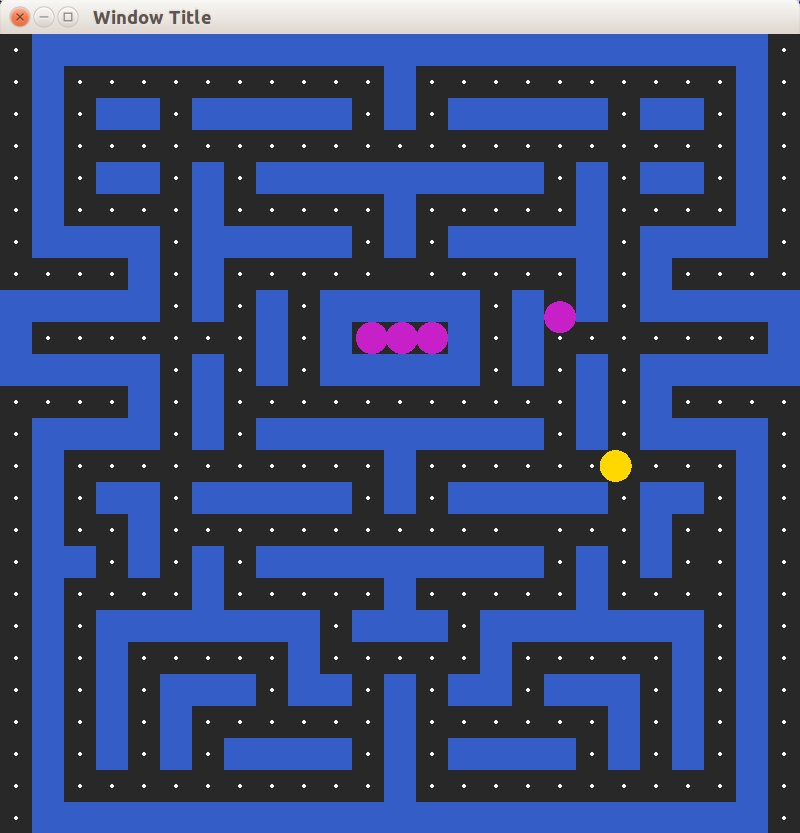

В этом примере мы добавим печенье, которое должен поедать пакман. Пример к статье [доступен на github](https://github.com/ps-group/sfml-packman/tree/master/packman_6). Так он выглядит:



## Счётчик съеденного печенья

Мы будем считать, сколько печенья было съедено персонажем. Эти данные будут связаны со структурой Packman. Поскольку количество печенья не может быть отрицательным, то для хранения данных мы применим тип `unsigned`:

```cpp
struct Packman
{
    sf::CircleShape shape;
    Direction direction;
    unsigned eatenCookies;
};

// обнуляем количество при инициализации
void initializePackman(Packman &packman)
{
    packman.direction = Direction::NONE;
    packman.shape.setRadius(PACKMAN_RADIUS);
    packman.shape.setFillColor(PACKMAN_COLOR);
    packman.shape.setPosition(getPackmanStartPosition());
    packman.eatenCookies = 0;
}
```

Использовать этот счётчик мы пока что не будем. В будущем с его помощью можно будет реализовать вывод количества очков, быстрый подсчёт оставшегося печенья (для определения момента победы) или даже таблицу рекордов.

## Поедание печенья

В рамках геймплея клона Packman можно задумать два способа поглощения печенья:

- персонаж поглощает всё печенье, которого он достиг
- персонаж поглощает печенье в направлении своего движения

Мы применим первый способ поглощения как более простой в реализации. Реализация поглощения печенья будет похожа на определение пересечений со стенами лабиринта. В целях улучшения читаемости мы выделим реализацию в отдельную функцию, и назовём её `eat all cookies in bounds`:

```cpp
unsigned eatAllCookiesInBounds(Field &field, const sf::FloatRect &bounds)
{
    unsigned cookiesCount = 0;
    for (size_t i = 0, n = field.width * field.height; i < n; i++)
    {
        Cell &cell = field.cells[i];
        if (cell.category != CellCategory::COOKIE)
        {
            continue;
        }
        if (cell.bounds.intersects(bounds))
        {
            ++cookiesCount;
            cell.category = CellCategory::EMPTY;
        }
    }
    return cookiesCount;
}
```

Такая реализация влечёт за собой серьёзный недостаток: персонаж поедает печенье слишком рано, как будто он использует телекинез. На иллюстрации ниже персонаж уже съел печенье вокруг, хотя ещё не достиг самого печенья &mdash; достигнута была лишь граница ячейки, содержащей печенье:


Исправить проблему можно как минимум двумя путями:

- проверять пересечение с центра печенья с границами пакмана
- требовать, чтобы область пересечения пакмана и ячейки с печеньем имела достаточно большую площадь

Мы воспользуемся первым способом, поскольку он легко реализуется с помощью второй версии перегрузки `sf::FloatRect::intersects()`, позволяющей получить область пересечения двух прямоугольников:

```cpp
sf::FloatRect intersection;
// Нужно не просто пересекаться с печеньем, но и иметь
// достаточную площадь пересечения.
if (cell.bounds.intersects(bounds, intersection))
{
    // в переменной intersection теперь лежит область пересечения
}
```

Мы также введём константу MIN_COOKIE_OVERLAP_AREA для хранения минимально необходимой области пересечения. Опытным путём можно выяснить, что будет достаточно площади 400px, что эквивалентно квадрату 20x20 или прямоугольнику 32x12.5:

```cpp
static const float MIN_COOKIE_OVERLAP_AREA = 400.f;

unsigned eatAllCookiesInBounds(Field &field, const sf::FloatRect &bounds)
{
    unsigned cookiesCount = 0;
    for (size_t i = 0, n = field.width * field.height; i < n; i++)
    {
        Cell &cell = field.cells[i];
        if (cell.category != CellCategory::COOKIE)
        {
            continue;
        }
        sf::FloatRect intersection;
        // Нужно не просто пересекаться с печеньем, но и иметь
        // достаточную площадь пересечения.
        if (cell.bounds.intersects(bounds, intersection)
                && (getArea(intersection) >= MIN_COOKIE_OVERLAP_AREA))
        {
            ++cookiesCount;
            cell.category = CellCategory::EMPTY;
        }
    }
    return cookiesCount;
}
```
