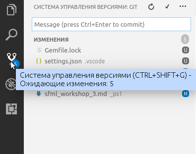

Git - распределённая система контроля версий. Он доступен в виде утилиты командной строки. Есть и графические оболочки над Git, но у таких программ другие названия: TortoiseGit, Github Client и так далее.

Кратко о Git:

- эта система распределённая, потому что копий хранилища может быть много и все они равноправные, нет "главной" копии
- эта система хранит все версии программы, от самой ранней до наиболее актуальной

Хранилище - это просто каталог, в котором есть подкаталог `.git`, созданный Git. Некоторые копии хранилища могут находиться на локальном компьютере, другие - на сервере (например, на github.com). Копии можно синхронизировать между собой.

## Работа с хранилищем Git

### Создание локального хранилища

Команда git init создаст хранилище и выведет краткий отчёт:

```bash
git init
```

Получить краткую справку по git init можно, если ввести `git init help`

Команда git add добавит один или несколько файлов в так называемый *индекс*, то есть подготовит их для выполнения *commit* (рус. "фиксация"). Эта команда в случае успеха ничего не выводит, а в случае ошибки выведет причину ошибки:

```bash
git add CMakeLists.txt
git add main.cpp
```

### Фиксация изменений (commit)

Commit - это фиксация новой версии. Новая версия продолжает одну из предыдущих версий, и отличается от неё несколькими файлами. Каждая фиксация должна иметь сообщение, которое будет записано в журнал (log).

Пример команды фиксации с сообщением "Added A+B program":

```
git commit -m "Added A+B program"
```

Если всё введено правильно, то Git зафиксирует версию и выведет краткий отчёт:

```
D:\Projects\CppDistro\workspace>git commit -m "Added A+B program"
[master (root-commit) 340778e] Added A+B program
 3 files changed, 16 insertions(+)
 create mode 100644 00/CMakeLists.txt
 create mode 100644 00/main.cpp
 create mode 100644 CMakeLists.txt
```

Если вы повторите команду, вы получите ошибку, потому что фиксировать больше нечего.

Возможно, git откажется выполнять фиксацию и предложит ввести свой email и имя. Ему нужны эти данные, чтобы у каждой версии был указан автор изменений. Вы можете ввести данные двумя командами, заменив `"ваш.email"` и `"ваше.имя"` на ваши email и имя, например `"admin@localhost.ru"` и `"Lavrentiy Pavlovich"`

```
git config --global user.email "ваш.email"
git config --global user.name "ваше.имя"
```

### Фиксация изменений в интерфейсе Visual Studio Code

Вы можете выбирать и фиксировать изменения прямо в Visual Studio Code. Для этого переключите левую панель в режим системы контроля версий. Как только вы это сделаете, вы сможете фиксировать изменения с выбранным сообщением.



### Добавление файлов

### Удаление файлов

TODO: git rm, git rm --cached, фиксация в интерфейсе Visual Studio Code

## Работа с Github

