Следуйте инструкциям. Также выполните задания, указанные в тексте.

## Создаём каталог проекта

Перейдите в каталог пользователя, и создайте каталог, в котором вы будете размещать свои проекты. Его можно назвать, например, "lw1" (laboratory work 1)

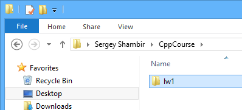

В Visual Studio Code откройте этот каталог. Для этого используйте меню "File">"Open Folder...".


Теперь вы можете добавить новый файл в каталог прямо из Visual Studio Code. Попробуйте, это так просто!

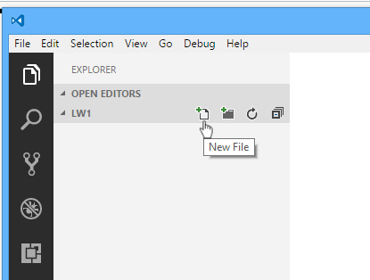

## Простейшая программа

Откройте редактор, создайте файл `hello.cpp` и перепишите следующий текст:

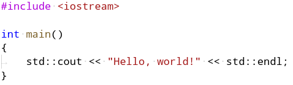

Это — минимальная программа на языке C++. Она выводит в терминал строку "Hello, world!" и завершается. Она состоит из:

- директива `#include <iostream>` подключит библиотеку потоков ввода-вывода, в том числе станут доступны поток вывода [std::cout](http://en.cppreference.com/w/cpp/io/cout) и манипулятор [std::endl](http://en.cppreference.com/w/cpp/io/manip/endl).
- функция `main` служит точкой входа в программу в тот момент, когда операционная система запускает программу
- в функции сейчас находится ровно одна инструкция, которая передаёт строку в поток вывода cout и затем передаёт туда же манипулятор endl (сокращение от **end** **l**ine), чтобы добавить перенос строки и завершить операцию вывода cout

Сохраните файл — это можно сделать в меню "File" либо горячей клавишей `Ctrl+S`:

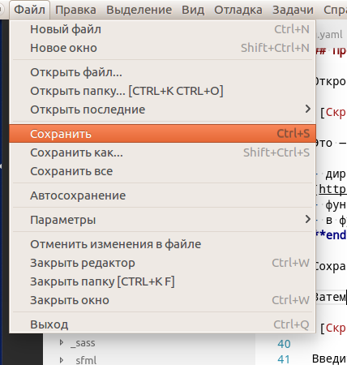

Затем откройте терминал. В Visual Studio Code терминал можно открыть в меню "Вид">"Интегрированный терминал" либо сочетанием клавиш "CTRL + `"

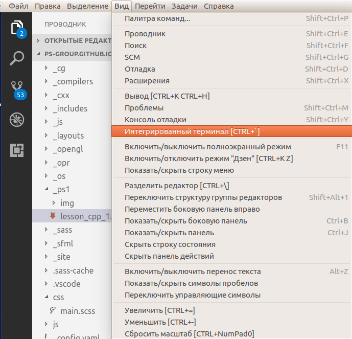

Введите в терминале команду `dir`. Команда выведет список файлов, и среди этих файлов должен быть файл `hello.cpp`.

Введите команду `g++ --version`. Программа `g++` — это компилятор C++ из состава GCC (GNU Compiler Collections). Передав ей флаг `--version`, вы заставите программу вывести свою версию и завершиться. Ожидается, что у вас будет g++ 7.0 или выше:

```
C:\Code\CppProjects>g++ --version
g++ (GCC) 7.2.0
Copyright (C) 2017 Free Software Foundation, Inc.
This is free software; see the source for copying conditions.  There is NO
warranty; not even for MERCHANTABILITY or FITNESS FOR A PARTICULAR PURPOSE.
```

Введите команду `g++ hello.cpp -o hello`. Эта команда компилирует файл hello.cpp в исполняемую программу называет исполняемый файл `hello.exe` на платформе Windows либо `hello` на Linux и MacOSX. Команда не должна выводить чего-либо, она должна просто успешно завершиться.

Теперь вы можете запустить исполняемую программу `hello.exe`, набрав в терминале команду `hello`.

```
C:\Code\CppProjects>hello
Hello, world!
```

### Задание cpp1.1

Убедитесь, что у вас есть файл `hello.cpp`, в котором записана работоспособная программа "Hello, World". Доработайте программу, чтобы вместо "Hello, World" она выводила "Hello, Name", где Name - ваше имя в английской транскрипции.

## Ошибки компиляции

Теперь попробуем составить неправильную программу. Например, уберём символ `;` в конце единственной инструкции:

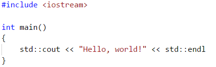

Запустите компиляцию снова. Вы увидите ошибку компиляции, примерно такую:

```
C:\Code\CppProjects\other>hello
Hello, world!

C:\Code\CppProjects\other>g++ hello.cpp -o hello
hello.cpp: In function 'int main()':
hello.cpp:6:1: error: expected ';' before '}' token
 }
 ^
```

Компилятор достаточно умён, чтобы показать вам точное место ошибки и способ её исправления! Именно поэтому сообщения от компиляторов C/C++ следует внимательно читать.

Теперь попробуем внедрить другую ошибку: точку с запятой вернём на место, а в названии cout перепутаем две буквы: "cuot"

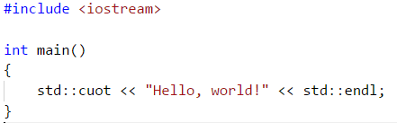

Запустите компилятор и прочитайте сообщение. Оно должно быть таким:

```
C:\Code\CppProjects\other>g++ hello.cpp -o hello
hello.cpp: In function 'int main()':
hello.cpp:5:10: error: 'cuot' is not a member of 'std'
     std::cuot << "Hello, world!" << std::endl;
          ^~~~
hello.cpp:5:10: note: suggested alternative: 'clog'
     std::cuot << "Hello, world!" << std::endl;
          ^~~~
          clog
```

Компилятор снова показал себя с лучшей стороны: он догадался, что программист опечатался, и предложил свой вариант замены. К сожалению, вариант не самый удачный: компилятор предложил `clog` вместо `cout`. Тем не менее, во многих случаях компилятор угадывает правильно.

## Задание cpp1.2

- Попробуйте самостоятельно найти такую опечатку в слове cout, чтобы компилятор правильно предложил способ исправления опечатки.
- Этот вариант программы сохраните в файле `hello_err.cpp`, чтобы затем показать преподавателю.

## Вывод в стиле языка C

Вывод в cout, которым мы воспользовались, относится к языку C++. Есть и другой способ: C++ позволяет использовать возможности языка C, в том числе функции ввода-вывода в стиле языка C.

Мы воспользуемся функцией [std::puts](http://en.cppreference.com/w/c/io/puts). Для доступа к ней надо подключить `<cstdio>`. Теперь программа будет выглядеть так:

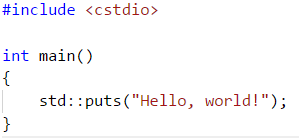

Выполните в терминале команду `del hello.exe` для удаления старого исполняемого файла, затем `g++ hello.cpp -o hello` для компиляции и запустите программу `hello.exe`. Вы должны получить тот же результат, что и раньше:

```
C:\Code\CppProjects\other>hello
Hello, world!
```

## Ввод-вывод

Теперь напишем программу, которая читает два числа из стандартного ввода и пишет их обратно в стандартный вывод. Эта программа будет использовать функции языка C: `std::scanf` и `std::printf`.

Создайте файл `ab.cpp` и напечатайте в нём следующий код:

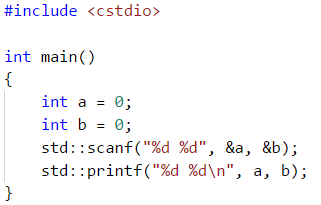

Скомпилируйте код командой `g++ ab.cpp -o ab`. Запустите, и введите

- два целых числа: `12 88`
- одно целое число и одно число с плавающей точкой: `12 88.7`
- одно целое число и одну букву f: `12 f`
- только букву f: `f`
- ничего не вводить, сразу нажать "Ctrl+Z" на Windows или "Ctrl+D" на остальных платформах, что означает "конец ввода"

Если что-то пошло неправильно, вы можете нажать в терминале `Ctrl+C` для завершения программы.

Мы прокомментировали код, чтобы вы поняли, что происходит. В языке C++ однострочные комментарии начинаются с символов `//`. Комментарии помогают понять текст программы, и поэтому хороший комментарий поясняет намерение там, где оно не очевидно из кода. Плохие комментарии поясняют очевидные вещи: писать такое — бесполезный труд. В то же время хороший комментарий может уберечь программиста от неосторожных и неправильных действий.

```cpp
// Подключаем заголовок cstdio из стандартной библиотеки
#include <cstdio>

// Определяем функцию main, возвращающую целочисленный код завершения.
int main()
{
    // Объявляем переменные a и b, инициализируем их нулями.
    int a = 0;
    int b = 0;

    // Считываем из стандартного ввода данные в определённом формате: "%d %d"
    //  "%d" означает "считать целое число и положить результат по переданному адресу",
    //  " " означает "считать любое количество пробелов"
    //  адреса для записи считанных значений передаются в дополнительных аргументах, начиная со 2-го
    // Документация: https://www.opennet.ru/man.shtml?topic=scanf&category=3&russian=0
    std::scanf("%d %d", &a, &b);

    // Записываем данные в определённом формате: "%d %d\n"
    //  "\n" кодирует символ переноса строки
    // Документация: https://www.opennet.ru/man.shtml?topic=printf&category=3&russian=0
    std::printf("%d %d\n", a, b);
}
```

Теперь доработаем программу

## Задание cpp1.3

Создайте файл `abc.cpp` и напишите программу, которая читает три числа и складывает их, а результат выводит в терминал.

## Решение линейного уравнения

Рассмотрим линейное уравнение `ax + b = 0` — оно также называется уравнением прямой. Мы напишем программу, способную решать такие уравнения. Но прежде чем приступить к кодированию, мы составим план действий с помощью комментариев:

```cpp
#include <cstdio>

int main()
{
	// 1. prompt user to enter coefficients

	// 2. read coefficients for equation `ax + b = 0`
    
	// 3. solve equation `ax + b = 0`
	// solution: `x = -b / a`
}
```

Первый шаг мы реализуем с помощью puts. Второй — с помощью scanf и объявления переменных a, b. Третий шаг - с помощью printf. Создайте файл `linear_equation.cpp`.

Перепечатайте в него следующий код:

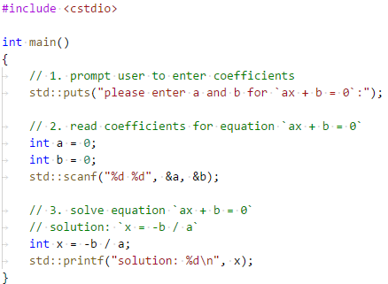

Скомпилируйте программу и запустите её. Попробуйте ввести две пары коэффициентов:

- -10 и 2
- 2 и -10
- 0 и 2
- 0 и 0

Везде ли программа решила задачу правильно?

## Числа с плавающей точкой

Конечно же, решить уравнение в целых числах получится не всегда. Но в C++ есть поддержка чисел с плавающей точкой:

- тип данных называется `float`
- ему соответствует формат `%f` для scanf и printf

Перепишите программу следующим образом:

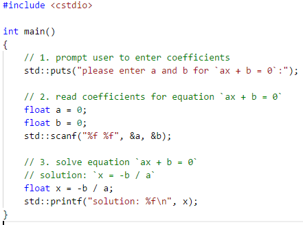

Попробуйте снова ввести две пары коэффициентов:

- -10 и 2
- 2 и -10
- 0 и 2
- 0 и 0

Как вы думаете, что получилось в последних двух случаях? Почему такое происходит?

### Задание cpp1.4

Создайте файл `square_equation.cpp` и напишите программу, которая читает три коэффициента уравнения `ax^2+bx+c=0` и вычисляет корни уравнения.

- Программа должна использовать числа с плавающей точкой.
- Вам пригодится функция [std::sqrt](en.cppreference.com/w/cpp/numeric/math/sqrt), помогающая извлечь квадратный корень; в документации к ней сказано, какой заголовочный файл требуется подключить через `#include <...>`.
