Создайте каталог с названием `sfml3`. Откройте каталог в Visual Studio Code. Откройте терминал и убедитесь, что вы находитесь в этом каталоге. Все упражнения и задания вы будете выполнять в подкаталогах каталога `sfml3`: `sfml3\00`, `sfml3\01` и так далее.

Создайте в каталоге `sfml3` файл `CMakeLists.txt`, перепишите в него текст:

```cmake
cmake_minimum_required(VERSION 3.8 FATAL_ERROR)

project(sfml-lab-3)

set(SFML_STATIC_LIBRARIES TRUE)

find_package(Freetype REQUIRED)
find_package(JPEG REQUIRED)
find_package(SFML 2 COMPONENTS window graphics system REQUIRED)

add_subdirectory(00)
```

>На это раз мы разместили инструкцию find_package в главном файле `CMakeLists.txt`. Это разумно, потому что SFML достаточно обнаружить один раз в пределах одного проекта.

Далее следуйте инструкциям. Также выполните задания, указанные в тексте. Если при сборке у вас возникнут ошибки, внимательно читайте текст ошибок в терминале.

## Сборка и отладка

Скорее всего, вы уже набили несколько шишек и поняли, что компилятор — ваш лучший друг: он подскажет, где закралась ошибка синтаксиса или опечатка. Но иногда ошибки вроде как и нет, а программа работает неправильно. Попробуйте зрительно обнаружить ошибку здесь:

```cpp
#include <iostream>

int main()
{
    int num = 0;
    while (num < 100);
    {
        if (num % 15)
        {
            std::cout << "FizzBuzz" << std::endl;
        }
        else if (num % 3)
        {
            std::cout << "Fizz" << std::endl;
        }
        else if (num % 5)
        {
            std::cout << "Buzz" << std::endl;
        }
        else
        {
            std::cout << num << std::endl;
        }
        num += 1;
    }
}
```

Заметили лишнюю точку с запятой? Если да, то вы — молодец. Но когда размер проекта становится большим, обнаруживать ошибки зрительно становится всё труднее и труднее. Компилятор (*англ.* compiler) вам не поможет, если программа синтаксически правильная.

И тогда на помощь приходит отладчик (*англ.* debugger) — он покажет, что реально происходит в программе, как меняются переменные и в какие функции программа заходит. Мы освоим отладчик, но сначала подготовим среду для работы с ним.

Создайте подкаталог `00` в каталоге `sfml.3`. В подкаталоге `00` создайте ещё один файл `CMakeLists.txt`, и скопируйте в него текст:

```cmake
# Добавляем исполняемый файл 00
# Он собирается из 1 файла исходного кода: main.cpp
add_executable(00 main.cpp)
```

Затем создайте в подкаталоге `00` файл `main.cpp`, и скопируйте в него код программы FizzBuzz:

```cpp
#include <iostream>

int main()
{
    int num = 0;
    while (num < 100)
    {
        if (num % 15)
        {
            std::cout << "FizzBuzz" << std::endl;
        }
        else if (num % 3)
        {
            std::cout << "Fizz" << std::endl;
        }
        else if (num % 5)
        {
            std::cout << "Buzz" << std::endl;
        }
        else
        {
            std::cout << num << std::endl;
        }
        num += 1;
    }
}
```

Сконфигурируйте программу через cmake, явно указав параметр `CMAKE_BUILD_TYPE` равным Debug с помощью опции `-DCMAKE_BUILD_TYPE=Debug`:

```cmake
cmake -G "MinGW Makefiles" -DCMAKE_BUILD_TYPE=Debug
cmake --build .
```

### Настраиваем сборку проекта в одно нажатие

>Этот материал основан на статье [C/C++ for VS Code (Preview)](https://code.visualstudio.com/docs/languages/cpp) из документации VS Code.

Чтобы собирать проект одним нажатием, нам надо создать и настроить для проекта файл `tasks.json`:

1. Откройте панель ввода команд сочетанием клавиш `Ctrl+Shift+P`
2. Введите "Tasks: ", в выпадающем списке найдите и выберите опцию **Tasks: Configure Task Runner**


Появится список, и в нём надо выбрать вариант Others (*рус.* Прочие) — мы будем настраивать сборку через CMake, а его в списке нет:


Теперь у вас в каталоге проекта появился файл `tasks.json`. Он будет сразу открыт в редакторе. Этот файл в специальном формате JSON

>JSON — сокращение от JavaScript Object Notation. Это формальный язык, удобный для описания простых данных. Будьте внимательны, работая с JSON: не пропускайте запятые, кавычки и скобки.

Файл скорее всего выглядит так:


Теперь надо доработать описание команды: мы поменяем "taskName", "command", добавим поле "args" для аргументов команды. Мы также опишем поле "group" так, чтобы редактор VSCode считал эту задачу (*англ.* task) командой сборки (*англ.* build). Доработайте `tasks.json`, как показано на скриншоте:


Теперь вы можете собирать одним нажатием! Нажмите сочетание `Ctrl+Shift+B`. Если всё в порядке, вы увидите внизу в терминале такой вывод:


Поздравляем! Теперь собирать программу стало проще. Вы также можете открыть панель команд сочетанием `Ctrl+Shift+P`, ввести "build" и увидеть ту же самую команду запуска сборки:


### Настраиваем запуск проекта в одно нажатие

Чтобы запускать проект одним нажатием, вам нужен файл `launch.json`. Создадим его по инструкции:

1. Перейдите в редакторе в режим отладки — нажмите на кнопку, как показано ниже, либо просто нажмите `Ctrl+Shift+D`:


2. В этом режиме нажмине кнопку настройки:


3. В выпадающем списке выберите "C+ (GDB/LLDB)", чтобы автоматически создать `launch.json`:


Если у вас нет варианта "C++", нажмите кнопку "More...", после чего откроется режим установки плагинов. В списке плагинов надо выбрать плагин "C/C++":

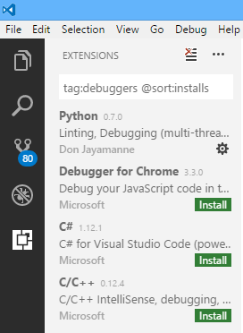

Когда плагин загрузится, вам потребуется нажать "Reload" для перезагрузки редактора с этим плагином:

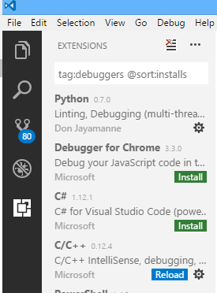

Теперь вы наконец-то можете выбрать вариант "C/C++"! Сразу после выбора будет создан файл `launch.json`. Этот файл будет выглядеть примерно так:

```js
{
    "version": "0.2.0",
    "configurations": [
        {
            "name": "(gdb) Launch",
            "type": "cppdbg",
            "request": "launch",
            "program": "enter program name, for example ${workspaceRoot}/a.out",
            "args": [],
            "stopAtEntry": false,
            "cwd": "${workspaceRoot}",
            "environment": [],
            "externalConsole": true,
            "MIMode": "gdb",
            "miDebuggerPath": "gdb.exe",
            "setupCommands": [
                {
                    "description": "Enable pretty-printing for gdb",
                    "text": "-enable-pretty-printing",
                    "ignoreFailures": true
                }
            ]
        }
    ]
}
```

Измените этот файл:

- для поля "program" надо указать путь к программе, включая переменную workspaceRoot: `"program": "${workspaceRoot}/04/04"`
- добавьте свойство `"preLaunchTask": "build all"`
- поменяйте значение свойства "externalConsole" на `false`

После изменений файл будет выглядеть так:

```js
{
	"version": "0.2.0",
	"configurations": [
		{
			"name": "(gdb) Launch",
			"type": "cppdbg",
			"request": "launch",
			"program": "${workspaceRoot}/00/00.exe",
			"args": [],
			"stopAtEntry": false,
			"cwd": "${workspaceRoot}",
			"environment": [],
			"externalConsole": false,
			"MIMode": "gdb",
			"setupCommands": [
				{
					"description": "Enable pretty-printing for gdb",
					"text": "-enable-pretty-printing",
					"ignoreFailures": true
				}
			],
			"preLaunchTask": "build all"
		}
	]
}
```

Теперь вы можете начать отладку, нажав на кнопку запуска в редакторе в режиме отладки:


 Вы также можете использовать горячую клавишу `F5`, либо открыть панель команд сочетанием `Ctrl+Shif+P` и найти команду **Debug: Start Debugging**:


### Точки останова и просмотр переменных

>Этот материал основан на статье [Debugging](https://code.visualstudio.com/docs/editor/debugging) из документации VSCode

Точки останова - это подсказки для отладчика: он остановит выполнение программы в указанном месте и позволит вам просмотреть состояние переменных. В Visual Studio Code вы можете добавить точку останова, нажав на область левее номера нужной строки:

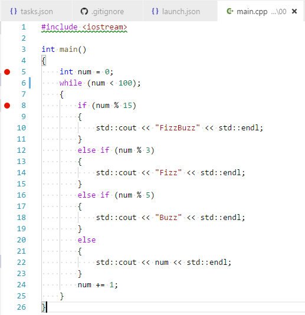

Добавьте точку останова напротив строки №5. После этого нажмите F5, либо нажмите кнопку запуска отладки в режиме отладки. Начнётся сборка, затем программа запустится под управлением отладчика. Вы увидите в редакторе панель, связанную с отладчиком:

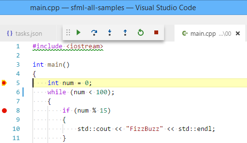

Наведите на каждую из кнопок этой панели. Посмотрите во всплывающих подсказках, что они делают и какие у них сочетания клавиш. Подсказка по горячим клавишам:

- `F10` переход через инструкцию
- `F11` заход в тело вызываемой функции
- `Shift+F11` выход из тела вызываемой функции
- `F5` продолжение выполнения до следующей точки останова либо до завершения программы

Состояние переменных можно просматривать в левой панели.

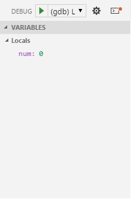

Теперь пройдите 6-8 раза по циклу, нажимая F10. После этого можно нажать F5, чтобы программа продолжила выполнение до самого конца.

## Получаем события мыши

Наша цель — написать программу, в которой треугольник будет следить за курсором мыши и поворачиваться вслед за ним. Выглядеть будет примерно так:


Прежде чем перейти к примеру, нам надо освоить инструкцию switch, научиться писать функции и набраться опыта в обработке событий мыши.

### Инструкция switch

Создайте подкаталог `01` в каталоге `sfml3`. В подкаталоге создайте ещё один файл `CMakeLists.txt`, и скопируйте в него текст:

```cmake
add_executable(01 main.cpp)
```

Теперь мы снова напишем програмаму FizzBuzz! На этот раз вмеcто `if` мы будем использовать `switch` (*рус.* "переключатель"). У этой инструкции любопытный синтаксис:

```cpp
switch (вычислимое_значение)
{
case константа_1:
    список_инструкций
case константа_2:
    список_инструкций
case константа_3:
    список_инструкций
...
default:
    список_инструкций
}

// ветка case выполняется, если значение совпадает с заданной константой
// ветка default выполяется, если значение не совпадает ни с одной константой
// после завершения ветки выполнение продолжается сквозь следующую ветку!

// неправильны пример: если число чётное, выводим его и пишем "odd!", иначе пишем "odd!"
switch (num % 2)
{
case 0:
    // чётное
    std::cout << num << std::endl;
    // выполнение продолжается, хотя (num % 2) != 1
    // такова особенность switch/case
case 1:
    // нечётное
    std::cout << "odd!" << std::endl;
}

// пример: если число чётное, выводим его, иначе выводим "odd!"
switch (num % 2)
{
case 0:
    // чётное
    std::cout << num << std::endl;
    // если не будет break, выполнение продолжится сквозь "case 1:"
    break;
case 1:
    // нечётное
    std::cout << "odd!" << std::endl;
    // ставим break в конце для безопасности:
    break;
}
```

Всегда будьте аккуратны со switch: если вы не ставите break в конце списка инструкций case, то выполнение продолжится далее, хотя условие case уже не соблюдается. Это источник огромного числа ошибок, хотя иногда программист действительно хотел продолжить выполнение насквозь.

Мы перепишем FizzBuzz, чтобы использовать switch для выбора поведения по остатку от деления на 15. Число 15 — это наименьшее общее кратное 3 и 5, и по остатку от деления на 15 можно судить о делимости на 3 и 5. Создайте файл `main.cpp` в каталоге `01` и перепишите в него код:


### Выводим в консоль координаты мыши

Создайте подкаталог `02` в каталоге `sfml.3`. В подкаталоге `02` создайте ещё один файл `CMakeLists.txt`, и скопируйте в него текст:

```cmake
add_executable(02 main.cpp)

target_include_directories(02 PRIVATE ${SFML_INCLUDE_DIR})
target_compile_features(02 PUBLIC cxx_std_17)
target_compile_definitions(02 PRIVATE SFML_STATIC)

target_link_libraries(02 ${SFML_LIBRARIES} ${SFML_DEPENDENCIES})
```

Затем создайте в подкаталоге `02` файл `main.cpp`, и скопируйте в него проблемный код:


Соберите программу командой `cmake --build .` и запустите — вы увидите пустое окно. Кликните несколько раз мышью в пределах окна, посмотрите вывод программы в терминале:

```
mouse pressed, x=585 y=291
mouse released, x=578 y=328
mouse pressed, x=255 y=268
mouse released, x=255 y=268
mouse pressed, x=249 y=187
mouse released, x=241 y=183
mouse pressed, x=200 y=168
mouse released, x=190 y=166
```

### Функции в языке C++

Функции — это фрагменты кода, пригодные для переиспользования. У них чётко объявлены входные и выходные данные. Новые функции создаются путём *объявления функций*, а существующие используются путём *вызова функций*.

Сначала разберёмся с объявлением. Внимательно прочитайте описание синтаксиса и изучите примеры:

```cpp
//////////////////// синтаксис функций //////////////////////
тип_данных название_функции(тип_параметра имя_параметра, ...)
{
    список_инструкций
}

///////////////////// примеры функций ///////////////////////

// возвращает целое, не принимает параметров
// для функции main (и только для неё) стандарт разрешает
// не возвращать ничего, хотя указан тип int.
int main()
{
}

// ничего не возвращает (void), принимает 1 параметр типа int
void printInt(int a)
{
    std::cout << a << std::endl;
}

// возвращает float, принимает 2 параметра типа float
float sum(float a, float b)
{
    return a + b;
}
```

После объявления функцию можно вызвать. Синтаксис вызова отличается: например, мы уже не указываем типы и имена *параметров*, вместо этого мы подставляем *аргументы* — выражения, вычисление которых задаёт фактические значения параметров функции.

### Функции и уровни абстракции

Пользуясь функциями, мы перепишем предыдущий пример. Будем следовать важному правилу: каждая функция работает на одном уровне абстракций, а если ей надо спуститься ниже в абстракциях, она должна вызвать другую функцию. Например, уровень абстракций функции main — это основной цикл программы, а всё более мелочное и ничтожное должны выполнять другие функции. Идея выглядит так:


Перепишите приведённый выше код. Затем добавьте тела функций pollEvents и redrawFrame, как показано ниже:


Соберите программу, запустите и проверьте её работоспособность.

В будущем при написании основных циклов мы советуем выделять 4 функции:

- `initialize`, иницилизирующая состояние ключевых переменных (например, фигур)
- `pollEvents`, выполняющая в цикле опрос и обработку событий
- `update`, выполняющая обновление переменных той модели, которую вы симулируете
- `drawFrame`, выполняющая очистку, рисование и вывод одного кадра

Эти функции реализуют шаблон Game Loop:


Запомните три правила хорошего стиля кодирования:

- одна функции должна содержать не более 20 строк или 20 инструкций (в редчайших случаях на практике это правило нарушают, но в учебных задачах надо учиться его соблюдать)
- хороший средний размер функии — примерно 5 строк
- также считается правильным писать строку кода не шире чем в 80 столбцов, а максимальная приемлемая длина строки кода — 100 столбцов.

### Вращаем объект вслед за мышью

Создайте подкаталог `03` в каталоге `sfml.3`. В подкаталоге `03` создайте ещё один файл `CMakeLists.txt`, и скопируйте в него текст:

```cmake
add_executable(03 main.cpp)

target_include_directories(03 PRIVATE ${SFML_INCLUDE_DIR})
target_compile_features(03 PUBLIC cxx_std_17)
target_compile_definitions(03 PRIVATE SFML_STATIC)

target_link_libraries(03 ${SFML_LIBRARIES} ${SFML_DEPENDENCIES})
```

Затем создайте в подкаталоге `03` файл `main.cpp`, и перепишите код:

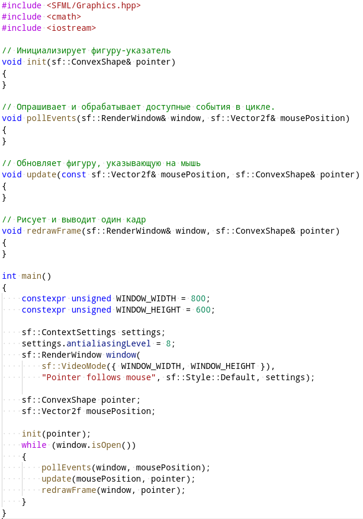

### Функции init и drawFrame

Добавьте функциям init и drawFrame тела, как показано ниже:

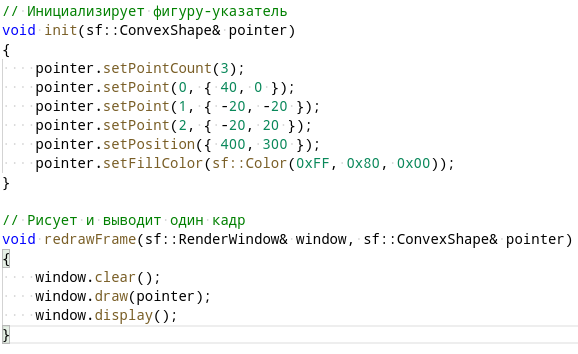

Вы можете заметить, что:

- для рисования фигуры-указателя мы используем оранжевый ConvexShape и задаём этот многоугольник как треугольник.
- обе функции используют *получение параметра по ссылке*: `sf::ConvexShape&`, `sf::RenderWindow&`; такой метод позволяет получить предыдущий объект вместо его копии и изменять состояние объекта, созданного в другой функции

В C++ есть три важных для вас способа передачи параметров:

- по значению (то есть передаётся копия значения): `int sum(int a, int b)`
- по изменяемой ссылке, что позволяет изменять переменную из другой функции: `void add(int a, int& b)`
- по константной ссылке, что позволяет не копировать крупный объект целиком, но и не изменять оригинальный объект: `void add(const BigNumber& a, const BigNumber& b)`

Теперь соберите и запустите программу. У вас должно получиться нечто подобное:

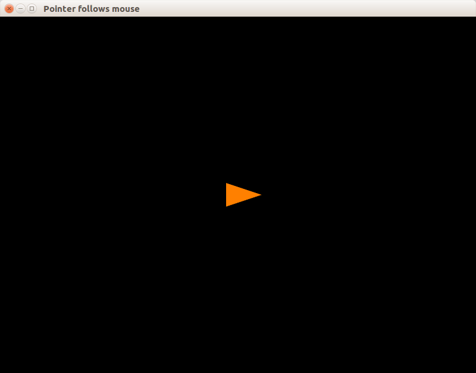

>Программа не будет закрываться по нажатию на кнопку "Закрыть", потому что не реализован цикл запроса и обработки событий.

### Добавляем цикл событий и обновление фигуры

Мы также опишем ещё две функции:

- выделим функцию toDegrees, переводящую углы из радианов в градусы - она пригодится нам чуть позже
- выделим функцию onMouseMove, которая будет обрабатывать только событие mouseMove

Добавьте две функции и доработайте функцию `pollEvents`, как показано ниже:

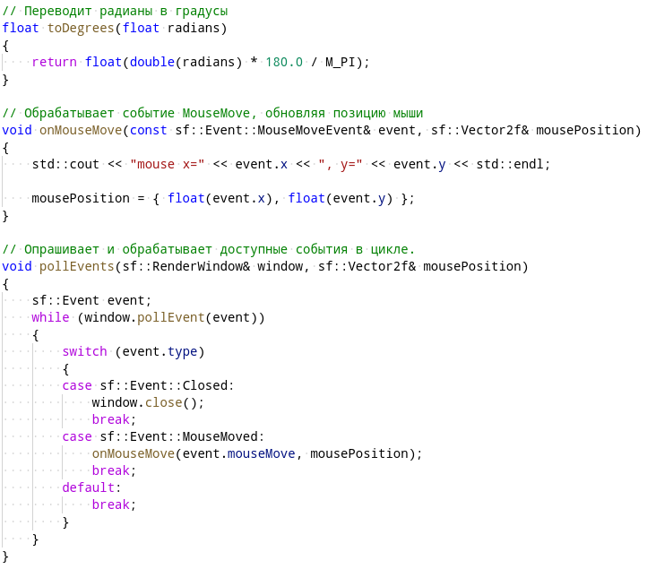

Финальный штрих - это поворот фигуры вслед за указателем. Чтобы вычислить угол поворота, надо вспомнить, что тангенс — это отношение противолежащего катета к прилежащему. Однако, у тангенса есть две проблемы:

1. Тангенс не определён для 90° и -90°
2. Для противоположных углов (например, 70° и -110°) тангенс одинаковый, и отличит эти углы по тангенсу невозможно

Поэтому в C++ есть две функции для расчёта тангенса, и обе определены в заголовке `cmath`:

1. `std::atan(t)` принимает тангенс и возвращает угол, она обладает недостатками, указанными выше
2. `std::atan2(y, x)` принимает координаты `y` и `x` (именно в таком порядке, т.к. это числитель и знаменатель в формуле тангенса) и возвращает корректный угол, измеряемый в радианах, диапазоне `[-π; π]`

После вычисления угла мы переведём его из радианов в градусы и установим как угол поворота фигуры путём вызова `.setRotation(...)`. Доработайте функцию update:

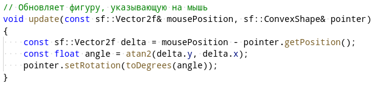

Теперь соберите проект, устраните ошибки компиляции. Запустите программу. Передвиньте мышь в пределах окна программы. Результат должен быть таким:


### Задание sfml3.1

Доработайте предыдущий пример, чтобы поворот фигуры вслед за мышью имел максимальную скорость не выше 15° в секунду. Для этого вам пригодятся функции [std::min](http://en.cppreference.com/w/cpp/algorithm/min) и [std::max](http://en.cppreference.com/w/cpp/algorithm/max) из заголовка `<algorithm>`.

## Составные объекты

Теперь мы улучшим предыдущий пример: вместо треугольника будет нарисована полноценная стрелка:


Изменения будут существенными, поэтому лучше создать новый каталог `04` в каталоге `sfml.3`. В подкаталоге `04` создайте ещё один файл `CMakeLists.txt`, и скопируйте в него текст:

```cmake
add_executable(04 main.cpp)

target_include_directories(04 PRIVATE ${SFML_INCLUDE_DIR})
target_compile_features(04 PUBLIC cxx_std_17)
target_compile_definitions(04 PRIVATE SFML_STATIC)

target_link_libraries(04 ${SFML_LIBRARIES} ${SFML_DEPENDENCIES})
```

Теперь создайте файл `main.cpp` и скопируйте в него заготовку будущей программы:

```cpp
#include <SFML/Graphics.hpp>

// Инициализирует фигуру-стрелку
void initArrow(Arrow& arrow)
{
}

// Опрашивает и обрабатывает доступные события в цикле.
void pollEvents(sf::RenderWindow& window, sf::Vector2f& mousePosition)
{
}

// Обновляет фигуру, указывающую на мышь
void update(const sf::Vector2f& mousePosition, Arrow& arrow)
{
}

// Рисует и выводит один кадр
void redrawFrame(sf::RenderWindow& window, Arrow& arrow)
{
}

// Программа рисует в окне стрелку, которая поворачивается вслед за курсором мыши.
int main()
{
    constexpr unsigned WINDOW_WIDTH = 800;
    constexpr unsigned WINDOW_HEIGHT = 600;

    sf::ContextSettings settings;
    settings.antialiasingLevel = 8;
    sf::RenderWindow window(
        sf::VideoMode({ WINDOW_WIDTH, WINDOW_HEIGHT }),
        "Arrow follows mouse", sf::Style::Default, settings);

    Arrow arrow;
    sf::Vector2f mousePosition;

    initArrow(arrow);
    while (window.isOpen())
    {
        pollEvents(window, mousePosition);
        update(mousePosition, arrow);
        redrawFrame(window, arrow);
    }
}
```

>Опытные программисты часто пишут код, начиная с таких заготовок в виде пустых функций. Затем они наращивают функциональность, пока не выполнят поставленную задачу, и в конце ещё раз проверяют и упрощают написанный код.

### Моделируем повёрнутую стрелку

Мы будем рисовать стрелку путём совмещения двух фигур:

- треугольника, нарисованного с помощью `sf::ConvexShape` (который умеет рисовать только выпуклые многоугольники)
- стержня, нарисованного с помощью `sf::RectangleShape`

Но если мы будем вращать такую комбинацию вокруг центра прямоугольника, возникнуть проблемы:

- треугольник должен постоянно менять свою позицию относительно центра прямоугольника: он вращается вокруг этого центра, а не вокруг своего
- прямоугольник надо поворачивать относительно своего центра, хотя в SFML точкой поворота обычно считается левый верхний угол прямоугольника

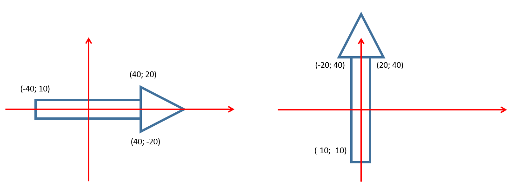

Для решения первой проблемы мы применим тригонометрию и линейную алгебру, а вторую решим средствами самого SFML.

### Структуры в языке C++

Мы можем соединить вместе переменные, описывающие стрелку, с помощью структуры. Структуры в C++ - это комбинированные типы данных, и каждая структура включает в себя несколько полей.

>Размер структуры в памяти компьютера не меньше суммы размеров её полей. Интуитивно кажется, что лучше всего сложить размеры полей и получить размер структуры. Но компилятор иногда добавляет лишние пустые байты - этот трюк, нацеленный на особенности работы памяти, известен как [data structure alignment](https://en.wikipedia.org/wiki/Data_structure_alignment).

```cpp
// --- синтаксис структур ---
// объявление:
struct имя_структуры
{
    тип_данных имя_поля;
    тип_данных имя_поля;
    тип_данных имя_поля;
    // ... и так далее
}; // точка с запятой в конце обязательна

// пример:
struct Vector2f
{
    float x;
    float y;
};
```

Структура будет объявлена следующим образом:

```cpp
// Структура хранит фигуры, составляющие стрелку, а также
//  позицию и поворот стрелки.
// После изменения позиции или поворота надо вызвать
//  функцию updateArrowElements, чтобы стрелка оставалась
//  в согласованном состоянии.
struct Arrow
{
    sf::ConvexShape head;
    sf::RectangleShape stem;
    sf::Vector2f position;
    float rotation = 0;
};
```

Скопируйте это объявление в начало файла сразу `#include`.

Стрелка состоит из треугольника и прямоугольного стержня. Чтобы сделать центр стрержня точкой отсчёта для вращения стержня, мы используем функцию `setOrigin`, которая устанавливает точку origin:

- в локальных координатах объекта она по умолчанию равна `(0; 0)`, но может быть изменена вызовом `setOrigin` у фигуры
- в глобальных координатах эта точка служит центром вращения, а позиция фигуры по сути является позицией этой точки

Эту идею можно проиллюстрировать так:

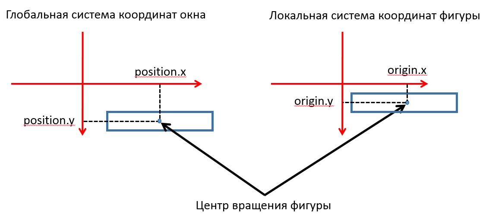

Также у стрелки заданы собственные параметры position и rotation, поэтому в конце фукнции `initArrow` мы вызовем `updateArrowElements`, которая повернёт и установит позиции компонентов стрелки согласно полям `.position` и `.rotation` структуры стрелки.

Реализуйте функцию `initArrow`, как показано ниже:

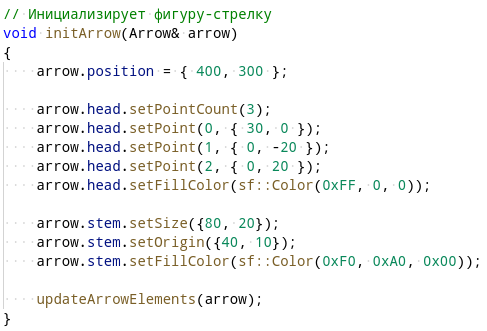

### Согласованное состояние стрелки

При повороте стрелку надо держать в согласованном состоянии, то есть поворачивать стержень вокруг своего центра, а треугольник поворачивать вокруг центра прямоугольника.

Поворот треугольника вокруг внешней точки можно разложить на два компонента: поворот вокруг своего центра и движение центра треугольник по окружности:


Для перемещения треугольника по окружности вокруг центра прямоугольника мы применим переход от полярных координат к эвклидовым: радиус будет константой, а угол будем брать из поля `arrow.rotation`.

Перепишите код обновления компонентов стрелки:


### Стрелка следует за мышью

Код обработки событий такой же, как в предыдущем примере. Перепишите его либо скопируйте из старого примера:

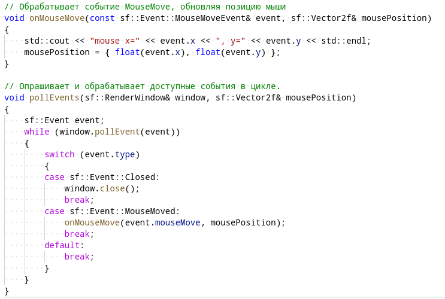

Теперь дело за малым! Реализуем функции update и drawFrame примерно так же, как предыдущем примере, но воспользуемся готовой функцией `updateArrowElements` вместо прямой работы с компонентами фигур:

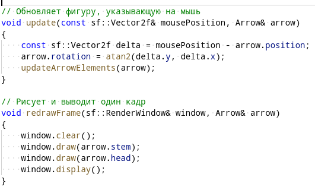

Соберите программу, есл возникнут ошибки компиляции - исправьте их. Запустите программу. Вы должны увидеть стрелку, движущуюся вслед за курсором:


### Задание sfml3.2

На основе предыдущего примера напишите программу, в которой отображаются мультяшные глаза, следящие за курсором мыши:

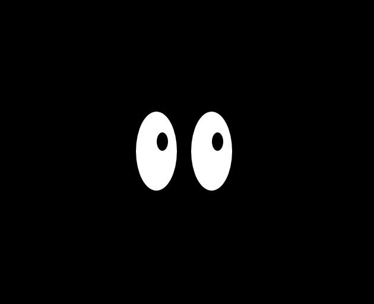

- нарисовать белки и зрачки глаз можно эллипсами
- лучше зарисовать на бумаге модель движения зрачков глаз
- можно не обрабатывать случай, когда курсор находится в области самих глаз


Повороты зрачков должны быть независимы друг от друга, иначе не получится обработать такой случай:

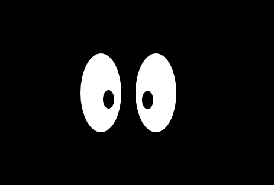

### Задание sfml3.3

Доработайте программу из задания sfml3.2, чтобы наведение курсора в область самих глаз обрабатывалось корректно (один зрачок находится под курсором, другой нацелен в сторону курсора как обычно).
