Создайте каталог с названием `sfml3`. Откройте каталог в Visual Studio Code. Откройте терминал и убедитесь, что вы находитесь в этом каталоге. Все упражнения и задания вы будете выполнять в подкаталогах каталога `sfml3`: `sfml3\00`, `sfml3\01` и так далее.

Создайте в каталоге `sfml3` файл `CMakeLists.txt`, перепишите в него текст:

```cmake
cmake_minimum_required(VERSION 3.8 FATAL_ERROR)

project(sfml-lab-3)

add_subdirectory(00)
```

Далее следуйте инструкциям. Также выполните задания, указанные в тексте. Если при сборке у вас возникнут ошибки, внимательно читайте текст ошибок в терминале.

## Сборка и отладка

Скорее всего, вы уже набили несколько шишек и поняли, что компилятор — ваш лучший друг: он подскажет, где закралась ошибка синтаксиса или опечатка. Но иногда ошибки вроде как и нет, а программа работает неправильно. Попробуйте зрительно обнаружить ошибку здесь:

```cpp
#include <iostream>

int main()
{
    int num = 0;
    while (num < 100);
    {
        if (num % 15)
        {
            std::cout << "FizzBuzz" << std::endl;
        }
        else if (num % 3)
        {
            std::cout << "Fizz" << std::endl;
        }
        else if (num % 5)
        {
            std::cout << "Buzz" << std::endl;
        }
        else
        {
            std::cout << num << std::endl;
        }
        num += 1;
    }
}
```

Заметили лишнюю точку с запятой? Если да, то вы — молодец. Но когда размер проекта становится большим, обнаруживать ошибки зрительно становится всё труднее и труднее. Компилятор (*англ.* compiler) вам не поможет, если программа синтаксически правильная.

И тогда на помощь приходит отладчик (*англ.* debugger) — он покажет, что реально происходит в программе, как меняются переменные и в какие функции программа заходит. Мы освоим отладчик, но сначала подготовим среду для работы с ним.

Создайте подкаталог `00` в каталоге `sfml.3`. В подкаталоге `00` создайте ещё один файл `CMakeLists.txt`, и скопируйте в него текст:

```cmake
# Добавляем исполняемый файл 00
# Он собирается из 1 файла исходного кода: main.cpp
add_executable(00 main.cpp)

# включаем режим C++17 для цели сборки 00
target_compile_features(00 PUBLIC cxx_std_17)
```

Затем создайте в подкаталоге `00` файл `main.cpp`, и скопируйте в него проблемный код:

```cpp
#include <iostream>

int main()
{
    int num = 0;
    while (num < 100);
    {
        if (num % 15)
        {
            std::cout << "FizzBuzz" << std::endl;
        }
        else if (num % 3)
        {
            std::cout << "Fizz" << std::endl;
        }
        else if (num % 5)
        {
            std::cout << "Buzz" << std::endl;
        }
        else
        {
            std::cout << num << std::endl;
        }
        num += 1;
    }
}
```

### Настраиваем сборку проекта в одно нажатие

>Этот материал основан на статье [C/C++ for VS Code (Preview)](https://code.visualstudio.com/docs/languages/cpp) из документации VS Code.

Чтобы собирать проект одним нажатием, нам надо создать и настроить для проекта файл `tasks.json`:

1. Откройте панель ввода команд сочетанием клавиш `Ctrl+Shift+P`
2. Введите "Tasks: ", в выпадающем списке найдите и выберите опцию **Tasks: Configure Task Runner**

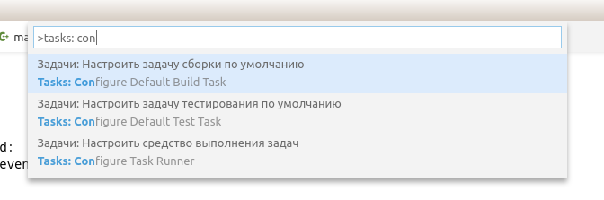

Появится список, и в нём надо выбрать вариант Others (*рус.* Прочие) — мы будем настраивать сборку через CMake, а его в списке нет:

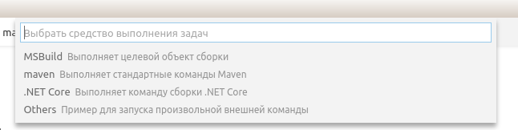

Теперь у вас в каталоге проекта появился файл `tasks.json`. Он будет сразу открыт в редакторе. Этот файл в специальном формате JSON

>JSON — сокращение от JavaScript Object Notation. Это формальный язык, удобный для описания простых данных. Будьте внимательны, работая с JSON: не пропускайте запятые, кавычки и скобки.

Файл скорее всего выглядит так:

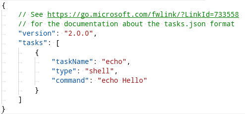

Теперь надо доработать описание команды: мы поменяем "taskName", "command", добавим поле "args" для аргументов команды. Мы также опишем поле "group" так, чтобы редактор VSCode считал эту задачу (*англ.* task) командой сборки (*англ.* build). Доработайте `tasks.json`, как показано на скриншоте:

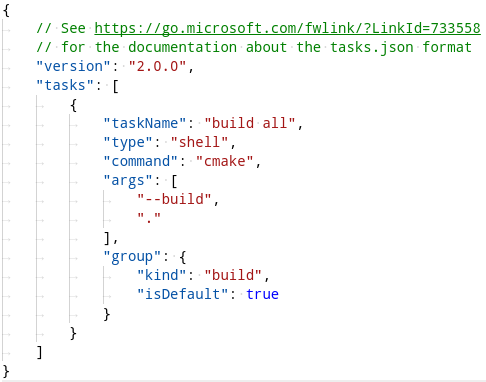

Теперь вы можете собирать одним нажатием! Нажмите сочетание `Ctrl+Shift+B`. Если всё в порядке, вы увидите внизу в терминале такой вывод:

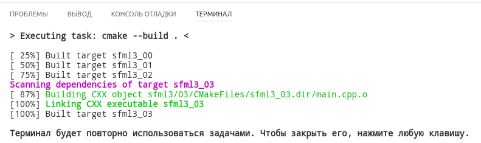

Поздравляем! Теперь собирать программу стало проще. Вы также можете открыть панель команд сочетанием `Ctrl+Shift+P`, ввести "build" и увидеть ту же самую команду запуска сборки:

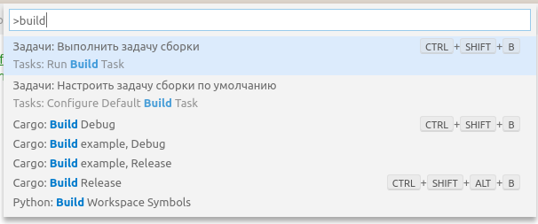

### Настраиваем запуск проекта в одно нажатие

Чтобы запускать проект одним нажатием, вам нужен файл `launch.json`. Создадим его по инструкции:

1. Перейдите в редакторе в режим отладки — нажмите на кнопку, как показано ниже, либо просто нажмите `Ctrl+Shift+D`:

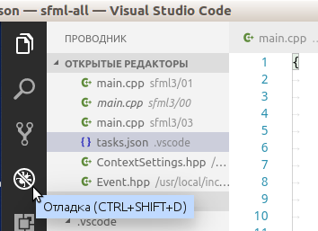

2. В этом режиме нажмине кнопку настройки:

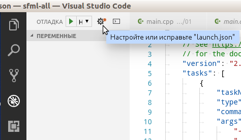

3. В выпадающем списке выберите "C+ (GDB/LLDB)", чтобы автоматически создать `launch.json`:

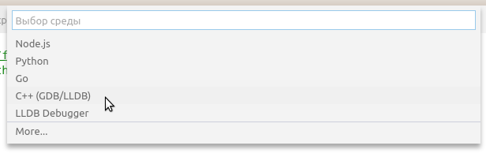

Полученный файл выглядит примерно так:

```js
{
    "version": "0.2.0",
    "configurations": [
        {
            "name": "(gdb) Launch",
            "type": "cppdbg",
            "request": "launch",
            "program": "enter program name, for example ${workspaceRoot}/a.out",
            "args": [],
            "stopAtEntry": false,
            "cwd": "${workspaceRoot}",
            "environment": [],
            "externalConsole": true,
            "MIMode": "gdb",
            "setupCommands": [
                {
                    "description": "Enable pretty-printing for gdb",
                    "text": "-enable-pretty-printing",
                    "ignoreFailures": true
                }
            ]
        }
    ]
}
```

Измените этот файл:

- для поля "program" надо указать путь к программе, включая переменную workspaceRoot: `"program": "${workspaceRoot}/04/04"`
- добавьте свойство `"preLaunchTask": "build all"`
- поменяйте значение свойства "externalConsole" на `false`

После изменений файл будет выглядеть так:

```js
{
	"version": "0.2.0",
	"configurations": [
		{
			"name": "(gdb) Launch",
			"type": "cppdbg",
			"request": "launch",
			"program": "${workspaceRoot}/sfml3/00/sfml3_00",
			"args": [],
			"stopAtEntry": false,
			"cwd": "${workspaceRoot}",
			"environment": [],
			"externalConsole": false,
			"MIMode": "gdb",
			"setupCommands": [
				{
					"description": "Enable pretty-printing for gdb",
					"text": "-enable-pretty-printing",
					"ignoreFailures": true
				}
			],
			"preLaunchTask": "build all"
		}
	]
}
```

Теперь вы можете начать отладку, нажав на кнопку запуска в редакторе в режиме отладки:

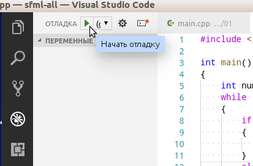

 Вы также можете использовать горячую клавишу `F5`, либо открыть панель команд сочетанием `Ctrl+Shif+P` и найти команду **Debug: Start Debugging**:

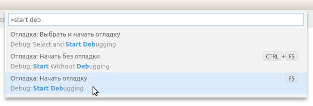

### Точки останова и просмотр переменных

>Этот материал основан на статье [Debugging](https://code.visualstudio.com/docs/editor/debugging) из документации VSCode

### Пошаговая отладка

## Получаем события мыши

Наша цель — написать программу, в которой треугольник будет следить за курсором мыши и поворачиваться вслед за ним. Выглядеть будет примерно так:

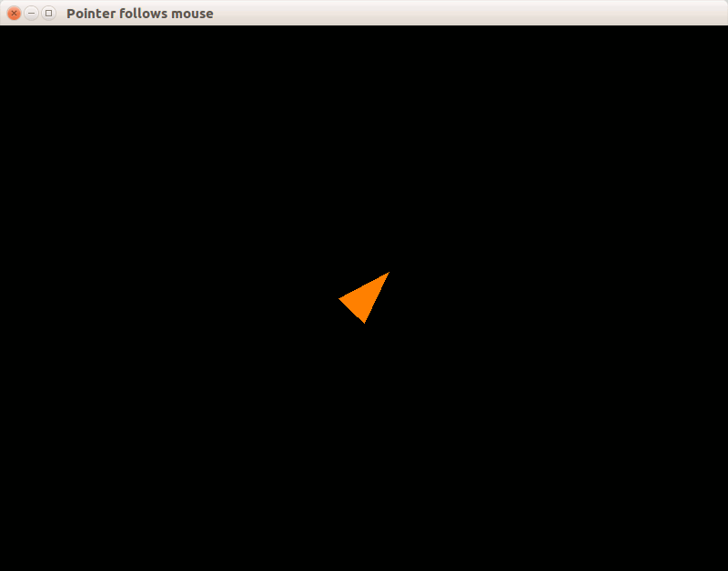

Прежде чем перейти к примеру, нам надо освоить инструкцию switch, научиться писать функции и набраться опыта в обработке событий мыши.

### Инструкция switch

Создайте подкаталог `00` в каталоге `sfml3`. В подкаталоге создайте ещё один файл `CMakeLists.txt`, и скопируйте в него текст:

```cmake
add_executable(00 main.cpp)
```

Теперь мы снова напишем програмаму FizzBuzz! На этот раз вмето `if` мы будем использовать `switch` (*рус.* "переключатель"). У этой инструкции любопытный синтаксис:

```cpp
switch (вычислимое_значение)
{
case константа_1:
    список_инструкций
case константа_2:
    список_инструкций
case константа_3:
    список_инструкций
...
default:
    список_инструкций
}

// ветка case выполняется, если значение совпадает с заданной константой
// ветка default выполяется, если значение не совпадает ни с одной константой
// после завершения ветки выполнение продолжается сквозь следующую ветку!

// неправильны пример: если число чётное, выводим его и пишем "odd!", иначе пишем "odd!"
switch (num % 2)
{
case 0:
    // чётное
    std::cout << num << std::endl;
    // выполнение продолжается, хотя (num % 2) != 1
    // такова особенность switch/case
case 1:
    // нечётное
    std::cout << "odd!" << std::endl;
}

// пример: если число чётное, выводим его, иначе выводим "odd!"
switch (num % 2)
{
case 0:
    // чётное
    std::cout << num << std::endl;
    // если не будет break, выполнение продолжится сквозь "case 1:"
    break;
case 1:
    // нечётное
    std::cout << "odd!" << std::endl;
    // ставим break в конце для безопасности:
    break;
}
```

Всегда будьте аккуратны со switch: если вы не ставите break в конце списка инструкций case, то выполнение продолжится далее, хотя условие case уже не соблюдается. Это источник огромного числа ошибок, хотя иногда программист действительно хотел продолжить выполнение насквозь.

Мы перепишем FizzBuzz, чтобы использовать switch для выбора поведения по остатку от деления на 15. Число 15 — это наименьшее общее кратное 3 и 5, и по остатку от деления на 15 можно судить о делимости на 3 и 5. Перепишите код в `main.cpp`:

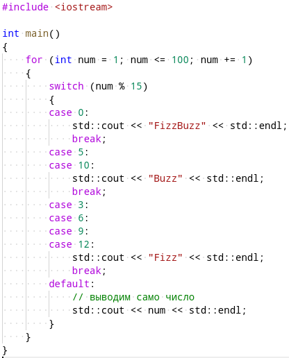

### Выводим в консоль координаты мыши

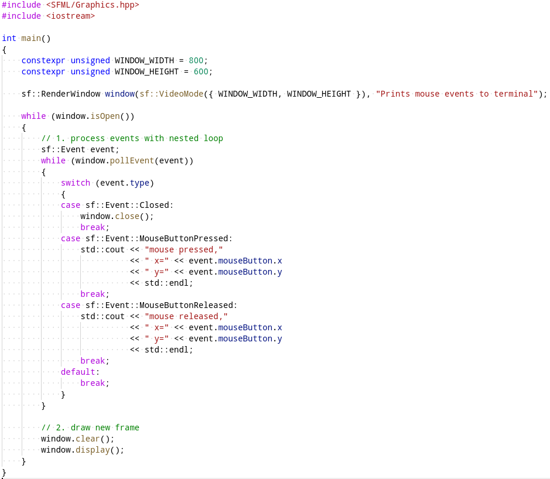

Соберите программу командой `cmake --build .` и запустите — вы увидите пустое окно. Кликните несколько раз мышью в пределах окна, посмотрите вывод программы в терминале:

```
mouse pressed, x=585 y=291
mouse released, x=578 y=328
mouse pressed, x=255 y=268
mouse released, x=255 y=268
mouse pressed, x=249 y=187
mouse released, x=241 y=183
mouse pressed, x=200 y=168
mouse released, x=190 y=166
```

### Функции в языке C++

Функции — это фрагменты кода, пригодные для переиспользования. У них чётко объявлены входные и выходные данные. Новые функции создаются путём *объявления функций*, а существующие используются путём *вызова функций*.

Сначала разберёмся с объявлением. Внимательно прочитайте описание синтаксиса и изучите примеры:

```cpp
//////////////////// синтаксис функций //////////////////////
тип_данных название_функции(тип_параметра имя_параметра, ...)
{
    список_инструкций
}

///////////////////// примеры функций ///////////////////////

// возвращает целое, не принимает параметров
// для функции main (и только для неё) стандарт разрешает
// не возвращать ничего, хотя указан тип int.
int main()
{
}

// ничего не возвращает (void), принимает 1 параметр типа int
void printInt(int a)
{
    std::cout << a << std::endl;
}

// возвращает float, принимает 2 параметра типа float
float sum(float a, float b)
{
    return a + b;
}
```

После объявления функцию можно вызвать. Синтаксис вызова отличается: например, мы уже не указываем типы и имена *параметров*, вместо этого мы подставляем *аргументы* — выражения, вычисление которых задаёт фактические значения параметров функции.

### Функции и уровни абстракции

Пользуясь функциями, мы перепишем предыдущий пример. Будем следовать важному правилу: каждая функция работает на одном уровне абстракций, а если ей надо спуститься ниже в абстракциях, она должна вызвать другую функцию. Например, уровень абстракций функции main — это основной цикл программы, а всё более мелочное и ничтожное должны выполнять другие функции. Идея выглядит так:

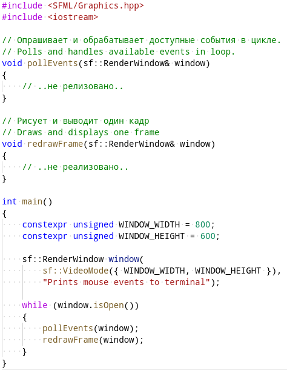

Перепишите приведённый выше код. Затем добавьте тела функций pollEvents и redrawFrame, как показано ниже:

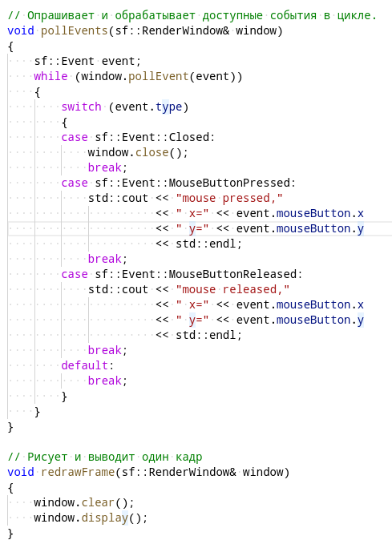

Соберите программу, запустите и проверьте её работоспособность.

В будущем при написании основных циклов мы советуем выделять 4 функции:

- `initialize`, иницилизирующая состояние ключевых переменных (например, фигур)
- `pollEvents`, выполняющая в цикле опрос и обработку событий
- `update`, 

### Вращаем объект вслед за мышью
