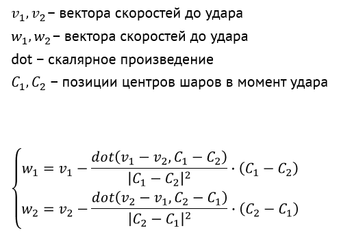

## Задание workshop2.1

Напишите программу, в которой несколько разноцветных шаров летают в пределах окна, отталкиваясь от стенок

- шарам не нужно сталкиваться между собой
- цвета и начальные скорости шаров задаются прямо в коде без какого-либо механизма случайностей
- для выполнения задания вы можете использовать массив либо `std::vector`
- скорость и CircleShape шара лучше поместить в структуру, и использовать массив структур

Перед выполнением задачи изучите статью [Массивы в C++](/cxx/cxx_arrays). Вы можете использовать инициализацию массива при объявлении, чтобы сделать код более аккуратным и читаемым.

## Задание workshop2.2

Добавьте шарам возможность отталкиваться друг от друга. При ударе важны скорости шаров и взаимное положение их центров, детально это показано на рисунке:

Считайте, что шары имеют одинаковую массу, а столкновение абсолютно упругое. В этом случае скорости шаров после удара вычисляются так, как показано на схеме:

## Задание workshop2.3

Перед выполнением задачи изучите статью [Генерация случайных чисел в Modern C++](/cxx/cxx_random).

Добавьте случайную генерацию скоростей для шаров. Скорости не должны быть слишком большими или слишком маленькими: при генерации случайных чисел надо задать разумные ограничения.

## Задание workshop2.4 (дополнительное)

Изучите документацию класса [sf::Color](https://www.sfml-dev.org/documentation/2.4.2/classsf_1_1Color.php).

Затем добавьте случайную генерацию цвета шаров. Выбирать случайный цвет можно, например, следующим методом:

 1. Создать массив предопределённых значений типа sf::Color (достаточно 8 цветов на ваш вкус), этот массив будет служить палитрой
 2. Реализовать случайную генерацию индекса в этом массиве
 3. Получив случайный индекс, запросить из палитры цвет с этим индексом

>Составить хорошую палитру поможет сайт [websafecolors.info](http://websafecolors.info/).

По желанию можно повысить случайность цвета:

- выбирать два случайных индекса вместо одного
- полученные из палитры два цвета комбинировать путём вычисления среднего арифметического их RGBA-значений

## Задание workshop2.5 (дополнительное)

Добавьте возможность создавать шар со случайным цветом и скоростью по клику левой кнопкой мыши.

- шар не должен создаваться, если после создания он бы сразу пересёкся с другим шаром (другими словами, нельзя создать шар над другим шаром)
- для хранения динамического массива шаров вам не подойдёт массив в стиле `Ball balls[...]`, используйте `std::vector`

## Задание workshop2.6 (дополнительное)

Добавьте шарикам время жизни: каждый шар после создания существует ровно 10 секунд, после чего исчезает.

- счётчик оставшегося времени жизни лучше держать в структуре Ball
- удаление отживших своё элементов массива шаров можно выполнять с помощью идиомы `remove_if + erase`; изучите, как эта идиома реализуется в C++, и используйте её
- удаление отживших своё элементов удобнее выделить в функцию removeDeathBalls, обновление времени жизни всех шаров удобно выделить в функцию updateBallLifetimes
