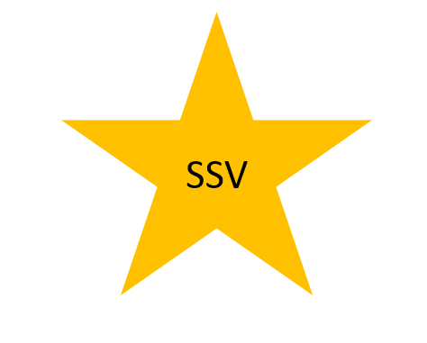

## Задание workshop3.1

Прежде чем начать, вам надо освоить использование класса `sf::Text`. Для этого изучите руководство [Text and fonts](https://www.sfml-dev.org/tutorials/2.4/graphics-text.php).

Также вам надо освоить написание программ, состоящих из нескольких файлов. Об этом расскажет руководство [Программы из нескольких файлов на C++](`/cxx/cxx_multiple_files`).

Напишите программу, которая рисует ваше имя либо ваши инициалы с помощью примитива `sf::Text`.

- шрифт `arial.ttf` вы можете взять здесь: [github.com/zyedidia/SFML.jl/blob/master/assets/arial.ttf](https://github.com/zyedidia/SFML.jl/blob/master/assets/arial.ttf)
- имя (инициалы) должно быть нарисовано в круге с обводкой
- вы должны следовать паттерну Game Loop и выделить шаги игрового цикла в отдельные функции (например, в функции init, pollEvents, update, drawFrame)
- вы должны разделить программу на несколько файлов:
	- объекты, формирующие имя или инициалы, должны быть объединены в одном типе данных (структуре или классе)
	- объединяющий тип и функции (либо методы) для работы с ним должны быть объявлены в отдельном заголовке
	- реализации (тела) функций должны быть в отдельном `cpp` файле, название которого совпадает с названием заголовка


## Задание workshop3.2

Прочитайте статью [Классы в C++ для новичков](/cxx/cxx_multiple_files) для вдохновения.

Доработайте программу так, чтобы ваш тип данных был классом и наследовался от Drawable, а рисовать кружок с вашими инициалами можно было привычным и удобным способом:

```cpp
window.draw(initials);
```

## Задание workshop3.3

- рисование вершинных массивов: https://www.sfml-dev.org/tutorials/2.4/graphics-vertex-array.php



## Задание workshop3.4

## Задание workshop3.5

- аффинные преобразования: https://www.sfml-dev.org/tutorials/2.4/graphics-transform.php

## Задание workshop3.6

TODO:

- камера, основанная на аффинных преобразованиях: https://www.sfml-dev.org/tutorials/2.4/graphics-view.php
