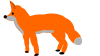
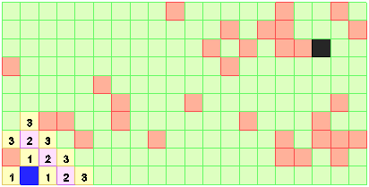

Помогите колобку добраться до лисы сквозь лабиринт из деревьев.



Помочь колобку можно одним из следующих способов:

- (Easy) Напишите на C++ программу, которая выполняет поиск кратчайшего пути от колобка к лисе в лабиринте, и затем выводит лабиринт в консоль, используя для обозначения стен символ решётки "#", для обозначения проходов пробел, для обозначения кратчайшего пути &mdash; символ точки ".". Для поиска использовать волновой алгоритм.
- (Medium) Напишите на C++ программу, которая выполняет поиск кратчайшего пути от колобка к лисе в лабиринте, и затем визуализирует движение колобка по лабиринту по кратчайшему пути. Для обозначения колобка можно использовать `sf::CircleShape`, для обозначения стен &mdash; `sf::RectangleShape`, для обозначения лисы &mdash; `sf::Sprite` с картинкой, показанной в начале статьи. Для поиска использовать волновой алгоритм.
- (Hard) То же самое, что и в предыдущем варианте, но для поиска использовать алгоритм "A*" (A-star)

## Полезные ссылки

- [Путь в двумерном лабиринте &mdash; волновой алгоритм](http://algolist.manual.ru/games/wavealg.php)
- [Клон Packman: печенье](https://ps-group.github.io/packman/6.html)
- [SFML Tutorials: Shapes](http://www.sfml-dev.org/tutorials/2.4/graphics-shape.php)

## Иллюстрация волнового алгоритма

Первый шаг распространения волны:


Второй шаг распространения волны:


Третий шаг распространения волны:



## Пример определения лабиринта с помощью `char[]`

В примере символ `#` обозначает стену, пробел &mdash; проход, символ `C` &mdash; местоположение колобка, символ `F` &mdash; местоположение лисы.

```cpp
static const size_t FIELD_WIDTH = 25;
static const size_t FIELD_HEIGHT = 25;
static const char FIELD_MAZE[] =
        " ####################### "
        " #          #          # "
        " # ## ##### # ##### ## # "
        " #                     # "
        " # ## # ######### # ## # "
        " #    #     #     #    # "
        " #### ##### # ##### #### "
        "    # #     C     # #    "
        "##### # # ##### # # #####"
        "#       #     # #       #"
        "##### # # ##### # # #####"
        "    # #    #      # #    "
        " #### # ######### # #### "
        " #          #          # "
        " # ## ##### # ##### ## # "
        " #  #           F   #  # "
        " ## # # ######### # #  # "
        " # $  #     #     #    # "
        " # ####### ### ####### # "
        " # #     #     #     # # "
        " # # ### ## # ## ### # # "
        " # # #      #      # # # "
        " # # # #### # #### # # # "
        " #          #          # "
        " ####################### ";
```
