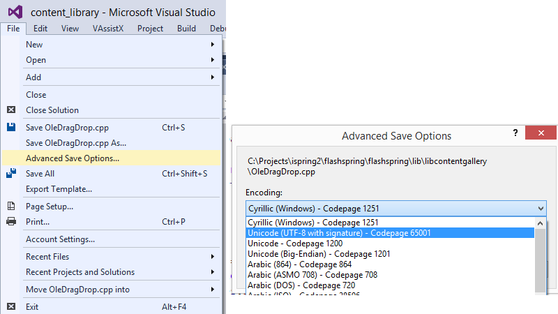

## На Github теряется кодировка русскоязычных комментариев

Комментарии на русском в русскоязычной системе по умолчанию сохраняются в кодировке CP1251, а Github считает, что файл закодирован в UTF-8. Правильным решением будет перекодирование файла в общепринятую для сети кодировку UTF-8.



- открыть файл с русскоязычными комментариями
- открыть меню "File"
- выбрать действие "Advanced Save Options"
- в диалоге выбрать кодировку UTF-8 (неважно, с BOM-сигнатурой или без неё)

## При запуске программа пишет, что ей не хватает какой-то DLL

Для визуализации зависимостей программы под Windows есть утилита [Dependency Walker (иногда её называют просто depends.exe)](http://www.dependencywalker.com/). С её помощью можно понять, каких DLL вам не хватает.

Надо учесть, что программа может давать ложные срабатывания, сообщая о нехватке DLL где-то в недрах WinAPI (например, о нехватке IESHIMS.DLL). Такие сообщения можно смело игнорировать.


## Что такое переменные сборки

## Как раскрываются относительные пути при запуске из среды

Относительные пути в современных ОС вычисляются относительно рабочего каталога программы. Проверить или изменить этот параметр можно в настройках проекта на вкладке Debugging, свойство "Working Directory".

Правильным будет располагать ресурсы программы рядом с исполняемым файлом. Для запуска из Visual Studio в таком случае лучше установить параметр "Working Directory" равным "$(OutDir)".

> Рабочий каталог программы (англ. current directory, или working directory) появился ещё в UNIX. Он задаётся для каждого процесса в системе при запуске. В POSIX (Unix) сущесвует API для запроса и изменения текущей директории: функции [getcwd](http://www.opennet.ru/man.shtml?topic=getcwd&category=3&russian=0) для получения пути к рабочему каталогу и [chdir](http://www.opennet.ru/man.shtml?topic=chdir&category=2&russian=0) для изменения. Пример кроссплатформенного подключения этого API приведён ниже:

```cpp
#ifdef _WIN32
#  include <direct.h>
// На Windows имена функций имеют префикс, #define вводит замещающий макрос.
#  define getcwd _getcwd
#  define chdir _chrdir
#else
#  include <unistd.h>
#endif
```

## Как работать с отладчиком Visual Studio

## Как собрать и подключить Boost

## Как подключить стороннюю библиотеку
